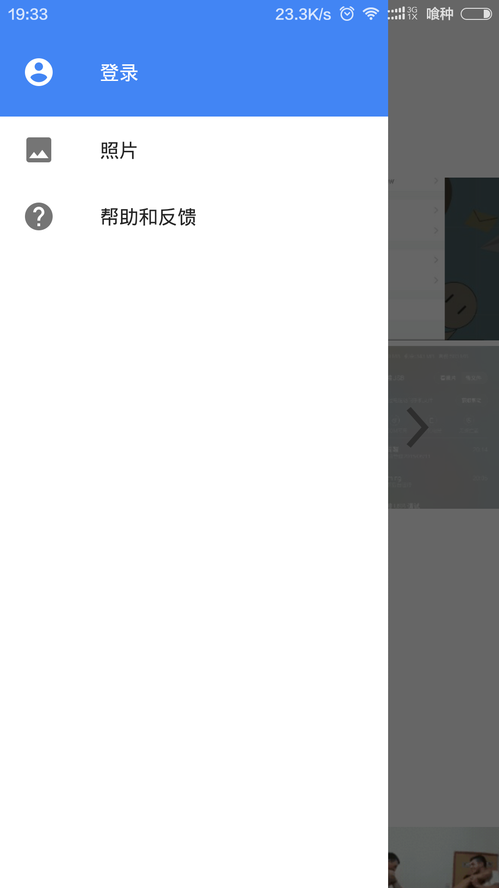

最近在网上看到谷歌自家的相册应用（Google Photos），它的侧滑栏很吸引我，于是在google了很久之后，终于完成，和大家分享分享。

<!--more-->

这是它的效果图：


废话不多说，上代码：

```
<android.support.v4.widget.DrawerLayout xmlns:android="http://schemas.android.com/apk/res/android"
    android:id="@+id/frame_drawer_layout"
    android:layout_width="match_parent"
    android:layout_height="match_parent">

    <LinearLayout
        android:layout_width="match_parent"
        android:layout_height="match_parent"
        android:background="@color/colorPrimary"
        android:orientation="vertical">

        <android.support.v7.widget.Toolbar
            android:id="@+id/frame_toolbar"
            android:layout_width="match_parent"
            android:layout_height="wrap_content"
            android:background="@color/colorPrimary"
            android:fitsSystemWindows="true" />
            ...
            <!--your content -->
            ...
    </LinearLayout>

	<!-- 侧滑的视图 -->
    <fragment
        android:id="@+id/frame_drawer_left"
        android:layout_width="240dp"
        android:layout_height="match_parent"
        android:layout_gravity="start" />
</android.support.v4.widget.DrawerLayout>
```

要实现图中的效果还需要在**value-v19/style.xml**中添加：

```
<style name="AppTheme" parent="Theme.AppCompat.NoActionBar">
        <item name="android:windowTranslucentStatus">true</item>
    </style>
```
然后再配置文件中设置Activity的主题
