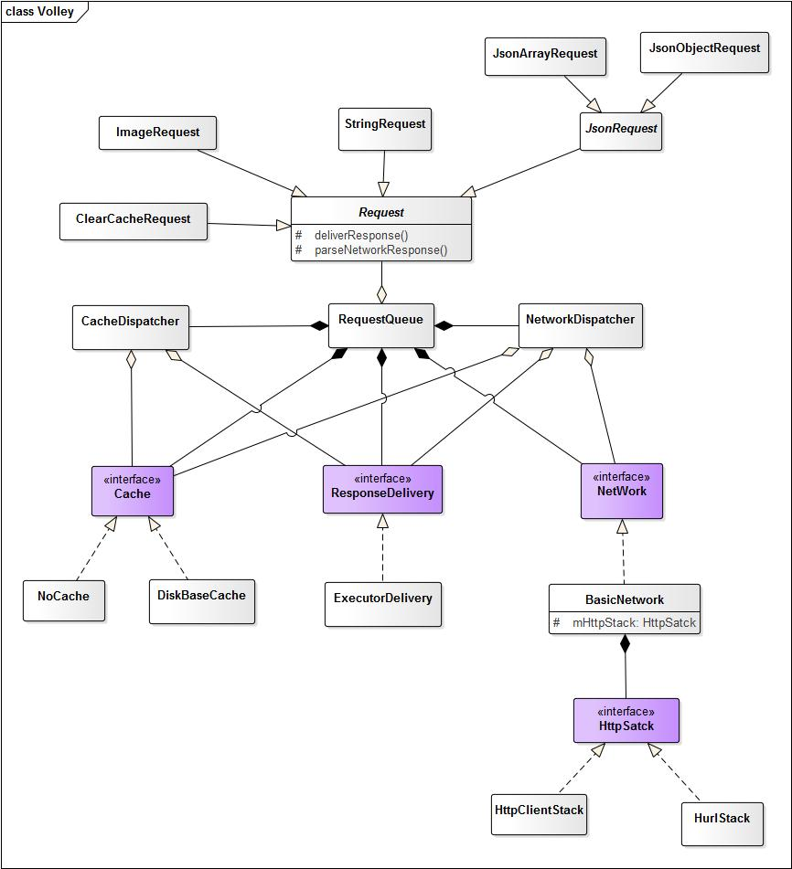
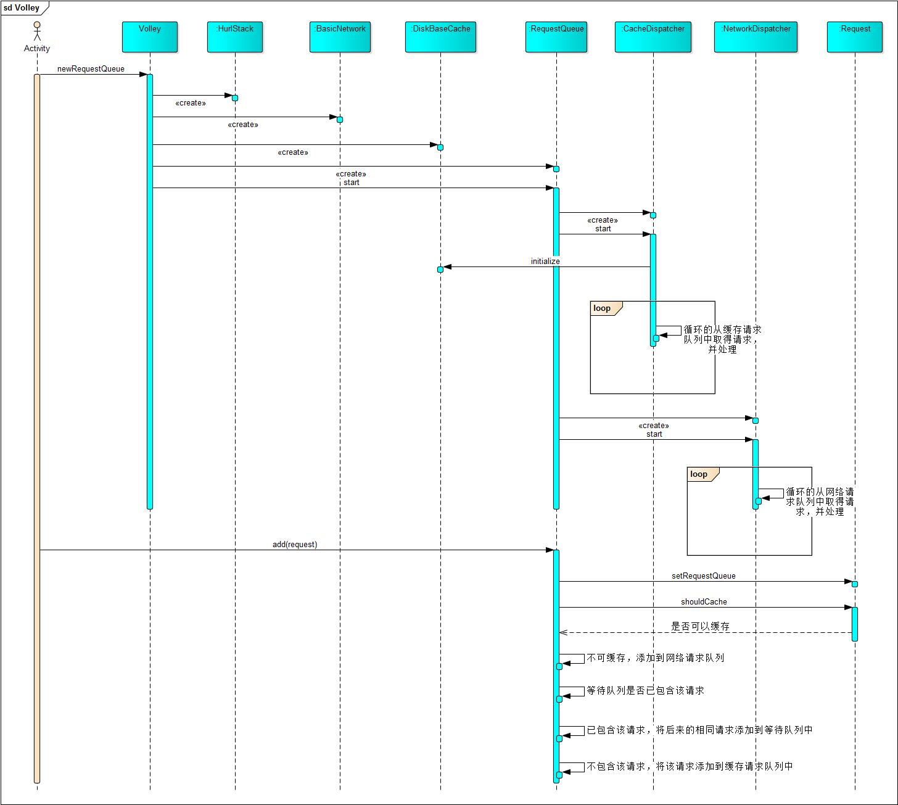
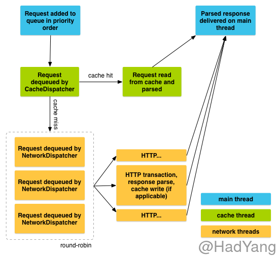

最近复习校招的时候，发现很多公司的面试题都有考Volley，今天我们就来学习学习这个当年在2013年 `Google I/O` 大会上发布的Android平台网络通信库。

<!--more-->

### Volley

Volley是在2013年 `Google I/O` 大会上发布的一款Android平台网络通信库，具有网络请求的处理、小图片的异步加载和缓存网络请求等功能，能够帮助开发者更方便地执行网络操作，而且更快速高效。

Volley适合高并发、小请求的场景，不适合用来下载大文件，因为Volley会保持在解析过程中所有的响应。Volley的使用比较简单，这里就不详细阐述，具体教程参见[Android官方教程](https://www.google.com/url?sa=t&rct=j&q=&esrc=s&source=web&cd=2&cad=rja&uact=8&ved=0ahUKEwjjj9e96InOAhVCzWMKHcpeCo0QFggpMAE&url=https%3A%2F%2Fdeveloper.android.com%2Ftraining%2Fvolley%2Findex.html&usg=AFQjCNFwn_mUDzUwjOceF4Lxu3Q4Zmsd_w&sig2=HVMQyTdQq9GwciCl6XMCQA)。

### 结构

Volley类图：



Volley的框架结构相对来说比较简单，主要由以下几个部分组成：
  - `RequestQueue`：Volley的主要类，负责请求分发，内部包含两个请求队列，分别是缓存请求队列和网络请求队列。`RequestQueue`作为`生产者-消费者`模式中的生产者。

  - `NetWorkDispatcher`：网络请求类，继承自`Thread`。`NetWorkDispatcher`自启动就一直在后台不断的获取`RequestQueue`的网络请求队列中的请求并处理。`RequestQueue`作为`生产者-消费者`模式中的消费者。

  - `CacheDispatcher`：缓存请求类，继承自`Thread`。这个类和`NetWorkDispatcher`在原理上是一致的，但是`CacheDispatcher`是获取`RequestQueue`的缓存请求队列中的请求，并且在处理时先从本地查找缓存，如果未命中则将请求添加到网络请求队列中，由`NetWorkDispatcher`处理。

  - `Request`：请求类，该类是抽象的泛型类，Volley提供了几个主要的实现，该类主要包含了对`Http`请求相关的操作，包括请求参数、编码等等。同时该类也提供了回调函数进行响应解析。

  - `ExecutorDelivery`：响应分发类，实现了`ResponseDelivery`接口，是该接口在`Volley`中的唯一实现。`ExecutorDelivery`使用主线程的`Handler`将响应分发到主线程中，并调用`Request`的响应回调函数。

  - `Cache`：提供了缓存的接口，在一般适用的是Volley提供的`DiskBaseCache`来进行本地缓存，当然我们也可以通过实现`Cache`接口自定义缓存方式。

  - `NetWork`：提供网络请求的具体方式，`NetWorkDispatcher`在获取到请求后，会将请求分发到`NetWork`的实现类中。

  - `HttpStack`：Http协议栈，在Volley中提供了两个实现类，其中`HurlStack`适用于Android 2.3及以上，`HttpClientStack`适用于Android 2.3以下。这样做的原因是 Android 2.3以下`HttpUrlConnection` 是不能用的，而Android 2.3以上就是采用`HttpUrlConnection`进行连接的，以下就是直接用的`HttpClient`。

### 请求分发

在看过Volley的基本结构后，我们通过源码来进一步认识Volley。

顺序图（图片有点大，可以点开放大看）：



从图中可以看出`RequestQueue`将请求进行分类，由不同的线程去执行。下面我们就从代码对这个过程进行分析。

```Java
public <T> Request<T> add(Request<T> request) {
    ...
    //判断请求是否可以缓存，如果不可以缓存，则直接加入网络请求队列，由NetWorkDispatcher处理。
    if (!request.shouldCache()) {
        mNetworkQueue.add(request);
        return request;
    }

    //这里判断是否有相同的请求，并利用缓存来减少请求数量
    synchronized (mWaitingRequests) {

        //getCacheKey默认返回：请求方式+请求URL
        String cacheKey = request.getCacheKey();

        //如果等待队列中已存在相同的请求，将后续的相同请求加入一个队列中
        if (mWaitingRequests.containsKey(cacheKey)) {
            Queue<Request<?>> stagedRequests = mWaitingRequests.get(cacheKey);
            if (stagedRequests == null) {
                stagedRequests = new LinkedList<Request<?>>();
            }
            stagedRequests.add(request);
            mWaitingRequests.put(cacheKey, stagedRequests);
            ...
        } else {

            //没有相同请求，向等待队列中放入标记位，并添加到缓存请求队列中
            mWaitingRequests.put(cacheKey, null);
            mCacheQueue.add(request);
        }
        return request;
    }
}
```

Volley在设计中采用了`生产者-消费者`模式，在上面的代码中`mNetworkQueue`和`mCacheQueue`是阻塞队列，`NetWorkDispatcher`和`CacheDispatcher`是工作者线程。

> `NetWorkDispatcher`在Volley中默认是4个线程。

对Volley的请求过程Android官方也有一张示意图：


