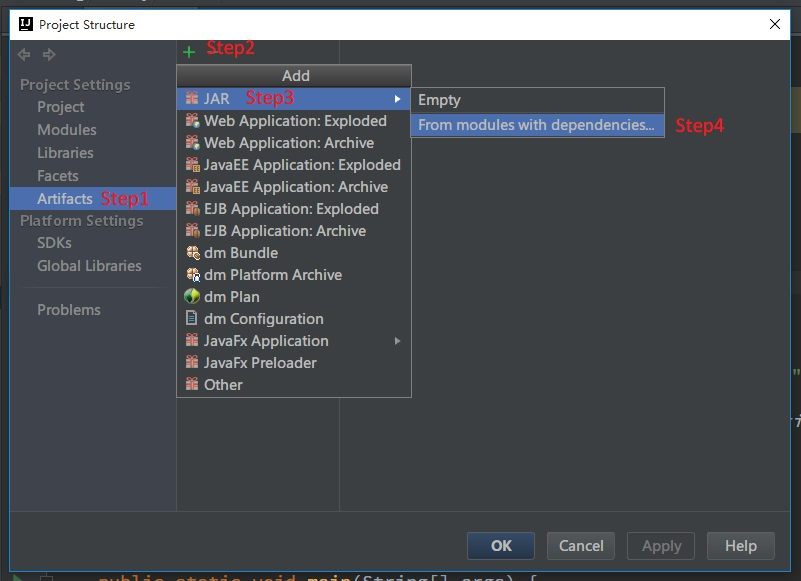
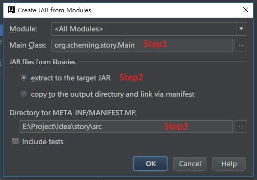
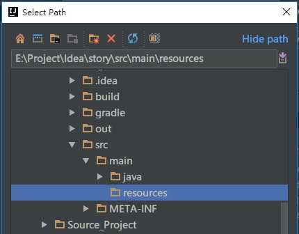

前段时间通过IDEA编写Java程序，使用的是Gradle进行依赖管理。在包管理方面Gradle的优势很大，但是在打包可执行Jar包的时候出现不能找到main方法的问题，在这里稍作记录。

<!--more-->

1. 在编写完代码后点击File->Project Structure，然后按照下图添加打包配置。

  

2. 添加manifest配置文件

  

  - Step1：选择main方法的位置

  - Step2：选择`extract to the target JAR`，意思是将所有依赖的jar解压到我们自己的jar包中。
  > `copy to the output directory and link via maifest`：将所有依赖的jar独立到我们jar包之外，形成多个独立的jar，然后在我们jar包中使用manifest链接。

  - Step3：这里一定要将manifest文件配置到`src`文件夹下面，不然manifest文件不能打包到jar中。

3. 下面是目前打包的配置如下，然后点击Build->Build Artifacts->Build。

  

  这是在你的项目文件夹下out/artifacts目录下就打包好了.jar文件，下面我们来执行jar包。`java -jar stroy.jar`

  

  这里执行jar包就报错了，从错误可以看出log4j的配置文件找不到，显然是log4j的配置文件没有打包到jar文件中。

4. 解决上面问题的方法就是：添加resources文件夹到jar文件中。打开Project Structure

  

  

  接下来在进行打包就可以了。
