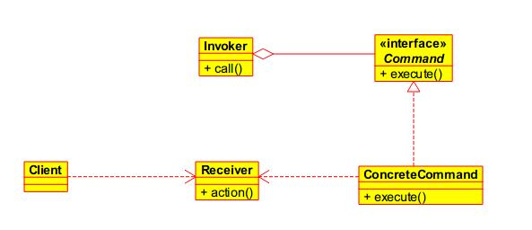

命令模式是将“请求”封装为对象，我们称之为命令对象，**一个命令对象通过绑定特定的一组动作来封装请求**。为达到这一目的，命令对象将动作和动作的执行者（即命令的接收者）包进对象中，并暴露出一个`execute()`方法，当此方法调用的时候，接收者就执行这些动作。命令模式是一种对象行为型模式，其别名为动作(Action)模式或事务(Transaction)模式。

<!--more-->

在软件设计中，我们经常需要向某些对象发送请求，但是并不知道请求的接收者是谁，也不知道被请求的操作是哪个，我们只需在程序运行时指定具体的请求接收者即可。此时，可以使用命令模式来进行设计，**使得请求发送者与请求接收者消除彼此之间的耦合，让对象之间的调用关系更加灵活**。

> 命令模式可以对发送者和接收者完全解耦，发送者与接收者之间没有直接引用关系，发送请求的对象只需要知道如何发送请求，而不必知道如何完成请求。

命令模式还可以支持撤销(Undo)和恢复(Redo)操作，我们只需要将上一次的状态记录下来，并且添加两个接口`undo()`,`redo()`。

### 结构

  - `Command`: 抽象命令类
  - `ConcreteCommand`: 具体命令类
  - `Invoker`: 调用者
  - `Receiver`: 接收者
  - `Client`:客户类

>有些人说可以不需要`Receiver`，直接将动作在`ConcreteCommand`里面定义，这样也是可以的，但是增加了`Invoker`和`Receiver`的耦合度。

上图是一种基本的命令模式，通过将`Receiver`里的动作封装在`ConcreteCommand`里，即使`Invoker`不知道`Command`的实现类里的具体细节，也能实现一组操作，并且这组操作是可以替换的，通过不同`Command`的实现类来完成这个目的。通过这种方式实现了`Invoker`和`Receiver`之间的解耦。

同时，命令模式也有许多的扩展，比如：队列请求、日志请求等。

### 队列请求

命令模式将运算块打包（一个接受者和一组动作），然后将它放入一个工作队列中。当线程池中的线程空闲时就会从工作队列中取出下一个命令对象，并调用它的`execute()`方法，等待这个调用完成，然后将此命令对象丢弃，再取出下一个命令对象。

>在这里，工作队列和进行计算的对象（Receiver）之间是完全解耦的。工作队列完全不知道命令对象具体执行哪些工作，只需要取出命令对象并执行`execute()`方法。

这种情景的应用可以说很多，比如：Android中的Handler、`AsyncTask`、Java中的线程池等都是运用了这种模式。

### 优点

  - 降低系统的耦合度。
  - 新的命令可以很容易地加入到系统中。
  - 可以比较容易地设计一个命令队列和宏命令（组合命令）。
  - 可以方便地实现对请求的Undo和Redo。

### 缺点

  - *使用命令模式可能会导致某些系统有过多的具体命令类* 。因为针对每一个命令都需要设计一个具体命令类，因此某些系统可能需要大量具体命令类，这将影响命令模式的使用。

### 使用场景

  - 系统需要将请求调用者和请求接收者解耦，使得调用者和接收者不直接交互。
  - 系统需要在不同的时间指定请求、将请求排队和执行请求。
  - 系统需要支持命令的撤销(Undo)操作和恢复(Redo)操作。
  - 系统需要将一组操作组合在一起，即支持宏命令
