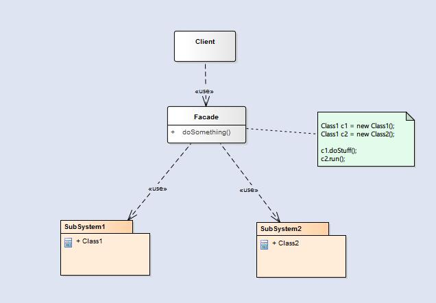

外观模式，提供了一个统一的接口，用来访问子系统中的一群接口。**外观定义了一个高层接口，使得子系统更容易使用**。外观模式是将子系统组合进外观中，然后将工作委托给子系统执行。

<!--more-->

### 结构

  - `Facade`: 外观角色
  - `SubSystem`:子系统角色

外观模式的意图就是 **提供一个简单的接口，让一个子系统更易于使用**。由于外观模式的存在，将客户从一个复杂的子系统中解耦，从而 **使我们可以在不影响客户的情况下对子系统进行升级或替换**。

### 优点

  - 对客户屏蔽子系统组件，减少了客户处理的对象数目并使得子系统使用起来更加容易。*通过引入外观模式，客户代码将变得很简单，与之关联的对象也很少*。
  - 实现了子系统与客户之间的松耦合关系，这使得子系统的组件变化不会影响到调用它的客户类，只需要调整外观类即可。
  - **只是提供了一个访问子系统的统一入口，并不影响用户直接使用子系统类**。

### 缺点

  - **不能很好地限制客户使用子系统类，如果对客户访问子系统类做太多的限制则减少了可变性和灵活性**。
  - 在不引入抽象外观类的情况下，增加新的子系统可能需要修改外观类或客户端的源代码，违背了“开闭原则”。

### 使用场景

  - 当要 **为一个复杂子系统提供一个简单接口时可以使用外观模式**。该接口可以满足大多数用户的需求，而且用户也可以越过外观类直接访问子系统。
  - **客户程序与多个子系统之间存在很大的依赖性**。引入外观类将子系统与客户以及其他子系统解耦，可以提高子系统的独立性和可移植性。
  - 在层次化结构中，可以使用外观模式定义系统中每一层的入口，层与层之间不直接产生联系，而通过外观类建立联系，**降低层之间的耦合度**。
