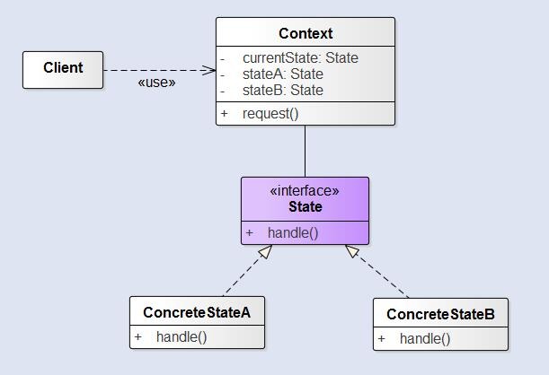

在很多情况下，一个对象的行为取决于一个或多个动态变化的属性，这样的属性叫做状态，这样的对象叫做有状态的对象，这样的对象状态是从事先定义好的一系列值中取出的。*当一个这样的对象与外部事件产生互动时，其内部状态就会改变，从而使得系统的行为也随之发生变化*。

<!--more-->

**状态模式允许对象在内部状态改变时改变它的行为，对象看起来似乎修改了它的类**。由于状态模式将状态封装成独立的类，并将动作委托到代表当前状态的对象，所有行为就随着内部状态的改变而改变。从客户的角度来看：如果说你使用的对象能完全改变它的行为，那么你会觉得，这个对象实际上是从别的类实例化的。然而，实际上，我们是使用组合通过简单的引用不同状态对象来造成类改变的假象。

### 结构

  - `Context`：拥有多个内部状态，与客户端进行交互
  - `State`：该接口定义了一个所有状态的共同接口。任何状态都要实现这个接口，这样状态之间就可以相互转换。
  - `ConcreteState_`：具体状态处理来自`Context`的请求。每个`ConcreteState`都提供了自己对于请求的实现。所以，当`Context`改变状态时行为也发生改变。

### 状态模式和策略模式

就状态模式而言，我们将一组行为封装在状态对象中，`Context`的行为随时可以委托到这些状态中的一个。当前状态的改变也反映出`Context`内部的状态改变，因此`Context`的行为也会随着改变，但是`Context`的客户对于状态对象完全不知情。

然而，对策略模式来说，客户通常主动指定`Context`所要组合的策略对象。固然策略模式让我们更具有弹性，能够运行时改变策略，但是对于某个`Context`对象来说，通常只有一个最适合的策略对象。

一般来说，我们把策略模式当做处理继承之外的一种弹性替代方案。如果你使用继承定义一个类的行为，你将被这个行为困住，甚至很难修改它。而状态模式是 **通过将行为包装在状态对象中，可以通过在`Context`内简单修改状态对象来改变`Context`的行为**。

### 优点

  - 封装了转换规则。
  - 枚举可能的状态，在枚举状态之前需要确定状态种类。
  - 将所有与某个状态有关的行为放到一个类中，并且可以方便地增加新的状态，只需要改变对象状态即可改变对象的行为。
  - 允许状态转换逻辑与状态对象合成一体，而不是某一个巨大的条件语句块。
  - **可以让多个环境对象共享一个状态对象，从而减少系统中对象的个数**。

### 缺点

  - 通常会导致设计中类的数目增加
  - 状态模式的结构与实现都较为复杂，如果使用不当将导致程序结构和代码的混乱。
  - 状态模式对“开闭原则”的支持并不太好，*对于可以切换状态的状态模式，增加新的状态类需要修改那些负责状态转换的源代码，否则无法切换到新增状态*；而且修改某个状态类的行为也需修改对应类的源代码。

### 使用场景

  - *对象的行为依赖于它的状态，并且可以根据它的状态改变而改变它的相关行为*。
  - 代码中包含大量与对象状态有关的条件语句，这些条件语句的出现，会导致代码的可维护性和灵活性变差，不能方便地增加和删除状态，使客户类与类库之间的耦合增强。
