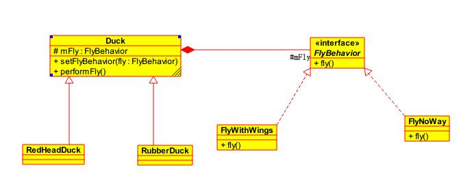

策略模式作为一种软件设计模式，指对象有某个行为，但是在不同的场景中，该行为有不同的实现算法。比如每个人都要“交个人所得税”，但是“在美国交个人所得税”和“在中国交个人所得税”就有不同的算税方法。

<!--more-->

### 特点

- 定义了一族算法（业务规则）；
- 封装了每个算法；
- 这族的算法可互换代替（interchangeable）。

### 结构

策略模式结构如下图所示：其中所有的鸭子继承Duck类，飞行行为实现FlyBehavior接口。在每个Duck类中都有一个`mFly`的成员变量，**通过聚合的方式将Fly这个行为继承到Duck类中**，而`FlyBehavior`又可以有很多的实现，客户端可以通过`setFlyBehavior`方法设置不同的`Fly`，这样的结构就是策略模式。

> 策略模式允许对象能够通过组合和委托来拥有不同的行为或算法。

在进行策略模式的使用时遵循以下三个规则：

1. 找出应用中可能需要变化之处，把他们独立出来，不要和那些不需要变化的代码混合。
2. 针对接口编程，而不是针对实现编程。（实质是针对超类型编程：接口和抽象类）
3. 多用组合，少用继承。

### 优点

  - 使用策略模式可以避免使用多重条件转移语句。

### 缺点

  - 客户端必须知道所有的策略类，并自行决定使用哪一个策略类。

### 应用场景

  - 多个类只区别在表现行为不同，在运行时动态选择具体要执行的行为。
  - 需要在不同情况下使用不同的策略(算法)，或者策略还可能在未来用其它方式来实现。
  - 不希望客户端知道复杂的、与算法相关的数据结构，在具体策略类中封装算法和相关的数据结构，提高算法的保密性与安全性。
