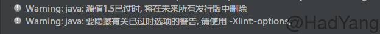

在使用IDEA创建Maven项目的时候，默认使用JDK 1.5版本，这样很多新版本的特性就不能使用。为了使用新特性（比如：Lambda表达式），必须在创建项目后进行手动修改，这样很麻烦，下面我就来介绍一个一劳永逸的方法。

<!--more-->

JDK1.5版本下，在运行项目时会出现以下警告：



网上有很多解决的办法，比如：http://blog.csdn.net/geekun/article/details/51325510 ，但是这种方法很是麻烦。下面就直接说说我的方法：

```
打开Setting -> File and Code Templates -> Other -> Maven -> Maven Project.xml
```

现在你应该在这个位置上：


然后将以下代码添加到右侧的代码框中（在 `${END}`之前）：

```
#set($JDK_VERSION="1.8")
    <properties>
        <maven.compiler.source>${JDK_VERSION}</maven.compiler.source>
        <maven.compiler.target>${JDK_VERSION}</maven.compiler.target>
    </properties>
```

现在你的代码应该是这样：


至此，完成了所有配置。现在再重新新建一个Maven项目，就可以看到项目默认JDK已经设置为 JDK1.8。
