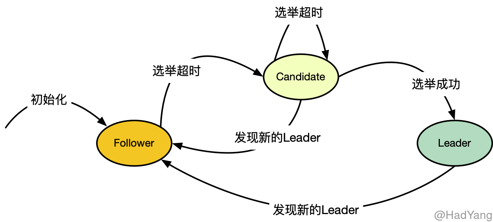
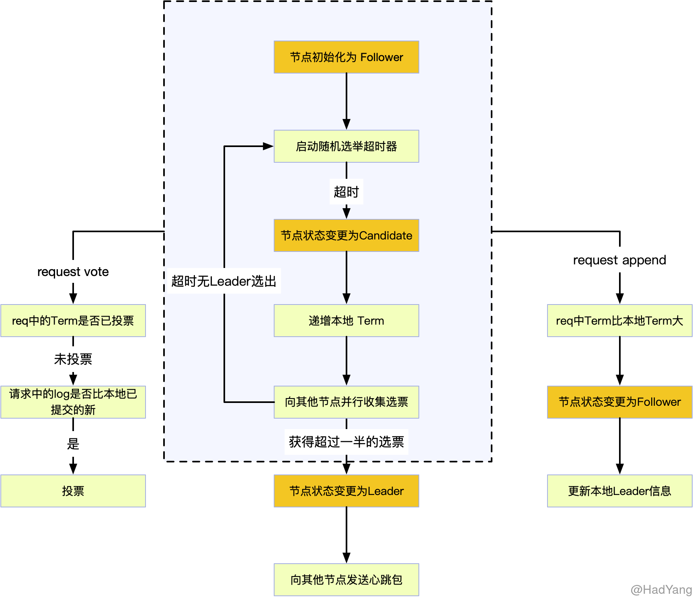
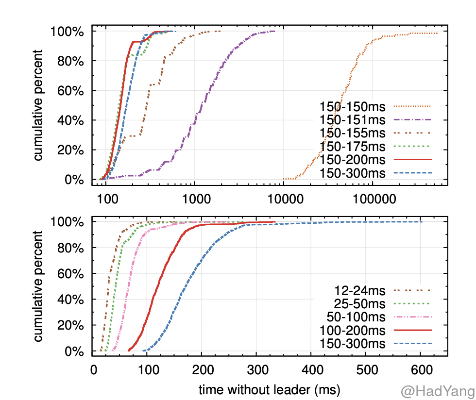

## Raft 简介

Raft 是一种共识算法，与 Paxos 有等效的容错能力和性能，同时又比 Paxos 更加容易理解。Raft 将共识问题拆分为几个独立的子问题，并且简单高效的解决了这些问题。

在之前的文章[《什么是共识算法？》](https://hadyang.github.io/2020/05/consensus/)中有详细介绍共识算法。共识通常出现在状态机复制的背景下，状态机复制是构建容错系统的通用方法。在状态机复制集群中，每个服务器都有一个 **状态机** 和一组 **日志**，这个状态机就是我们需要容错，比如一个 KV 存储。

对客户端来说，即使其中小部分的服务器故障，整个集群的表现和单个可靠的状态机一致。每个状态机从日志中获取输入，共识算法就是要协调多个服务器在日志的顺序上达成共识。共识算法保证如果任意一个状态机将输入 $input_i$ 作为 $command_i$ 执行，那么所有状态机中一定存在 $command_i=input_i$。每个状态机都会以相同的顺序执行相同的命令，因此会产生一系列相同的输出并且到达相同的状态。


## Raft 共识算法

Raft 通过选举产生的 Leader，并让 Leader 管理日志复制来实现共识。Leader 从客户端接受日志，把日志复制到其他服务器，并当 “安全” 时将日志应用到自己的状态机。选举 Leader 可以简化日志复制的复杂度，比如，Leader 可以决定放置新日志的位置，而不需要与其他服务器交互，并且日志的复制模型也很简单。当 Leader 故障或与其他服务器断开连接后，就会开启新一轮的选举过程。

Raft 在始终保证以下五个属性：

- **选举安全**：在一个任期内最多只会选举出一个 Leader
- **Leader 不覆盖日志**：Leader 不会对自己的日志进行覆盖，只会追加日志条目
- **日志一致性**：如果两个日志序列包含具有相同索引和任期的日志条目，则直到这个日志条目的所有日志条目都是相同的
- **Leader 日志完整性**：日志条目在某个任期被提交，则在之后的任期中，该条目都不会消失
- **状态机安全**：如果一个日志在某节点的状态机上被应用，则不会存在相同索引的不同日志条目被应用到状态机

Raft 将整个共识问题分为了三个子问题：**选举**、**日志复制**、**安全性保证**。这三个子问题，会分为三个文章进行介绍。


## 节点状态

在任意时刻，Raft 集群中的节点均处于以下三种状态之一：**Leader**、**Follower** 和 **Candidate**。通常情况下，集群中只有一个 Leader，其他节点均为 Follower。

Follower 是被动的，它们本身不发出请求，只是响应 Leader 或 Candidate 发出的请求。 Leader 会处理所有的客户端请求，如果客户端请求到 Follower ，Follower 会把请求转发到 Leader。Candidate 是集群选举过程中的一个中间状态。



如果 Follower 在选举超时时间内没有收到请求，则其状态会变更为 Candidate，并且开始选举过程。当 Candidate 获取到集群中大多数节点的选票后，其状态变更为 Leader。通常来说， Leader 状态会持续到 Leader 节点故障。

## 任期

Raft 协议将现实中的时间划分为任意长度的 **Term（任期）**，Term 是连续增长的整数。每个新的 Term 都伴随一次选举，当 Candidate 获取到大多数节点的选票后，Candidate 就作为集群中这个 Term 的 Leader。在某些情况下，会出现多个 Candidate 选票数一样的情况，这种情况下，当前的 Term 就会直接结束，并开启下一轮选举。


不同的节点可能会在不同的时间观察到 Term 的变化，甚至节点可能对选举过程完全无感知（节点已失效）。 Term 在集群中作为 **逻辑时钟**，每个节点都会保存一个 “当前任期” 的变量，这个变量是单调递增的，这样就可以让节点检测到集群的 Leader 是否已经变化。

节点每次请求的时候，都会携带当前节点 “当前任期”，如果一个节点接受到比自己 “当前任期” 大的请求，则更新自己的 “当前任期”。如果 Candidate 或者 Leader 发现有比自己大的 “当前任期”，则会将自己的状态转变为 Follower。如果节点接收到比自己小的 “当前任期” 的请求，则会拒绝该请求。


## 选举

在 Raft 协议中，节点之间通过 RPC 进行通信。一般情况下有两种请求： `RqeustVote` 和 `AppendEntries`，第一个请求用作获取选票，第二个请求用作日志复制和心跳包（当 Entries 为空时）。下面是 `RequstVote` 的请求和响应：

```protobuf
message RequestVoteRequest {
    uint64 term = 1; // 候选人的任期号
    uint64 candidate_id = 2; //	请求投票的候选人 id
    uint64 last_log_index = 3;// 候选人最新日志条目的索引值
    uint64 last_log_term = 4;//	候选人最新日志条目对应的任期号
}

message RequestVoteResponse {
    uint64 term = 1; //目前的任期号，用于候选人更新自己
    bool vote_granted = 2;//如果候选人收到选票为 true
}
```

Raft 协议中，所有节点初始均为 Follower 状态，初始化本地数据后，就会启动一个 **随机** 的选举超时器。在选举超时器过期前，如果收到来自 Leader 的 `AppendEntries` 请求，则会对请求信息与本地信息进行比对，如果满足条件则当前集群有合法 Leader。

如果在 **选举超时** 时间内 Follower 没有收到心跳包，则 Follower 会认为当前集群无合法 Leader ，并发起新一轮的选举。如下图所示：



在将本节点变更为 Candidate 后，递增本节点的 Term。向本节点投票，并且向其他节点并发的发起 `RequstVote` 请求。 Candidate 只有在以下两种情况才会迁移状态：

1. Candidate 获得超过半数的投票
2. Candidate 收到合法 Leader 的 `AppendEntries` 请求

当出现选票分裂（多个 Candidate 均未拿到合法选票个数）时，Raft 会再次启动随机的选举超时器，用于进行下一次选举。通常，随机的时间范围在 `150ms ~ 300ms` 之间，通过随机打散各个节点的超时时间，在大多数情况下只会有一个节点超时，发起下一次选举。这种随机超时的方式，示 Raft 能有效减小再次出现选票分裂的概率。


### 超时时间的选择

这里借用 Raft 论文中的一个测试结果，这里测试是在 5 个节点的环境中，并且心跳间隔在 15ms 左右。两幅图中，上面的图是改变了超时时间的随机性，下面的图是改变了超时时间的最小值。可见，**随机性越大，最小超时时间越小，整个集群无 Leader 的时间就越短**。



这里解释下上面的结果，横坐标代表集群中没有 Leader 的时间，纵坐标代表实验次数的占比。比如 100~200ms 这条线，表示集群中的 “选举超时时间” 在100~200ms，并且在多次实验中，超过90%的实验无 Leader 的状态少于 200ms。


### Leader 合法性

在处理 Candidate 的 `RequstVote` 请求时，不止要比较 Term，还需要比较 Log 的信息。这里校验时需要保证 Leader 的合法性， Leader 的合法性就体现在其日志是否是 **最新** 的。

在所有 **Leader-Base** 的共识算法中，**Leader 必须保存所有已提交（包含前任 Leader 提交的）的日志**，同时 Leader **不能覆盖** 已提交的日志。这就意味着，整个集群中日志数据的流向是 **单一** 的 —— 从 Leader 到 Follower，大大简化了集群交互机制。

Raft 通过一个简单的方法来保证 **Leader 保存所有已提交的日志**：在选举过程中 Candidate 必须与 **超过半数** 的节点进行交互，这就意味着每个已提交的日志，至少存在于这些节点中的一个节点上（日志提交要求至少半数以上的节点确认）。如果 Candidate 的日志对于大多数节点来说都是 “最新” 的，那么可以认为 Candidate 包含所有已提交的日志，则这个选举出来的 Leader 是合法的。

> “最新”：如果 `RequstVote` 请求中的 `last_log_term` 于本节点 `last_log_term` 相同，则更大的 `last_log_index` 为最新；如果 `last_log_term` 与本节点 `last_log_term` 不同，则 Term 大的为最新。


## 参考文档

- [The Raft Consensus Algorithm](https://raft.github.io/)
- [In Search of an Understandable Consensus Algorithm](https://raft.github.io/raft.pdf)