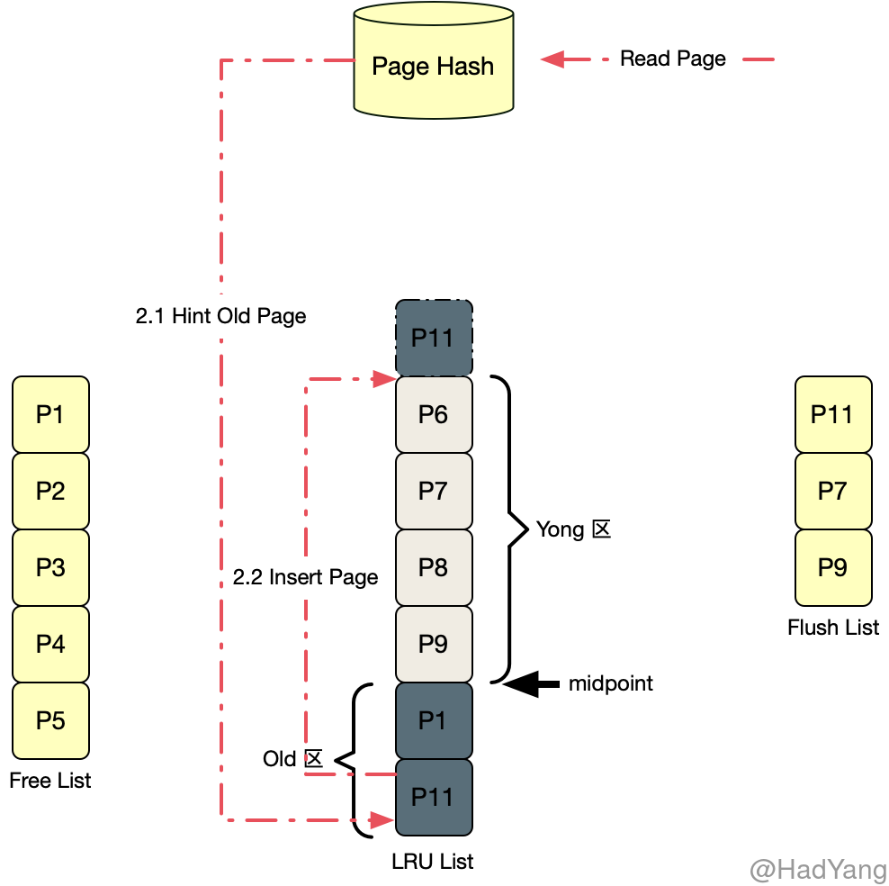
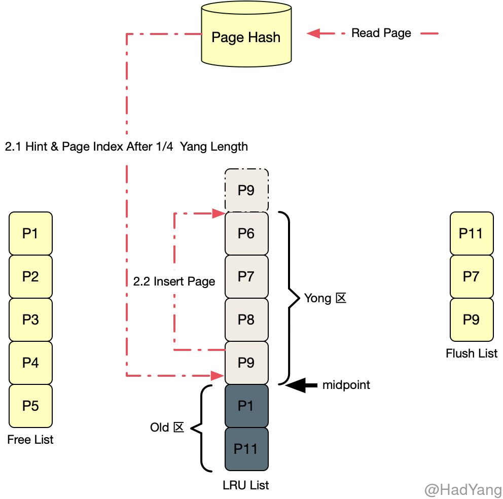

## Buffer Pool

Innodb 启动时会划分一片连续的内存空间，并将这些内存空间分配给多个 Buffer Pool Instance，每个 Buffer Pool Instance 都会维护一组 Buffer Pool 模块，拥有独立的锁、Mutex、Buffer Chunk 以及各种链表 Instance 可以并发的访问。Innodb 中的 Page 会被分配到不同的 Buffer Pool Instance 中，各个 Instance 中的 Page 不重合。

Buffer Pool 中包含物理页面的缓存，包括索引页、数据页、Undo页，还包含 Change Buffer、AHI 以及Innodb的锁信息。当 Innodb 访问物理页面时，会先从对应 Buffer Pool Instance 中的 Buffer Pool 查找该页面的缓存，若未找到则从磁盘读取该页面，并加载到 Buffer Pool 中。

### Buffer Chunk

Buffer Chunk 是 Buffer Pool 中实际存储数据的物理结构，每个 Buffer Pool 包含一个或多个 Buffer Chunk。每个 Buffer Chunk 都包含一个 Block 数组，Block 数组中的每个元素是一个数据页控制体，其中包含了一个指向具体数据页的指针，以及对应的数据页控制体。

### 页链表

页链表中的元素，均为数据页控制体 `buf_page_t`

#### Free List

管理未使用的空闲数据页，在 Buffer Pool 初始化时，会将 Buffer Chunk 中所有 Page 均加入 Free List。当 Buffer Pool 需要使用 Page 时，先从 Free List 中获取空闲页。若获取失败，则会进行页淘汰策略，将 LRU List 中最近最少使用的页（Old 区末尾的页）淘汰掉，若淘汰的页为脏页，则会触发 Flush 操作。

#### LRU List

管理已使用的页，当 Innodb 刚启动时 LRU List 是空的，随着开始处理 SQL 请求 Innodb 会从 Free List 中获取空闲的页，加入 LRU List。相比于朴素的 LRU 列表，Innodb 中的 LRU List 中加入一个 **midpoint** 位置，将 LRU List 分割为 Yong 和 Old 两个区。Yang 区保存较热数据，Old 区保存刚从数据文件中读取出来的数据。

对于 Innodb 对页的请求，首先会从 Page Hash 中进行判断，根据不同结果有以下三种处理方式：

1. Page Hash 中未找到该页（说明该页不存在于 LRU List），则从磁盘中读取该页加入到 Old 区头部

2. Page Hash 中找到该页，并且该页位于 Old 区，读取完该页后将其加入 Yang 区头部

3. Page Hash 中找到该页，并且该页位于 Yang 区，读取完该页后，若该页位于 Yang 区的 1/4 位置之后，则将其插入 Yang 区头部

相比于朴素的 LRU 算法，Innodb 采用了相对精细化的 LRU 算法。避免一些 **一次性读取** 将热点数据挤出缓存，比如对于一些全表扫描来说，若直接将页加入 LRU 头部，则会导致热点数据被淘汰，整体效率下降。

#### Flush List

管理已修改但尚未 Flush 的页，Flush List 上的页在 LRU List 一定同时存在，反之则不成立。在 Flush List 上的 Page 按其最早修改时的 LSN 降序排列，最小的 LSN 位于链表的尾部，每次 Flush 都是从尾部开始。

### Page Hash

LRU List 中 Page 的字典，每个 Buffer Pool 都包含一个独立的 Page Hash，其作用主要是为了避免对 LRU List 的全链表扫描，通过使用 `Space_id` 和 `Page_no` 就能快速找到已经被读入 Buffer Pool 的 Page 。

缓存更新策略

- **Cache Aside** 懒加载模式，客户端请求缓存数据，若缓存中不存在该数据，则客户端再从底层数据源获取数据，并更新到缓存中
- **Read Through** 缓存代理模式，客户端请求缓存数据，若缓存不存在该数据，则缓存层从底层数据源获取数据，加载到缓存，并返回给客户端。

Read Through 与 Cache Aside 类似，但代理了底层数据源，客户端不需要关心缓存未命中的情况。Innodb 使用的是 Read Through 模式

缓存具有两种基本的写入方式：

- **直写式**（Write Through）：将数据同步写入缓存和后端存储设备。
- **回写式**（Write Back）（也叫做后写式）：首先，将数据写入缓存。然后，缓存会延缓将这些数据写入至后端存储设备，直到缓存块包含的数据即将被新的数据修改/替换。

## DoubleWrite

DoubleWrite 是 Innodb 数据安全的保证，由于 Innodb 的页大小（默认）为 `16KB`，而一般的磁盘簇大小为 `4KB`。因此可能存在只写入前 `4KB` 数据，然后宕机的情况，这种就称为 **部分写失效**（Partial page write）。部分写失效就可能导致数据丢失，为防止这种情况，Innodb 采用 DoubleWrite 机制。

1. DoubleWrite 机制使用内存中的 DoubleWrite Buffer 存储从 Innodb Flush List 中准备写入的页
2. 将 DoubleWrite Buffer 中的数据页写入磁盘的系统表空间中，并调用 fsync （连续写）
3. 完成 DoubleWrite 写入后，再将 DoubleWrite Buffer 中的页逐个写入对应的文件中 （离散写）

## Change Buffer

与聚集索引不一样，二级索引通常是非唯一的，并且 **二级索引的插入顺序相对比较随机**。相似地，删除和更新操作影响的二级索引页在索引树上也不是相邻的。为解决这个问题，Innodb 引入了 Change Buffer 机制。Change Buffer 是一个特殊的数据结构，当非唯一二级索引页不在 Buffer Pool 时，保存其修改的索引页。缓存的修改页，可能是 INSERT、UPDATE 或者 DELETE 操作产生的，当这些修改页由于用户读取操作加载到 Buffer Pool 时合并。这样就可以有效避免将二级索引页从磁盘读入 Buffer Pool 带来的频繁随机 IO。

在内存中，Change Buffer 会占用一部分 Buffer Pool 。在磁盘上，Change Buffer 是系统表空间的一部分，当服务关闭时将索引改变缓存在其中。另外，Change Buffer 不支持包含倒排索引的二级索引，或者主键包含倒排索引。

修改页存储在 Change Buffer 中，在下面三种时机下会将修改合并到二级索引

1. 修改页被读入 Buffer Pool
2. Insert Buffer Bitmap 页追踪到该二级索引页上已无可用空间
3. Master Thread 定时合并

当修改页由于用户或系统操作读取到 Buffer Pool 时，检查 Insert Buffer Bitmap 确认该二级索引页是否有修改。若有，则将对该页的修改都合并进去。

**Insert Buffer Bitmap** 页用来追踪每个二级索引页的可用空间，若插入二级索引时发现本次插入会导致索引页可用空间小于 1/32 页，则会强制读取二级索引页，将 Change Buffer 中的修改合并进去。

Master Thread 会定时将 Change Buffer 中的修改合并到索引页中。

### Change Buffer 实现

Change Buffer 内部是一个 B+树，并且全局（所有表）只有一个，负责对所有表的二级索引进行 Change Buffer。而这个 B+ 树结构就存储在系统表空间中。 Change Buffer 中 B+ 树的所有节点都包含 `spaceid` 和 `offset` ，用于标记表空间和索引页的偏移地址。

因为在启用 Change Buffer 后，二级索引页的记录可能插入 Change Buffer ，为了保证每次合并 Change Buffer 都能成功，Innodb 使用一个特殊的页标记每个二级索引页的可用空间，这个页就是 Insert Buffer Bitmap。

Insert Buffer Bitmap 标记了每个页的可用空间，以及该页是否有记录被缓存在 Change Buffer 中。
