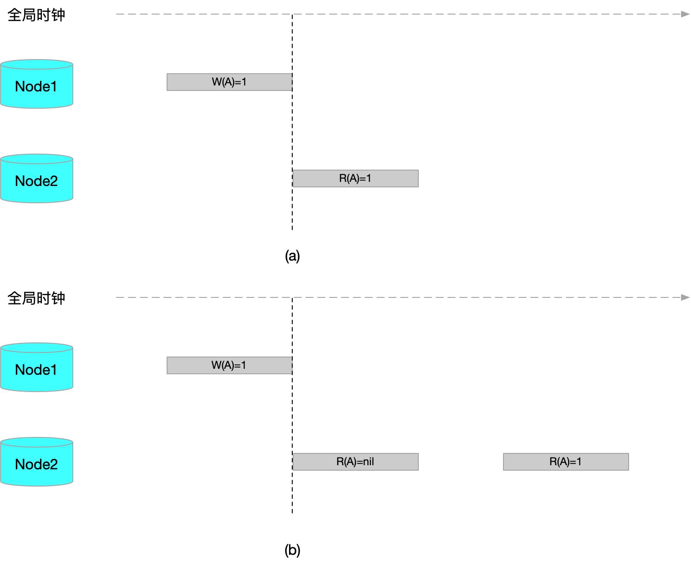
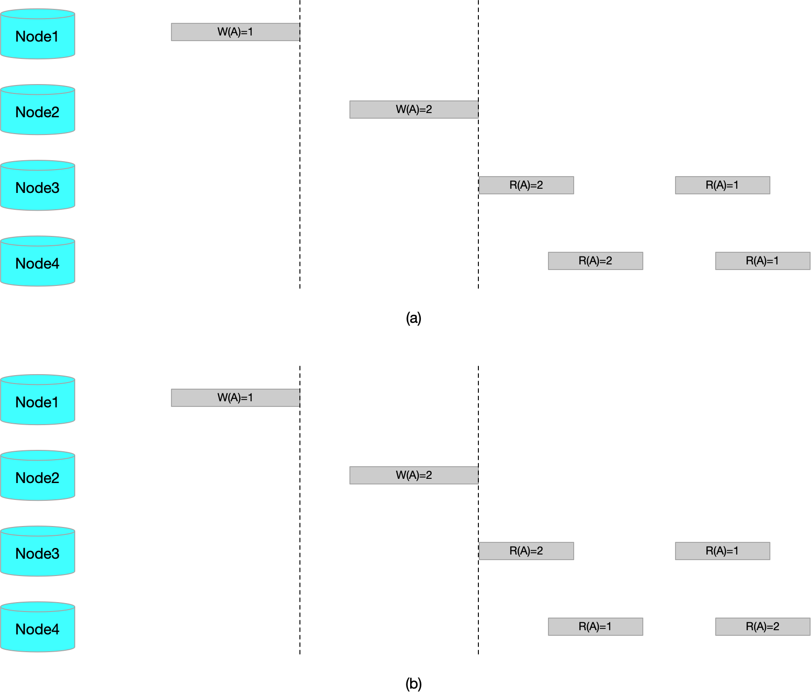
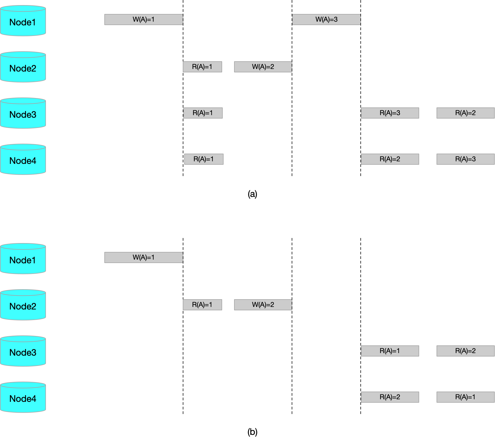
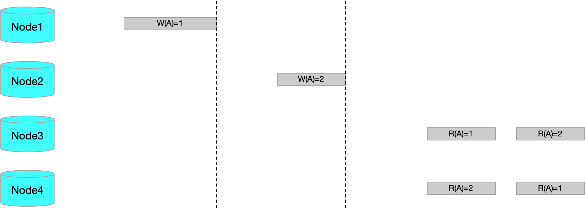
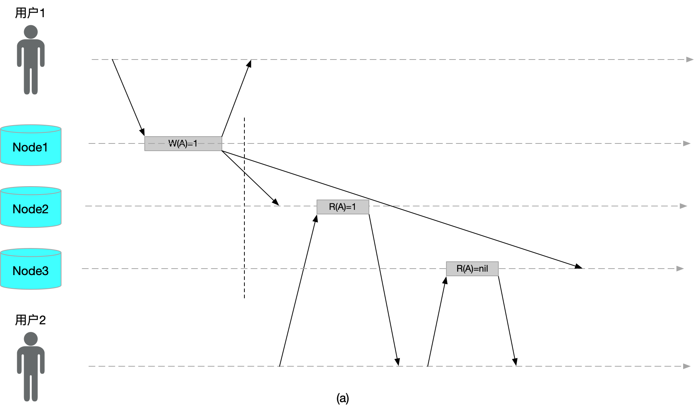
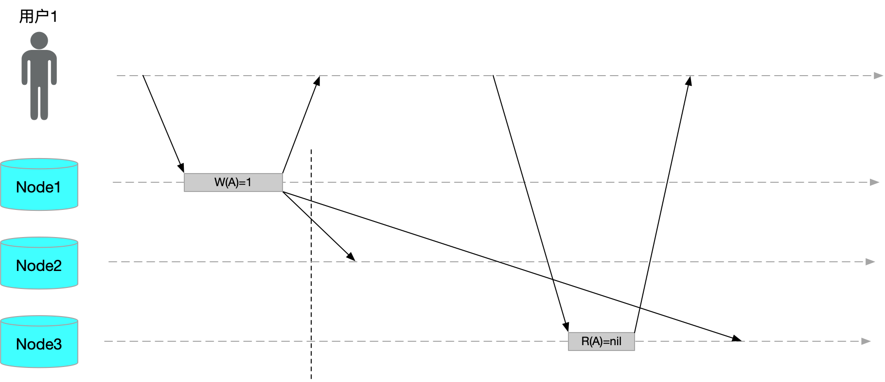

## 一致性的含义

在计算机领域，一致性的使用场景是多样的，在不同的场景下其含义也大相径庭，主要包括：事务一致性、分布式一致性以及一致性哈希。

**事务一致性** 是事务 ACID 特性中的一项，主要是指对数据有特定的预期状态，任何数据修改必须满足这些状态。事务一致性本身应属于应用层的属性，因为数据的预期状态，即约束，是应用层的状态。应用程序可以借助数据库的原子性、隔离性以及持久性来实现一致性。

**一致性哈希** 是一种 **负载均衡** 的算法，不是一种哈希算法。一致性哈希常常用于集群中，节点失效后数据的平滑过渡，以减少数据的大量迁移。

**分布式一致性** 主要是针对分布式环境中，针对各节点之间的延迟和节点失效等问题来协调副本之间的状态。分布式一致性可以分为两类场景： **分布式事务** 和 **状态机复制** ，两者的区别在于各节点数据是否互为副本。通常来说，分布式事务是协调多个节点上的不同数据，以达到数据一致。而状态机复制则是同一份数据的多个副本。

下面就聊聊状态机复制与分布式一致性的问题，造成分布式一致性问题的原因主要有两个： **并发写** 和 **网络延迟**。在大多数的复制场景下，我们都会选择一主多从的集群架构，以此来解决并发写的问题。

## 线性一致性

线性一致性，又被称作强一致性、原子一致性，是分布式一致性中最强的一致性模型。原子一致性指在分布式环境中，数据存在于集群中多个节点，当数据被写入集群中一个节点后，其他所有节点对数据都是 **立即可见** 的，并且操作是 **原子** 的。

> 比较文本化的定义如下：任何对数据 $A$ 的读取，均返回最近一次写的结果。

> 上图中，a 满足线性一致性，b 不满足线性一致性

线性一致性是最严格的模型，在这个模型下，用户每次查询都能返回期望的值，是确定的。但是在分布式环境中，很少有保持线性一致性的系统，因为这样做的代价太高，会牺牲系统的可用性。

## 顺序一致性

顺序一致性是相比于线性一致性弱一些的一致性模型，顺序一致性的定义如下：如果对集群的读写操作与每个节点执行这些操作的顺序一致，则认为集群拥有 **顺序一致性**。

在顺序一致性中，没有读最近写的要求。因此相比与线性一致性，顺序一致性少了实时性的要求。可以把线性一致性定义为具有实时约束的顺序一致性。

> 上图中，a 满足顺序一致性，b 不满足顺序一致性

上图中，b 不满足顺序一致性的点在于，Node3 读取顺序与 Node4 读取顺序不一致。可以看出，a 中的数据并不满足全局时钟的顺序，但是同样满足顺序一致性。

## 因果一致性

因果一致性要求对于两个有因果关联的操作结果，必须以相同的顺序对所有节点可见。因果一致性是比顺序一致性弱的一致性模型，并发的写入在不同节点看到的顺序可能不一致。

> 上图中，a 满足因果一致性，b 不满足因果一致性

上图中，a 满足因果一致性，Node3 和 Node4 读取的顺序并不一致，其实 Node3 反应的是 Node1 的写入因果顺序，然后才是 Node2 的写入，而 Node4 恰好相反。b 不满足因果一致性的点在于，不存在 Node3 读取的因果顺序。

与顺序一致性相比，可以发现，即使不存在并发写入，那么因果一致性与顺序一致性还是不一样的。下图就是满足因果一致性但不满足顺序一致性。

## 单调读一致性

单调读一致性是比线性一致性弱，但是比最终一致性强的保证。当读取数据时，单调读保证，如果某个用户依次对 $A$ 进行多次读取，则不会看到回滚现象，即在读取较新值后又发生读旧值的情况。

上图就是不符合单调读的情况，这种情况的出现主要是因为，异步复制导致数据延迟。实现单调读的一种方式是，确保每个用户总是从固定的同一副本执行读取操作。当该副本失效后，则用户读请求转发到其他副本。

## 读写一致性

读写一致性，也称为写后读一致性，即用户总能看到自己最近提交的更新。但是对其他用户则没有这种保证。

上图就是不符合读写一致性的情况，要让用户获得读写一致性，可以考虑以下方案：

- 如果用户访问可能被修改的内容，则从主节点读取，否则在从节点读取
- 跟踪最近更新时间，如果在主从同步延迟时间之内，则从主节点读取，否则在从节点读取

## 最终一致性模型

最终一致性是一种很弱的一致性模型，指的是多个节点的数据不一致是暂时的状态，如果没有更多的数据写入，则经过一段时间后，所有副本最终后呈现一致的状态。

理论上来说，最终一致性没有延迟的上限。正常情况下，数据复制可能只有不到1秒的延迟，但是如果系统已接近设计上限，或网络存在问题，则延迟的时间窗口可能增加到几分钟。

## CAP 定理

CAP 定理是在分布式系统实践中的经验法则，CAP 定理的内容是针对一个分布式系统，不能同时满足以下三点：一致性、可用性和分区容错性。

- **一致性**（Consistency）：等同原子一致性，即强一致性
- **可用性**（Availability）：每次请求都能获取到非错的响应，但是不保证获取的数据为最新数据
- **分区容错性**（Partition tolerance）：分区相当于对通信的时限要求。系统如果不能在时限内达成数据一致性，就意味着发生了分区的情况。

在分布式系统中，节点分区是常见的，所以分区容错是必须保证的。在这种情况下，我们就需要对 C 和 A 进行权衡。例如现在有 P1 和 P2 两个分区，如果我们允许单个分区进行数据更新，那么就会丧失（强）一致性；如果我们不允许单个分区更新，那么就会导致两个分区均处于不可用状态，丧失可用性。

## 参考文档

- [一致性哈希](https://zh.wikipedia.org/wiki/%E4%B8%80%E8%87%B4%E5%93%88%E5%B8%8C)
- [CAP定理](https://zh.wikipedia.org/wiki/CAP%E5%AE%9A%E7%90%86)
- [Consistency model](https://en.wikipedia.org/wiki/Consistency_model#Strict_consistency)
- [Distributed Systems:Replication and Consistency](https://www.cs.helsinki.fi/webfm_send/1256)