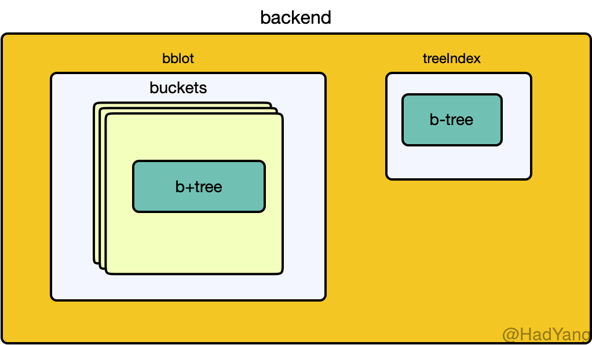

ETCD 服务端提供强一致性的 KV 存储，其整体结构在[《初识ETCD》](https://hadyang.github.io/2020/07/etcd-overview/) 中介绍过其组成部分，这里再详细的介绍其底层物理存储结构。ETCD 中底层存储就是 `Backend` 这个接口，其主要提供读写事务的能力。Backend 的组成如下图所示，包含 bblot 和 treeIndex 两个部分。



## bblot

实现上，ETCD 目前（v3.4.9）是采用 [bbolt](https://github.com/etcd-io/bbolt) 数据库，这个数据库是一种内置的数据库，和 sqlite 有些相似。bbolt 是纯 go 语言编写的 KV 数据库，其提供简单、高效并且可靠数据存储，但不能提供类似 MySQL 这种数据库的全部功能。

bblot 可以提供有效的数据一致性和线程安全保证，但是其在处理并发上有些欠缺。 bblot 允许多个读事务并行，但只允许 **同时存在一个写事务**，当同时开启多个写事务时，事务会被阻塞直到上一个写事务完成。

bblot 的数据存放在单独的文件中，一个数据库文件也就对应一个 **DB**。在 DB 内对存储按 **Bucket** 组织，每个 DB 有都有一个 **rootBucket**，其在 DB 创建时就会初始化。然后，每个 rootBucket 下可以拥有多个 **subBucket** 如下图所示，是一个树型结构。Bucket 可以理解为命名空间， Bucket 内部是一颗 [B+ 树](https://hadyang.github.io/interview/docs/basic/algo/tree/#b%E6%A0%91-1)。


ECTD 提供 MVCC 的能力，看起来 bblot 本身并不提供这种支持。所以 ETCD 在 bblot 中存储的不是用户提交的 KV 数据，而是将 **revision** 作为键，将 KV 数据以及一些其他辅助信息存储为值。 

`revision` 表示键空间的修改，其拥有两个属性： `main` 表示一次键空间的原子操作（事务提交）， `sub` 表示单个事务内部的多次修改。每次事务（单Key的写入也会开启事务）提交后 `main` 都会递增。

```go
type revision struct {
	main int64
	sub int64
}
```

bblot 中存储的值包含用户提交的 KV 、版本信息以及 Lease。

```go
type KeyValue struct {
	Key []byte 
	CreateRevision int64
	ModRevision int64
	Version int64 
	Value []byte
	Lease int64
}
```

## TreeIndex

为了加速用户 Key 的查找，ETCD 还将 KV 数据中的 Key 单独存放。使用一个 `treeIndex` 数据结构存放 Key，其内部是一个 [B 树](https://hadyang.github.io/interview/docs/basic/algo/tree/#b%E6%A0%91)。 `treeIndex` 是存储在 **内存** 中的，用于加速 Key 的查找，并且在每次服务启动的时候进行初始化，**加载 DB 中的数据进行构建**。`treeIndex` 中键存储的是 `keyIndex` 结构，包含 Key 以及 `generation` 信息。

```go
type keyIndex struct {
	key         []byte
	modified    revision
	generations []generation
}
```

每个 `keyIndex` 都至少包含一个 `generation`，每个 `generation` 都表示 Key 的一个生命周期。当 Key 被删除时，会将当前的 `generation` 标记为删除，并生成新的空 `generation`。

```go
type generation struct {
	ver     int64
	created revision
	revs    []revision
}
```

对某一个 Key 进行一系列操作：`put(1.0);put(2.0);tombstone(3.0);put(4.0);tombstone(5.0)`，会生成如下数据：

```bash
rev: 5
generations:
   {empty}
   {4.0, 5.0(t)}
   {1.0, 2.0, 3.0(t)}
```

当进行数据压缩时，如果 `generation` 中包含的 revision 小于被压缩的 revision，则 `generation` 中的 revision 会被移除：

```bash
compact(2) on the previous example
generations:
   {empty}
   {4.0, 5.0(t)}
   {2.0, 3.0(t)}
```

如果 `generation` 中所有的 revision 都被压缩了，则 `generation` 会被移除：

```bash
compact(4)
generations:
   {empty}
   {4.0, 5.0(t)}
```

如果 `keyIndex` 中所有的 `generation` 都被移除，则 `keyIndex` 会被移除：

```bash
compact(5):
generations:
   {empty} -> key SHOULD be removed.

compact(6):
generations:
   {empty} -> key SHOULD be removed.
```