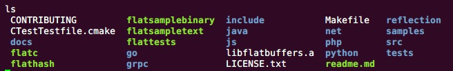
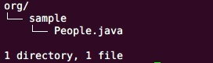

`FlatBuffer`是一个跨平台的序列化库，可以在C++,C#, C, Go, Java, JavaScript, PHP, Python语言中使用，最初这个库是Google为游戏开发中所使用，其源代码地址在[Github](http://github.com/google/flatbuffers)。FlatBuffer提供了详细的使用文档，可以参考[Google.github.io](http://google.github.io/flatbuffers/index.html)主页上的教程。

<!--more-->

### 编译

`FlatBuffer`主要使用`flatc`程序进行操作，`flatc`是通过编译`FlatBuffer`的源码生成的。由于FlatBuffer是跨平台的，所以`FlatBuffer`提供了不同平台上编译可执行文件`flatc`的方法，我们这里使用Linux环境对FlatBuffer进行编译。

#### 安装gcc g++环境

编译FlatBuffer使用的是CMake工具，CMake需要使用到gcc和g++编译工具。首先查看Linux中是否安装gcc 和 g++：

```
gcc -v
g++ -v
```

如果没有安装则先安装gcc 和 g++

```
yum install gcc
yum install gcc-c++
```

接下来就需要安装CMake，下载CMake源码进行编译安装

```
wget https://cmake.org/files/v3.5/cmake-3.5.2.tar.gz
tar -zxvf cmake-3.5.2.tar.gz
cd cmake-3.5.2/
sh bootstrap
gmake
make install
```

下面就可以编译`flatc`程序

```
cd flatbuffers/
cmake -G "Unix Makefiles"
make
```

这样就生成了flatc, flatctest等一系列的可执行文件，其中flatctest是用来测试程序是否正确生成，接下来我们就可以正式开始FlatBuffer的使用。



### 使用

#### Schema

不同于JSON，FlatBuffer使用Schema来定义数据的结构，这里先给出一份简单的Schema，更加高级的使用以及相关语法请参见[Google官方的Schema](http://google.github.io/flatbuffers/flatbuffers_guide_tutorial.html)。

```
namespace org.sample;

table People {
  name:string;
  age:int;
}
root_type People;
```

将该Schema命名为sample.fbs并保存，接下来就可以通过flatc来编译这个Schema

```
./flatc --java sample.fbs
```

这是就会在当前目录下生成相关的java代码，可以从生成的代码结构看出，Schema中的`namespace`就是Java中的包名，`table`就相当于Java类，`root_type`是每个Schema文件必须的属性。



#### 序列化

将生成的包导入Java工程，同时还需要将`flatbuffers/java`路径下的com文件夹导入工程，这个文件夹下面是FlatBuffer需要依赖的jar包。下面上代码

```Java
FlatBufferBuilder builder = new FlatBufferBuilder(0);

int sun = builder.createString("Sun");

//下面向People中填充属性
People.startPeople(builder);
People.addName(builder, sun);
People.addAge(builder, 18);
int tom = People.endPeople(builder);

builder.finish(tom);
ByteBuffer buffer = builder.dataBuffer();
```

下面我们将序列化的数据进行反序列化

```Java
People people = People.getRootAsPeople(buffer);

System.out.println(people.name());
System.out.println(people.age());
```

到此我们简单的使用一下FlatBuffer，从上面的过程中可以看出FlatBuffer使用相比较于JSON比较繁琐，但是从官方的数据来看性能比较好。
