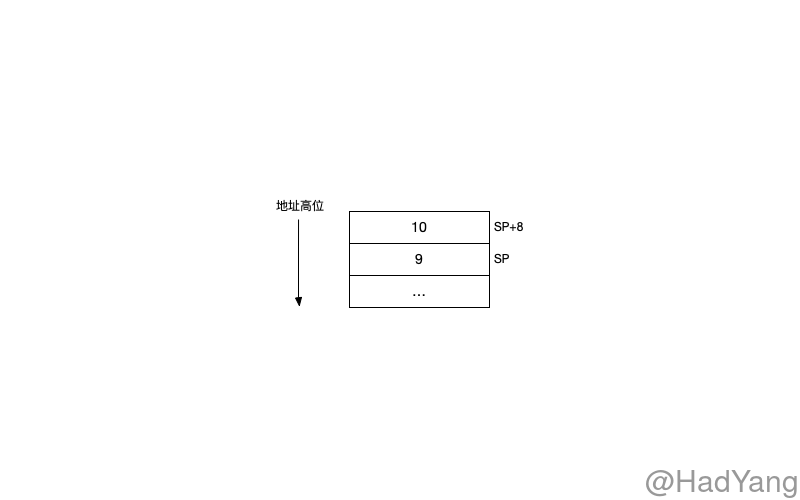
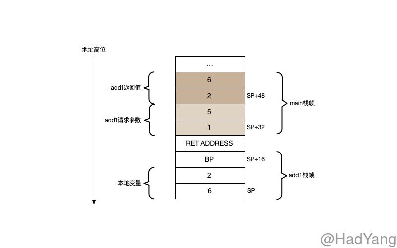

Go 的汇编代码基于 [Plan 9](https://9p.io/sys/doc/asm.html) 进行改造的，提供一种半抽象的语义。其中有两个很大的不同，一个是操作符的优先级不同，Go 汇编会使用 Go 语言的优先级；第二个是负数的表示，在 Go 汇编中数字都是无符号的 64bit 表示，所以负数在汇编中不会表达位 “负”，而是与负数位相同的无符号 64bit 数字。

## 寄存器

某些符号是预定义寄存器符号，并且与特定的 CPU 架构有关，例如：`R1`、`LR`。在 Go 汇编中定义了四个 **伪寄存器** ，伪寄存器由 Go 维护不存在物理上的寄存器，伪寄存器在不同的 CPU 架构上含义均一致。

1. `FP`: 栈帧指针，用于函数参数和本地变量
2. `PC`: 指令计数器，用于分支和指令跳转
3. `SB`: 静态基地址，指向全局变量
4. `SP`: 栈指针，指向当前栈顶

`SB` 伪寄存器可以用来获取符号的内存地址，比如 `foo(SB)` 表示符号 `foo` 的内存地址，通常使用这种方式来访问全局函数和数据。通过在符号后增加偏移量可以访问特定位置的数据，`foo+4(SB)` 访问 `foo` 后 4byte 的数据。

> `foo` 在这里只是一个标记，没有任何的语义

在官方的文档中[A Quick Guide to Go's Assembler](https://golang.org/doc/asm)，`FP` 伪寄存器用于访问函数参数；

在 Linux/amd64 go 14 版本下，Go 编译器生成的代码中，没有出现 `FP` 寄存器。在多方考证下，发现这个疑问也困惑者其他开发人员 [chapter1: Frame pointer](https://github.com/teh-cmc/go-internals/issues/2)。在 issues 的最后给出的结论是，该官方文档是针对手写 ASM 的介绍，Go 编译器的行为 **不一定遵守** 文档中的规则。

> And I've yet to see any assembly generated by the Go compiler that relies on the frame-pointer to reference anything. Have you?

## 函数的定义

`TEXT` 指令将符号 `"".foo` 声明为函数，在之后是 TEXT 指令的参数（`NOSPLIT`，`ABIInternal`）。最后的一组数组 `$32-24` 分别表示 32 byte 的 **栈帧大小** 和 24 byte 的 **参数长度**，参数长度包含请求参数和返回值。参数数据保存在 **调用函数** 的栈帧中，栈帧数据保存在 **被调用函数** 的栈帧中。

```text
TEXT	"".foo(SB), NOSPLIT|ABIInternal, $32-24
```

`SRODATA` 指令将符号 `go.string."SDD"` 声明为只读数据，`DUPOK` 表示单个二进制文件中可以有多个定义，但在 Link 阶段该符号会唯一对应一个地址，size 表示其二进制数据的大小（byte单位）

```text
go.string."SDD" SRODATA dupok size=3
    0x0000 53 44 44                                         SDD
```
## Go 栈布局

接下来，我们再通过汇编代码和 delve 工具研究下栈的布局。Go 中的栈是 **向下生长** 的，即向地址低位增长。栈空间上会存储本地变量、方法参数以及返回值，栈的布局也主要是考虑这些数据的存放。

```go
func swap(x, y int) (int, int) {
	x = x + 1
	y = y + 1
	return y, x
}

func main() {
	a, b := swap(1, 5)

	_, _ = a, b
}
```

上面的代码包含多参数、多返回值的情况，可以让我们更好的了解栈布局，通过 `go tool compile -S -l -N main.go > main.s` 查看汇编。

```text
MOVQ	$1, (SP)        ;
MOVQ	$5, 8(SP)      ;
...                     ; 本文中的汇编代码都删除了 PCDATA 和 FUNCDATA 指令，这两个指令均与 GC 有关，与本文关系不大
CALL	"".add1(SB)     ;
```

在调用 `add1` 之前，栈的布局如下



当执行 CALL 指令时，会将 SP 寄存器自动减少一个 byte ，并填充调用的返回地址。然后就执行具体的代码逻辑，其汇编代码如下

```
MOVQ	"".x+32(SP), AX     ;AX=x       计算a
INCQ	AX                  ;AX=AX+1
MOVQ	AX, "".a+8(SP)      ;a=AX
MOVQ	"".y+40(SP), AX     ;AX=y       计算b
INCQ	AX                  ;AX=AX+1
MOVQ	AX, "".b(SP)        ;b=AX
MOVQ	"".a+8(SP), AX      ;AX=a       填充返回值
MOVQ	AX, "".~r2+48(SP)   ;SP+48=AX
MOVQ	"".b(SP), AX        ;
MOVQ	AX, "".~r3+56(SP)   ;
```

通过 `add1` 的汇编代码我们能看出，`SP` 指针向下移动了 24byte，与栈帧的大小一致。在 `16(SP)` 的位置放入 `BP` 寄存器（栈基址寄存器），并将 `BP` 移动到 `16(SP)` 的位置。同时，我们可以发现 **`add1` 函数的参数是从 `main` 函数的栈帧中获取的**，并且返回值是紧跟在参数之上由 `add1` 直接写入。




Go 的汇编语言在结构上与 NASM 等有相似的地方，但语法上更多了一些提示信息。通过反编译代码，能更好的认识 Go 的底层实现。文中出现的各种指令、寄存器可以查看参考文档的链接。

## 参考文档

- [A Quick Guide to Go's Assembler](https://github.com/teh-cmc/go-internals/issues/21)
- [x86 and amd64 instruction reference](https://www.felixcloutier.com/x86/)
- [x86 Assembly/X86 Architecture](https://en.wikibooks.org/wiki/X86_Assembly/X86_Architecture)