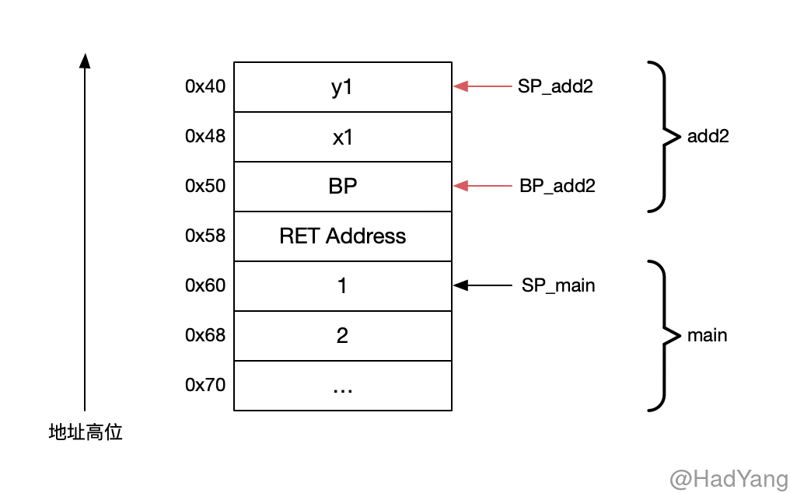
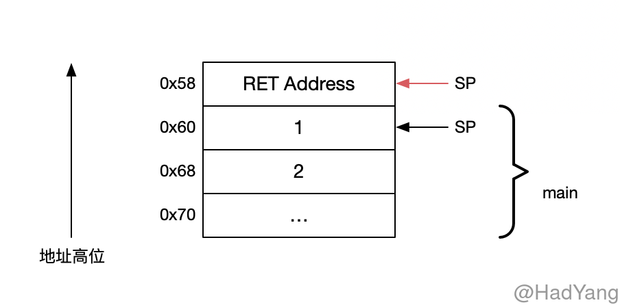

Go 的汇编代码基于 [Plan 9](https://9p.io/sys/doc/asm.html) 进行改造的，提供一种半抽象的语义。其中有两个很大的不同，一个是操作符的优先级不同，Go 汇编会使用 Go 语言的优先级；第二个是负数的表示，在 Go 汇编中数字都是无符号的 64bit 表示，所以负数在汇编中不会表达位 “负”，而是与负数位相同的无符号 64bit 数字。

## 寄存器

某些符号是预定义寄存器符号，并且与特定的 CPU 架构有关，例如：`R1`、`LR`。在 Go 汇编中定义了四个 **伪寄存器** ，伪寄存器由 Go 维护不存在物理上的寄存器，伪寄存器在不同的 CPU 架构上含义均一致。

1. `FP`: 栈帧指针，用于函数参数和本地变量
2. `PC`: 指令计数器，用于分支和指令跳转
3. `SB`: 静态基地址，指向全局变量
4. `SP`: 栈指针，指向当前栈顶

`SB` 伪寄存器可以用来获取符号的内存地址，比如 `foo(SB)` 表示符号 `foo` 的内存地址，通常使用这种方式来访问全局函数和数据。通过在符号后增加偏移量可以访问特定位置的数据，`foo+4(SB)` 访问 `foo` 后 4byte 的数据。

> `foo` 在这里只是一个标记，没有任何的语义

在官方的文档中[A Quick Guide to Go's Assembler](https://golang.org/doc/asm)，`FP` 伪寄存器用于访问函数参数；

在 Linux/amd64 go 14 版本下，Go 编译器生成的代码中，没有出现 `FP` 寄存器。在多方考证下，发现这个疑问也困惑者其他开发人员 [chapter1: Frame pointer](https://github.com/teh-cmc/go-internals/issues/2)。在 issues 的最后给出的结论是，该官方文档是针对手写 ASM 的介绍，Go 编译器的行为 **不一定遵守** 文档中的规则。

> And I've yet to see any assembly generated by the Go compiler that relies on the frame-pointer to reference anything. Have you?

文档中同时介绍了 `SP` 指令用户访问本地变量，并且常常以负数的偏移量出现。由于在某些架构下存在物理的 `SP` 寄存器，因此 `x-8(SP)` and `-8(SP)` 表示不同的地址。前者代表 `SP` 伪寄存器，后者代表物理 `SP` 寄存器。

下面，我们通过汇编来探究下具体情况。首先，定义一个函数 `add2`如下（为方便对应汇编和源码，下面把行号也写上）：

```go
12:	func add2(x, y int) int {
13:		x1 := x + 10
14:		y1 := y + 12
15:		return x1 + y1
16:	}
```

生成对应的 go 汇编代码，`go tool compile -S -l -N main.go > main.s`

```nasm
0x0000 00000 (main.go:12)	TEXT	"".add2(SB), NOSPLIT|ABIInternal, $24-24
0x0000 00000 (main.go:12)	SUBQ	$24, SP
0x0004 00004 (main.go:12)	MOVQ	BP, 16(SP)
0x0009 00009 (main.go:12)	LEAQ	16(SP), BP
...; 本文中的汇编代码都删除了 PCDATA 和 FUNCDATA 指令，这两个指令均与 GC 有关，与本文关系不大
0x000e 00014 (main.go:12)	MOVQ	$0, "".~r2+48(SP)
0x0017 00023 (main.go:13)	MOVQ	"".x+32(SP), AX
0x001c 00028 (main.go:13)	ADDQ	$10, AX
0x0020 00032 (main.go:13)	MOVQ	AX, "".x1+8(SP)
0x0025 00037 (main.go:14)	MOVQ	"".y+40(SP), AX
0x002a 00042 (main.go:14)	LEAQ	12(AX), CX
0x002e 00046 (main.go:14)	MOVQ	CX, "".y1(SP)
0x0032 00050 (main.go:15)	MOVQ	"".x1+8(SP), CX
0x0037 00055 (main.go:15)	LEAQ	(AX)(CX*1), AX
0x003b 00059 (main.go:15)	LEAQ	12(AX), AX
0x003f 00063 (main.go:15)	MOVQ	AX, "".~r2+48(SP)
0x0044 00068 (main.go:15)	MOVQ	16(SP), BP
0x0049 00073 (main.go:15)	ADDQ	$24, SP
```

对应可执行文件的汇编为

```nasm
main.go:12	0x10aae50	4883ec18		sub rsp, 0x18
main.go:12	0x10aae54	48896c2410		mov qword ptr [rsp+0x10], rbp
main.go:12	0x10aae59	488d6c2410		lea rbp, ptr [rsp+0x10]
main.go:12	0x10aae5e	48c744243000000000	mov qword ptr [rsp+0x30], 0x0
main.go:13	0x10aae67	488b442420		mov rax, qword ptr [rsp+0x20]
main.go:13	0x10aae6c	4883c00a		add rax, 0xa
main.go:13	0x10aae70	4889442408		mov qword ptr [rsp+0x8], rax
main.go:14	0x10aae75	488b442428		mov rax, qword ptr [rsp+0x28]
main.go:14	0x10aae7a	488d480c		lea rcx, ptr [rax+0xc]
main.go:14	0x10aae7e	48890c24		mov qword ptr [rsp], rcx
main.go:15	0x10aae82	488b4c2408		mov rcx, qword ptr [rsp+0x8]
main.go:15	0x10aae87	488d0408		lea rax, ptr [rax+rcx*1]
```

可以看到，`16(SP)` 对应 `rsp+0x10` 、`"".x+32(SP)` 对应 `rsp+0x20`，带前缀和无前缀的 `SP` 寄存器中，最终的 **指令都对应物理的寄存器**（至少在 amd64 上是这样的）。

## 函数的定义

Go 汇编中，通过各种指令将 TEXT 和 DATA 绑定到符号上。 `TEXT` 指令将符号 `"".add2` 声明为函数，在之后是 TEXT 指令的参数（`NOSPLIT`，`ABIInternal`）。最后的一组数组 `$24-24` 分别表示 24 byte 的 **栈帧大小** 和 24 byte 的 **参数长度**，参数长度包含请求参数和返回值。参数数据保存在 **调用函数** 的栈帧中，栈帧数据保存在 **被调用函数** 的栈帧中。

```nasm
0x0000 00000 (main.go:12)	TEXT	"".add2(SB), NOSPLIT|ABIInternal, $24-24
```

## Go 栈布局

接下来，我们再通过汇编代码和 delve 工具研究下栈的布局。Go 中的栈是 **向下生长** 的，即向地址低位增长。还是通过上面定义的函数 `add2` 来观察，这里我再补充下 `main` 函数的汇编代码。

```nasm
0x0000 00000 (main.go:3)	TEXT	"".main(SB), ABIInternal, $32-0
0x0000 00000 (main.go:3)	MOVQ	(TLS), CX
0x0009 00009 (main.go:3)	CMPQ	SP, 16(CX)
0x000d 00013 (main.go:3)	JLS	83
0x000f 00015 (main.go:3)	SUBQ	$32, SP
0x0013 00019 (main.go:3)	MOVQ	BP, 24(SP)
0x0018 00024 (main.go:3)	LEAQ	24(SP), BP
...
0x001d 00029 (main.go:4)	MOVQ	$1, (SP)
0x0025 00037 (main.go:4)	MOVQ	$2, 8(SP)
0x002e 00046 (main.go:4)	CALL	"".add1(SB)
0x0033 00051 (main.go:5)	MOVQ	$1, (SP)
0x003b 00059 (main.go:5)	MOVQ	$2, 8(SP)
0x0044 00068 (main.go:5)	CALL	"".add2(SB)
```


通过 `add2` 的汇编代码我们能看出，`SP` 指针向下移动了 24byte，与栈帧的大小一致。在 `16(SP)` 的位置放入 `BP` 寄存器（栈基址寄存器），并将 `BP` 移动到 `16(SP)` 的位置。同时，我们可以发现 **`add2` 函数的参数是从 `main` 函数的栈帧中获取的**。




下面，我们再定义一个函数 `add1` 这个函数没有本地变量，因此其栈帧大小为0，其代码和汇编如下

```go
8:	func add1(x, y int) int {
9:		return x + y
10:	}
```

```nasm
0x0000 00000 (main.go:8)	TEXT	"".add1(SB), NOSPLIT|ABIInternal, $0-24
...
0x0000 00000 (main.go:8)	MOVQ	$0, "".~r2+24(SP)
0x0009 00009 (main.go:9)	MOVQ	"".x+8(SP), AX
0x000e 00014 (main.go:9)	ADDQ	"".y+16(SP), AX
0x0013 00019 (main.go:9)	MOVQ	AX, "".~r2+24(SP)
0x0018 00024 (main.go:9)	RET
```

在汇编代码上也能看到，函数 `add1` 的栈帧大小为 0，参数长度为 24byte。相比于 `add2`，`add1` 没有了本地变量，同时栈中也没有存储 `BP` 寄存器。其栈结构如下



Go 的汇编语言在结构上与 NASM 等有相似的地方，但语法上更多了一些提示信息。通过反编译代码，能更好的认识 Go 的底层实现。文中出现的各种指令、寄存器可以查看参考文档的链接。

## 参考文档

- [A Quick Guide to Go's Assembler](https://github.com/teh-cmc/go-internals/issues/21)
- [x86 and amd64 instruction reference](https://www.felixcloutier.com/x86/)
- [x86 Assembly/X86 Architecture](https://en.wikibooks.org/wiki/X86_Assembly/X86_Architecture)