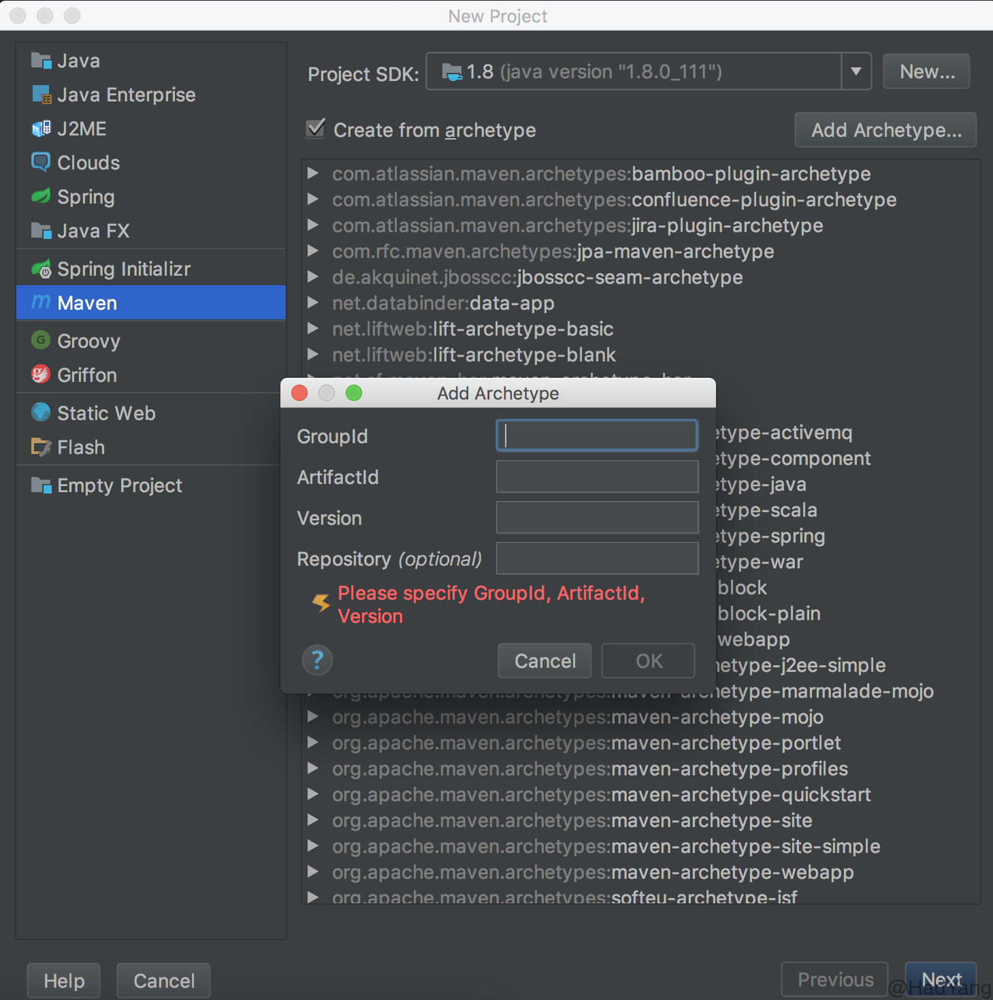

最近在做项目的时候发现Web项目中很多配置都是相对固定的，比如Spring，常用的配置都是那些，每次新建工程的时候很是麻烦，为了减少没必要的复制粘贴（提高效率），这里介绍一种自定义 Archetypes 的方法。Archetypes 是Maven中的一种模板，我们可以通过 Archetypes 将常用的配置放在模板里，每次新建项目的时候选择模板就可以了。

<!--more-->

最后通过 Archetypes 可以生成下面的项目：

```
demo
├── pom.xml
└── src
    ├── main
    │   ├── java
    │   │   └── App.java
    │   ├── resources
    │   │   ├── jdbc.properties
    │   │   ├── logback.xml
    │   │   ├── mybatis-config.xml
    │   │   ├── spring-mvc.xml
    │   │   └── spring-mybatis.xml
    │   └── webapp
    │       ├── WEB-INF
    │       │   └── web.xml
    │       └── index.jsp
    └── test
        └── java
            └── AppTest.java
```

### 创建 Archetypes 工程

首先通过Maven创建一个 Archetypes 的标准项目，在 Terminal 中执行如下命令：

```Shell
mvn archetype:generate        \
  -DarchetypeCatalog=internal \
  -DgroupId=com.hadyang       \
  -DartifactId=ssm            \
  -DarchetypeArtifactId=maven-archetype-archetype
```

  - `-DarchetypeCatalog=internal`：禁止 Maven 访问远程 Catalog，可以加速Maven项目的创建
  - `-DgroupId=com.hadyang`：Archetypes 的groupId
  - `-DartifactId=ssm`： Archetypes 的arifactId

在命令执行过程中会输入版本号，命令执行完成后，在当前目录就生成了一个`ssm`的目录，其目录结构如下：

```
ssm
├── pom.xml
└── src
    └── main
        └── resources
            ├── META-INF
            │   └── maven
            │       └── archetype.xml
            └── archetype-resources
                ├── pom.xml
                └── src
                    ├── main
                    │   └── java
                    │       └── App.java
                    └── test
                        └── java
                            └── AppTest.java
```

### 自定义 Archetype

`archetype-resources`目录就是工程的模板，`archetype.xml`是archetype的配置文件，同时在`archetype.xml`的同级目录下添加一个`archetype-metadata.xml`文件。两个文件的内容如下：

```xml
<!-- archetype.xml -->
<archetype xmlns="http://maven.apache.org/plugins/maven-archetype-plugin/archetype/1.0.0" xmlns:xsi="http://www.w3.org/2001/XMLSchema-instance"
  xsi:schemaLocation="http://maven.apache.org/plugins/maven-archetype-plugin/archetype/1.0.0 http://maven.apache.org/xsd/archetype-1.0.0.xsd">
  <id>ssm</id>
  <sources>
    <source>src/main/java</source>
  </sources>
  <testSources>
    <source>src/test/java</source>
  </testSources>

</archetype>
```

  - `<id>`：为 artifactId
  - `<sources>`：源文件目录
  - `<testsources>`：测试代码目录

```xml
<!-- archetype-metadata.xml -->
<archetype-descriptor xmlns="http://maven.apache.org/plugins/maven-archetype-plugin/archetype-descriptor/1.0.0" xmlns:xsi="http://www.w3.org/2001/XMLSchema-instance"
  xsi:schemaLocation="http://maven.apache.org/plugins/maven-archetype-plugin/archetype-descriptor/1.0.0 http://maven.apache.org/xsd/archetype-descriptor-1.0.0.xsd"
  name="ssm" >

  <fileSets filtered="true" encoding="UTF-8">
    <fileSet>
      <directory>src</directory>
    </fileSet>
  </fileSets>
</archetype-descriptor>
```

  - `<fileSets>`：新工程需要包含的文件

更多关于该文件的配置参见：[ArchetypeDescriptor](http://maven.apache.org/archetype/archetype-models/archetype-descriptor/archetype-descriptor.html)

下面我们可以自定义pom文件，修改在`archetype-resources`文件夹下的`pom.xml`：

```xml
<project xmlns="http://maven.apache.org/POM/4.0.0" xmlns:xsi="http://www.w3.org/2001/XMLSchema-instance"
  xsi:schemaLocation="http://maven.apache.org/POM/4.0.0 http://maven.apache.org/maven-v4_0_0.xsd">
  <modelVersion>4.0.0</modelVersion>

  <groupId>${groupId}</groupId>
  <artifactId>${artifactId}</artifactId>
  <version>${version}</version>

  <!-- 添加你需要的依赖、配置等等 -->

</project>
```

将你需要的配置文件等拷贝到 `archetype-resources/src`目录下，在这里我就将 Spring 、 Logback 、 Mybatis 的相关配置文件添加到对应目录：

```
.
├── pom.xml
└── src
    └── main
        └── resources
            ├── META-INF
            │   └── maven
            │       ├── archetype-metadata.xml
            │       └── archetype.xml
            └── archetype-resources
                ├── pom.xml
                └── src
                    ├── main
                    │   ├── java
                    │   ├── resources
                    │   │   ├── jdbc.properties
                    │   │   ├── logback.xml
                    │   │   ├── mybatis-config.xml
                    │   │   ├── spring-mvc.xml
                    │   │   └── spring-mybatis.xml
                    │   └── webapp
                    │       ├── WEB-INF
                    │       │   └── web.xml
                    │       └── index.jsp
                    └── test
                        └── java
```

### 安装及使用

进入 Archetype 项目目录，执行`mvn install`命令，当命令完成后会在本地资源库（`~/.m2/repository/`）下生成该项目的jar包。下面就可以在Idea中使用该 Archetype。

1. 打开Idea，新建项目，选择Maven，勾选`Create from archetype`，点击`Add Archetype`

  

2. 填入 archetype 的相关信息，注意版本号必须和你生成的一致，不然Maven找不到该 Archetype；`Repository`中填本地仓库的地址，在Mac中：`file://~/.m2/repository`，点击OK。

3. 选择你的 archetype ，点击Next，填入新项目的相关信息。当Idea执行完Maven命令后，就可以看到你的新项目中已经存在了你在上面模板中添加的文件。


更多关于 Archetype 的信息参见：[Guide to Creating Archetypes](https://maven.apache.org/guides/mini/guide-creating-archetypes.html)
