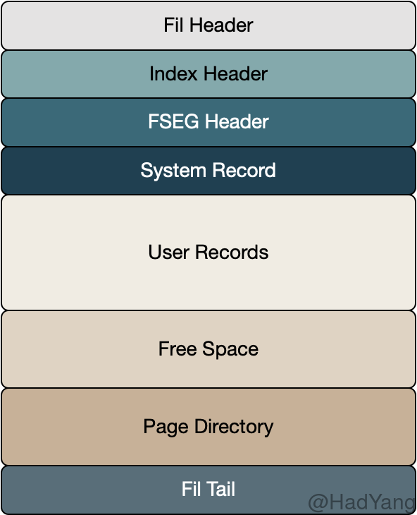

InnoDB的数据页有很多种，比如，索引页，Undo页，Inode页，系统页，Blob页等，一共有10多种。本文主要介绍最常见的索引页。 索引数据页包括七个部分，数据页文件头，数据页头，最大最小记录，用户记录，空闲空间，数据目录，数据页尾部。

1. **FIL Header&Tail** 这两个字段是所有类型的 Page 所通用的。在其中通过 `FIL_PAGE_PREV` 和 `FIL_PAGE_NEXT` 两个字段，指向索引键上前后（按一定顺序）相邻的 Page，以此构成一个双向链表。这个双向链表能关联该 Page 这一层级的所有 B 树节点。
2. **Index Header** 包含多个用于管理索引和记录的字段，下面会详细介绍
3. **FSEG （File Segment）** 索引根节点的 Page 包含 FSEG ，该 FSEG 包含该索引使用的所有文件 Segmnet。其他索引页的该字段均置0，不被使用
4. **System Record Innodb** 包含两个 System Record，分别是 infimum and supremum。它们被记录在页的固定位置，因此总能通过偏移量找到。
5. **User Records** 存储用户数据，每条记录都包含一个 Header 以及 数据列。在 Header 中包含指向递增顺序上的下一条记录，以此构成一个单向链表。
6. **Page Directory** 该字段从 FIL Tail 向下增长，包含当前页的部分记录（每4条或8条） 

## 数据页头（Page Header）

1. **PAGE_INDEX_ID** 该页所属索引的ID
2. **PAGE_MAX_TRX_ID** 对该页中任意记录事务的最大ID
3. **PAGE_N_HEAP** 该页包含的记录总数，包括  infimum 和 supremum 记录，以及被删除的记录。此外，最高位被用来标记这个数据页是否存了新格式的记录(compact和redundant)
4. **PAGE_N_RECS** 该页包含的未删除记录总数
5. **PAGE_HEAP_TOP** `User Recodrs` 的最大偏移量，在该偏移量之上则是 `Free Space`
6. **PAGE_FREE** 删除记录的链表，记录被删除，会放到这个链表头上，如果这个页上有记录要插入，可以先从这里分配空间，如果空间不够，才从空闲地址(PAGE_HEAP_TOP)分配。注意放到这个链表里面的，都是被purge线程彻底删除的记录，delete-marked 的记录不在这里。
7. **PAGE_GARBAGE:** 被删除记录链表所占用的空间大小
8. **PAGE_LAST_INSERT** 该页上最近一次插入记录的偏移量，主要用来加速后续插入操作
9.  **PAGE_DIRECTION** 最近一次插入记录的方向，可以取 LEFT, RIGHT, 和 NO_DIRECTION。每次插入记录时，都会和上次插入记录进行比较，以决定插入方向，主要用来加速后续插入操作
10. **PAGE_N_DIRECTION** 同一个方向上连续插入的记录数，主要用来加速后续插入操作
11. **PAGE_N_DIR_SLOTS** Page Directory 中 Slot 的个数
12. **PAGE_LEVEL** 当前页在索引中的层级（深度），叶子节点的 Level=0，随着越靠近B树根节点 Level 也随之增长。在一个层级为3的B树中，根节点的 Level=2

## 最大最小记录（infimum & supremum）

每个索引页都包含两条系统记录，并且位于页中的固定位置。这两条系统记录有特殊的header，“infimum” 和 “supremum” 字符串是其唯一的数据。

infimum 记录代表在该页中最小的记录，其 Next Record 指针指向该页用户记录中最小的那条记录，作为扫描用户记录的固定入口。

supremum 记录代表在该页中最大的记录，其 Next Record 指针始终是 NULL，用户记录中最大记录的 Next Record 指向 supremum

## 用户记录（User Records）

用户记录按其插入的顺序放置在页中，同时可能会使用已删除记录的空间，并且通过 Next Record 指针建立一个单向链表。该单向链表从 infimum 开始，将所有的用户记录按增序串起来，并以 supremum 结束。通过这个链表，可以按增序扫描该页中所有用户记录。

通过在 FIL Header 中的 Next Page 指针，我们可以按增序扫描索引中所有页。因此，对于增序扫描全表的操作可以如下进行：
1. 通过 B树找到最小的页
2. 从最小页的 infimum 记录开始，按 Next Record 进行遍历
3. 如果当前记录为 supremum 则跳转到 5
4. 遍历 Next Record 直到条件 3
5. 如果 Next Page 不存在则遍历结束，如果存在则跳转到 2

用户记录中存储实际的用户数据，在创建表结构的时候可以通过 DDL 语句设置不同的行格式，包含 REDUNDANT、COMPACT、DYNAMIC 和 COMPRESSED。

## 数据目录（Page Directory）

数据目录是一个包含记录指针的变长数组，其中的元素被称为 Slot 。Innodb 中的数据目录是一个稀疏表，并非所有的记录都有对应的 Slot。在一个满的页上，数据目录中一个 Slot 对应 6 条记录。

数据目录中的 Slot 按键的增序排列，而非堆的顺序。比如，对于一组记录 `'A''B''F''D'`，其数据目录存储结构如下 `(pointer to 'A') (pointer to 'B') (pointer to 'D') (pointer to 'F')`。由于 Slot 按顺序排列，并且每个 Slot 大小固定，因此很容易通过二分法进行查找。

<!-- 

## 参考

1. https://blog.jcole.us/2013/01/07/the-physical-structure-of-innodb-index-pages/
2. https://dev.mysql.com/doc/internals/en/innodb-page-directory.html
3. https://www.zhihu.com/question/268388266/answer/337074461
4. http://mysql.taobao.org/monthly/2018/04/03/
5. https://dba.stackexchange.com/questions/220877/how-are-page-splits-determined-internally-in-mysql 
6. 

-->

