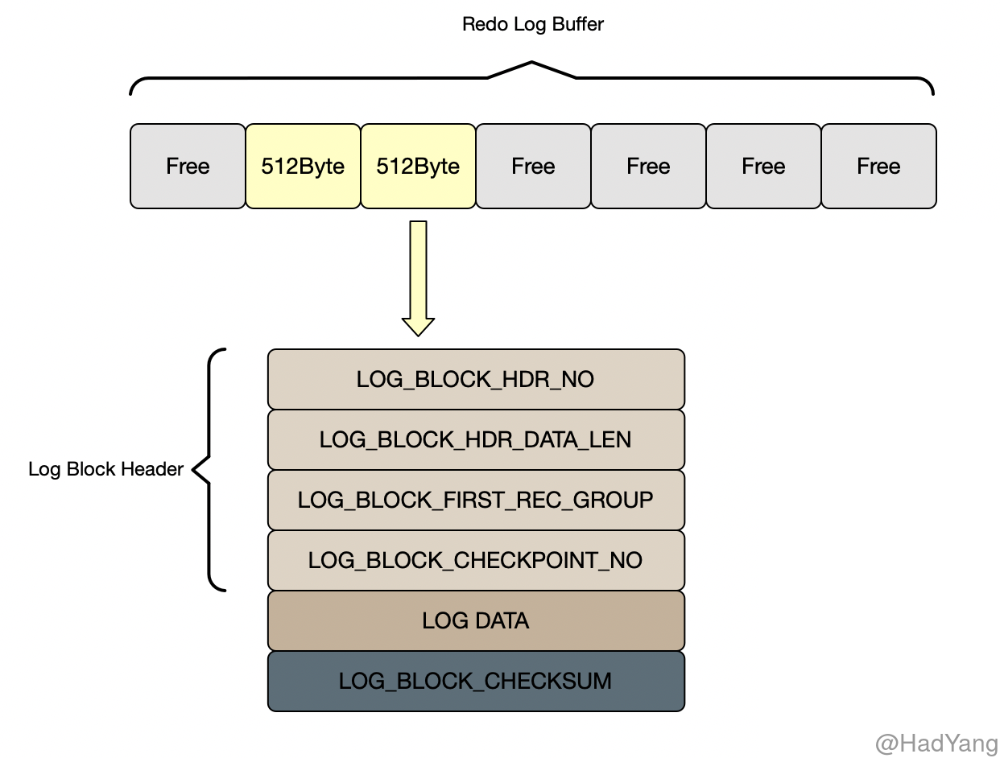
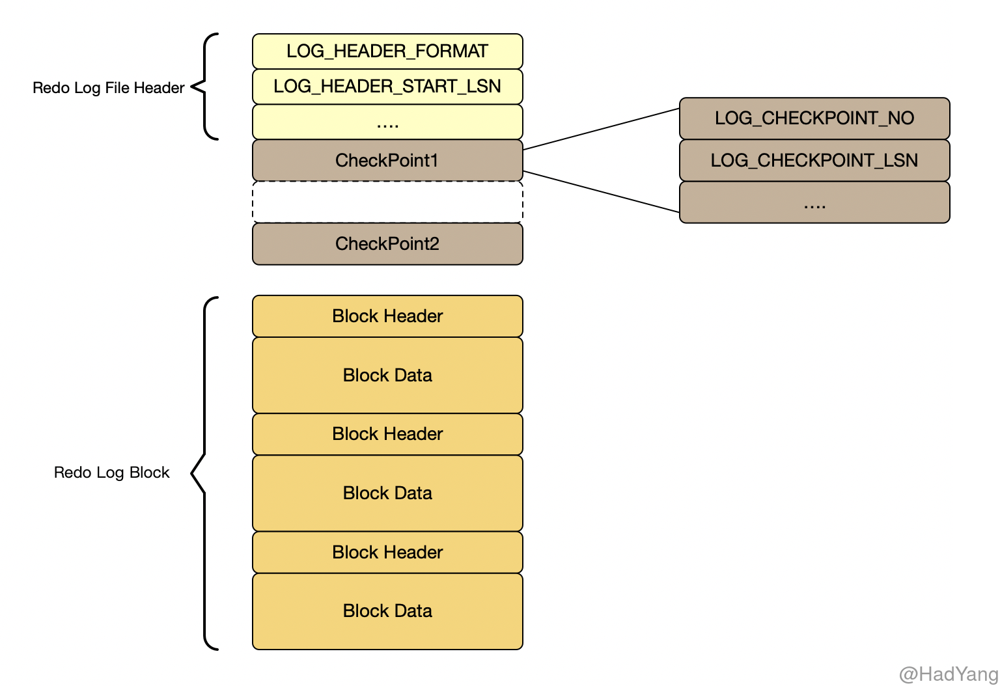
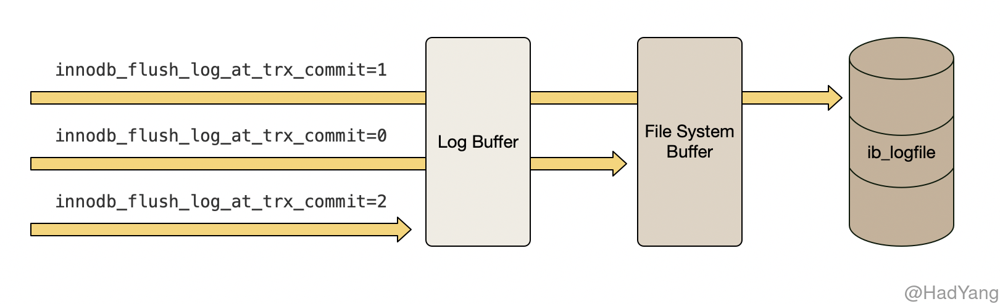
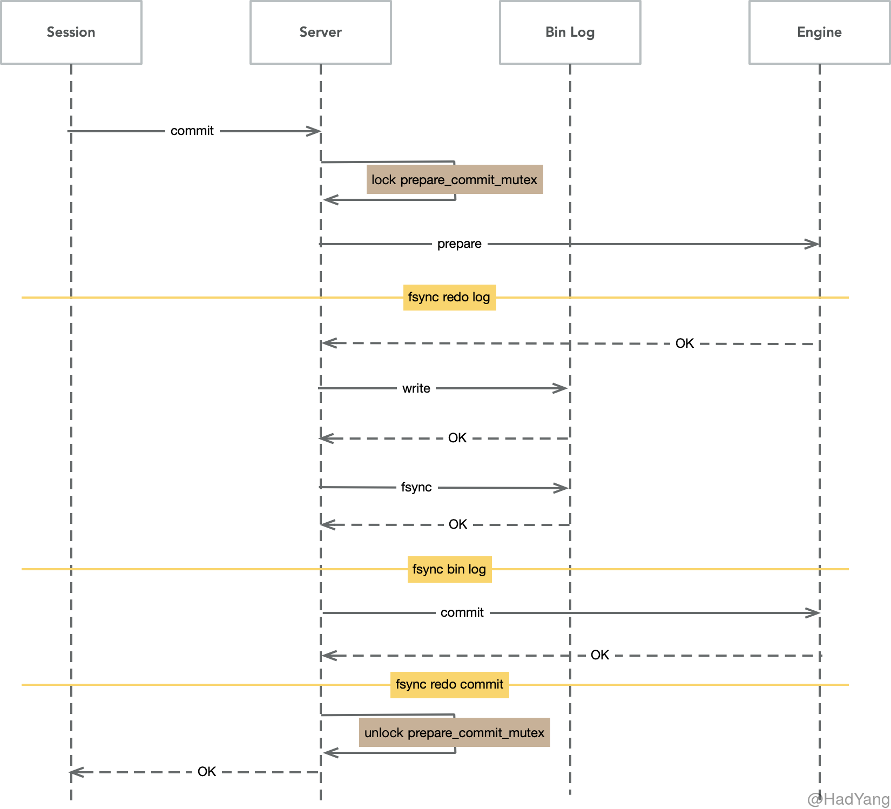

## Redo Log

Redo Log 是 Innodb 的事务日志之一，并且为 Innodb **提供 ACID 中一致性的保证**。 在很多数据库设计中，都存在日志先行（WAL）的概念，Redo Log 就是 WAL 先行写入的日志。 Redo Log 记录了数据库文件的物理层面的修改记录，包括 **用户触发的修改以及 Innodb 内部触发的修改行为**。

**LSN（Log Sequence Number）** 表示 Redo 日志序列号，Innodb 保证其单调递增。LSN 无处不在，通过 LSN 可以找到对应的 Redo Log，因此其在故障恢复机制中发挥重要作用。

在 Innodb 内部 Redo Log 分为两个部分，分别是位于内存的 Redo Log Buffer，以及位于磁盘的 Redo Log File。Redo Log Buffer 和 Redo Log File 都是由 **Redo Log Block** 组成的数据结构，Redo Log Block 在内存和磁盘中均具有相同的数据结构。

Redo Log Block 以 512Byte 对齐，各类型的 Redo Log Block 都有统一的头部，包括 `LOG_BLOCK_HDR_NO` 、 `LOG_BLOCK_HDR_DATA_LEN` 、 `LOG_BLOCK_FIRST_REC_GROUP` 和 `LOG_BLOCK_CHECKPOINT_NO`，而 Redo Log Block 的内容根据不同类型有不同的结构。

- `LOG_BLOCK_HDR_NO`：根据该块的 LSN 以及当前 Redo Log File 的起始 LSN 转换的块序列号
- `LOG_BLOCK_HDR_DATA_LEN`：写入该块的日志长度
- `LOG_BLOCK_FIRST_REC_GROUP`：块中第一个 Redo Log 在块中的长度
- `LOG_BLOCK_CHECKPOINT_NO`：记录当前块的 CheckPoint 序号

一个事务可以使用多个 Redo Log Block，这种情况下，可能导致最后一个 Block 剩余部分空间，为提高存储效率和性能，可以将下个 Redo Log 分配到最后一个 Block 中。

### Redo Log File

Innodb  据参数 `innodb_log_files_in_group` 使用多个 Redo Log File 来持久化 Redo Log，多个 Redo Log File 作为一个 Log Group，采用 **round-robin** 方式循环写入 Redo Log File。当 Redo Log File 被覆盖时，要保证对应的脏页已刷新到磁盘，否则会暂停 Redo Log 的写入，并进行一次 Checkpoint 操作。

每个 Log Group 的第一个 Redo Log File 都会有 2K 的空间存储 `Log File Header`（包含当前 Log Group 中起始 LSN） 以及两个交替写入的 Checkpoint 信息（防止存储介质损坏而导致 Checkpoint 无法读取）。对 Redo Log File 的写入也 **不完全** 是顺序的，因为每次都会更新 Checkpoint 信息。在崩溃恢复的过程中，直接从 Log Group 的第一个 Redo Log File 获取 Checkpoint 信息即可。

Redo Log 的写入时机受参数 `innodb_flush_log_at_trx_commit` 控制，其有 0，1，2 三种取值。

- `1` 是默认策略，在每次事务提交时都持久化（执行 fsync） Redo Log
- `0` 表示事务提交时不持久化 Redo Log，而是每秒定时刷新（执行 fsync） Redo Log 到磁盘上
- `2` 表示事务提交时将 Redo Log 刷新到系统文件缓存中（不执行 fsync）

  
Redo Log 的每个 Block 大小与磁盘大小一致，因此 Redo Log 的写入也不需要 DoubleWrite 机制。

### Log Write Ahead

InnoDB 以 512 字节一个 Block 的方式对齐写入 `ib_logfile` 文件，但现代文件系统一般以 4096 字节为一个 Block 单位。如果即将写入的日志文件块不在 OS Cache 时，就需要将对应的 4096 字节的 Block 读入内存，修改其中的 512 字节，然后再把该 Block 写回磁盘。

为解决这个问题，MySQL 5.7 引入了一个新参数： `innodb_log_write_ahead_size` ，当前写入文件的偏移量不能整除该值时，则补 0 ，多写一部分数据。这样当写入的数据是以磁盘 Block size 对齐时，就可以直接 `write` 磁盘，而无需 `read-modify-write` 这三步了。

### Checkpoint

Checkpoint 是 Innodb 崩溃恢复中的重要的一个环节，在 Checkpoint 中用 LSN 表示系统写入磁盘的进度。Checkpoint 表示一个 **安全点**，在 Checkpoint 之前的所有数据库数据都是安全可靠的，在系统崩溃中不会丢失。

Checkpoint 的目的有三个：缩短数据库的恢复时间、保证 Buffer Pool 可用容量 以及 确保 Redo Log 可用存储容量。因此，系统会在四种情况下进行 Checkpoint：

1. Master Thread CheckPoint （定时刷新）
2. FLUSH_LRU_LIST CheckPoint （LRU 空闲页不足）
3. Async/Sync Flush CheckPoint （Redo Log 不可用，即 Redo Log 空间不足）
4. Dirty Page too much CheckPoint （Buffer Pool 脏页过多）

### 内部XA协议

Bin Log 是 MySQL 服务层的数据变更日志，记录了表数据中变更事件。当 MySQL 开启 Bin Log 后，为保证存储引擎层的事务日志和 Bin Log 一致，在 MySQL 内部使用了 XA 协议，并使用了一个全局的 `prepare_commit_mutex` 锁。

1. 当事务提交时 Innodb 进行 Prepare 操作：持有 `prepare_commit_mutex`，写入 Redo Log 并 fsync
2. MySQL 服务层写入 Bin Log 并 fsync
3. Innodb 存储引擎进行 Commit 操作：写入 Commit 标记，并释放 `prepare_commit_mutex`

内部的XA协议保证了事务在多个引擎和 Bin Log 之间的原子性，以 Bin Log 写入成功作为事务提交的标志，而 InnoDB 的 Commit 标志并不是事务成功与否的标志。

在崩溃恢复中，是以 Bin Log 中的 `xid` 和 Redo Log 中的 `xid` 进行比较，`xid` 在 Bin Log 里存在则提交，不存在则回滚。

- 已写入 Redo Log，未写入 Bin Log，则会回滚
- 已写入 Redo Log，写入 Bin Log，未写入 Commit 标记，则重新写入 Commit 标志，完成提交

通过 `prepare_commit_mutex` 对整个 2PC 过程进行加锁的方式，只有当上一个事务 commit 后释放锁，下个事务才可以进行 prepare 操作，这样完全串行化的执行保证了顺序一致。

存在的问题是 `prepare_commit_mutex` 的锁机制会严重影响高并发时的性能，在每个事务执行过程中， 都会至少调用 3 次刷盘操作，多个小 IO 是非常低效的方式。

### BLGC

为了提高并发性能，肯定要细化锁粒度。MySQL 5.6 引入了 Bin Log 的组提交（BLGC）功能：prepare 阶段不变，只针对 commit 阶段，将 commit 阶段拆分为三个过程：

1. **flush stage** 多个线程按进入的顺序将 Bin Log 从 cache 写入文件（不刷盘）
2. **sync stage** 对 Bin Log 文件做 fsync 操作（多个线程的 Bin Log 合并一次刷盘）
3. **commit stage** 各个线程按顺序做 InnoDB commit 操作

其中，每个阶段有 Lock 进行保护，因此保证了事务写入的顺序。

实现方法是，在每个 stage 设置一个队列，第一个进入该队列的线程会成为 Leader，后续进入的线程会阻塞直至完成提交。Leader 线程会领导队列中的所有线程执行该 stage 的任务，并带领所有 Follower 进入到下一个 stage 去执行，当遇到下一个 stage 为非空队列时，Leader 会变成 Follower 注册到此队列中。

这种组提交的优势在于锁的粒度减小，三个阶段可以并发执行，从而提升效率。

#### BLGC 优化

MySQL 5.6 的组提交逻辑中，每个事务各自做 prepare 并写 Redo Log，只有到了 commit 阶段才进入组提交，因此每个事务的 Redo Log fsync 操作成为性能瓶颈。

在 5.7 版本中，修改了组提交的 Flush 阶段，在 prepare 阶段不再让线程各自执行 Flush Redo Log 操作，而是推迟到组提交的 Flush 阶段，Flush stage 修改成如下逻辑：

1. 收集组提交队列，得到 Leader 线程，其余 Follower 线程进入阻塞
2. Leader 调用 `ha_flush_logs` 做一次 Redo `write/fsync`，即一次将所有线程的 Redo Log 刷盘
3. 将队列中 thd 的所有 Bin Log cache 写到 Bin Log 文件中

这个优化是将 Redo Log 的刷盘延迟到了 BLGC 的 Flush stage 之中，Sync stage 之前。通过延迟写 Redo Log 的方式，为 Redo Log 做了一次组写入，这样 Bin Log 和 Redo Log 都进行了优化。

