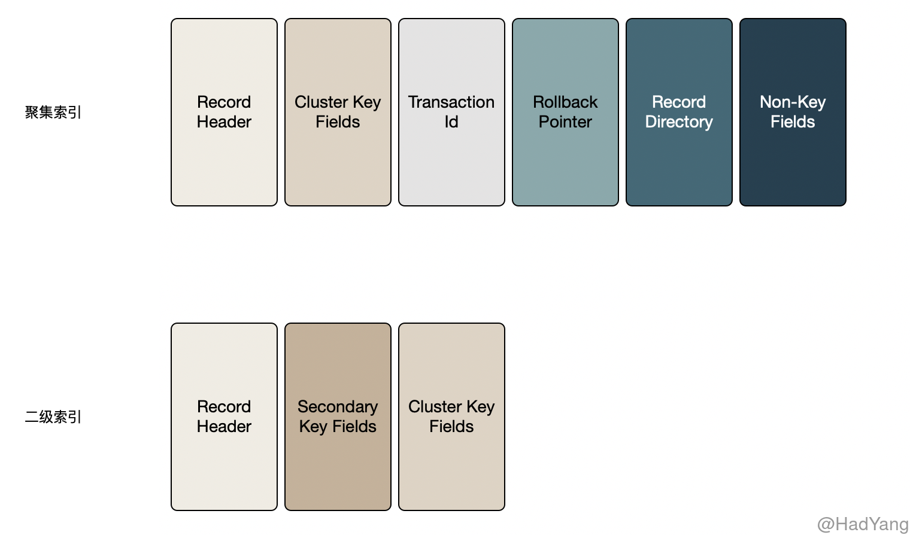
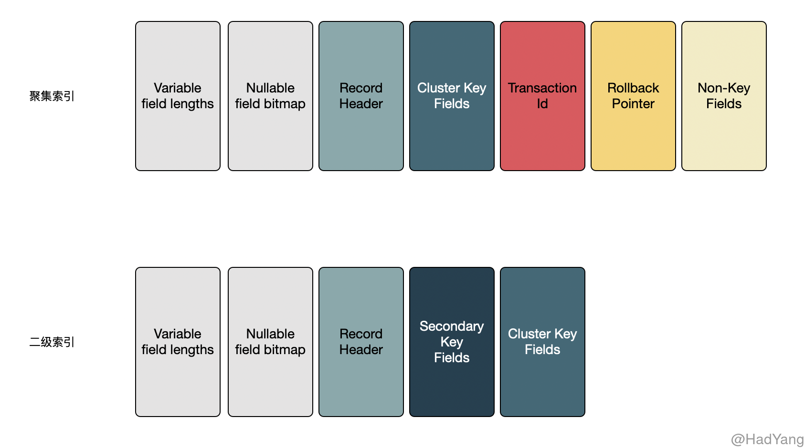

## 文件格式

随着 Innodb 的演进，老版本的数据文件格式已经不能支撑新特性的诉求。为方便管理降级和升级以及不同版本 MySQL 的运行，Innodb 采用命名文件格式，Innodb 目前支持两种文件格式： `Antelope` 和 `Barracuda`

- **Antelope** 是最原始的 Innodb 文件格式，在之前都没有名称。它支持 **COMPACT** 和 **REDUNDANT** 两种行格式
- **Barracuda** 是新的文件格式。它支持所有的行格式，包括新的 **COMPRESSED** 和 **DYNAMIC** 行格式

可以通过元数据表 `INFORMATION_SCHEMA.INNODB_SYS_TABLES` 查看表对应的文件格式和行格式

```sql
mysql> SELECT * FROM INFORMATION_SCHEMA.INNODB_SYS_TABLES WHERE NAME='test/t1'\G
*************************** 1. row ***************************
     TABLE_ID: 44
         NAME: test/t1
         FLAG: 1
       N_COLS: 6
        SPACE: 30
  FILE_FORMAT: Antelope
   ROW_FORMAT: Compact
ZIP_PAGE_SIZE: 0
```

## 行格式

行格式决定表如何对行进行物理存储，这会影响到查询和 DML 语句的性能。当单个磁盘页能容纳越多的行，则其查询和索引性能就越好，在 Buffer Pool 中占用越少的内存，以及更新数据时越少的IO操作

每个表中的数据都是存储在各个 Page 中的，Page 组成的表排列在一个被称为B树索引的结构中。表数据和二级索引都使用 B树这种数据结构。当B树索引代表整个表时，称之为聚集索引，聚集索引按主键排列。聚集索引的节点包含整行记录数据。二级索引的节点包含 **索引列** 和 **主键列**。

一般情况下，列的数据都存储在B树节点中，但变长列是个例外。当变长列过大，导致B树的 Page 无法容纳时，会在磁盘上单独开辟 **溢出页** 进行存储。这些列被称为页外列（off-page columns）。页外列的值存储在溢出页的单链表，每个列都有其自己的链表，包含一个或多个溢出页。根据列的不同长度，变长列可以将全部或前缀数据存放在B树中，以免浪费存储空间和读取更多的页。

在 MySQL 中字段的大小不仅与表定义的列长度有关，还与表使用的字符集有关联。比如对于 `CHAR(10)` 列，在 `latin1` 字符集下最多只占用 10byte，而在 `utf8` 字符集下其占用的存储空间在 10byte ~ 40byte 范围中。

Innodb 中有四种行格式，分别为 `REDUNDANT`、`COMPACT`、`DYNAMIC`和`COMPRESSED`。

### REDUNDANT


1. 每条索引记录都包含 6byte 的 header，header 的作用在于链接连续的记录以及行级锁
2. 记录在聚集索引上包含所有用户定义的列。额外还包含 6byte 的事务ID 以及 7byte 的回滚指针
3. 如果没有定义主键，则聚集索引还会包含一个 6byte 的行ID
4. 每个二级索引记录除索引列本身外，还包含主键列
5. 每个记录中中包含一个指针指向每个字段。如果这些字段的总长度不超过 128byte，则指针只有 1byte，否则为 2byte。这些指针组成的数组被称为记录目录（Record Directory），指针指向的区域是记录的数据区
6. 默认情况下，固定长度的列比如 CHAR(10) 以固定长度存储。 VARCHAR 的后缀空格不会被截断（那就是说 CHAR 类型会截断）
7. 固定长度的列大于或等于 768byte 时，被当作变长列处理，**可以** 存储在溢出页上。
8. Null 值在记录目（Record Directory）里会消耗 1～2byte。Null在变长列的数据区占用0byte，在固定长度列消耗“固定长度” 的空间。这样有助于 固定长度列从 空 → 非空的值更新，从而避免页分裂导致的碎片化



### COMPACT

1. 每条索引记录都包含 5byte 的 header 以及 变长部分，header 的作用在于链接连续的记录以及行级锁
2. 记录头的变长部分包含一个 bit 向量，用于标记 NULL 列。bit 向量的大小由行中允许为 NULL 的列的个数决定，比如，由6～19列可以为 NULL，则这个 bit 向量使用 2byte。空列除 bit 向量外，不占用其他存储空间。变长部分还包含变长列的长度，根据列最大长度的不同，每个列长度占用 1～2 byte。如果所有的列都是 Not-NULL 并且都是固定长度，那么记录头不包含任何变长部分。
3. 对于非NULL 变长列，记录头占用1～2byte来记录列长度。2byte 在列存储在溢出页、最大长度超过255byte、实际长度超过127byte情况下使用。对于溢出页的列 2byte 用于标记页内存储+20byte溢出页指针的长度。页内存储长度为 768 byte，所以长度为 768+20。这 20byte指针存储真正的列长度
4. 记录头后紧跟着 **非空列** 的数据
5. 记录在聚集索引上包含所有用户定义的列。额外还包含 6byte 的事务ID 以及 7byte 的回滚指针
6. 如果没有定义主键，则聚集索引还会包含一个 6byte 的行ID
7. 每个二级索引记录除索引列本身外，还包含主键列。如果主键列是变长的，每个二级索引的记录头都会有一个变长的部分来记录其长度，即使二级索引是定长的
8. 对非变长的字符集，定长的字符列是按定长格式存储， VARCHAR 的后缀空白字符不会被截断
9. 对于变长字符集（utf8mb4），Innodb 截断 CHAR(n) 的后缀空白字符，并尝试存储在 n 个字节中。如果 CHAR(n) 的值超过 n 个字节，截断后缀空白的值就是该列的最小长度。最大长度就是字符集的最大长度*n
    1. 为 CHAR(n) 至少保留 n 个字节，在大多数情况下都可以原地更新，减少页碎片。相比来说，REDUNDANT 则会占用列的最大可能长度。
    2. 当定长列超过或等于 768byte 时，会被当作变长字段，**可以**被存储在溢出页中。char(255) 在 utf8mb4 的编码下，最大长度就可能超过 768




### DYNAMIC 行格式

在存储特性上 DYNAMIC 与 COMPACT 相同，但增强了对超长变长列的存储能力，以支持更大索引前缀。对于溢出页的存储 DYNAMIC 基于一个想法：将长数据的一部分存储在页外，等效于将整个数据放到页外。 DYNAMIC 格式会尽量将短的列存储在行内，减少溢出页的个数

1. 超长的变长列（ `VARCHAR VARBINARY BLOB TEXT` ）完全存储到页外（off-page），在聚集索引中只包含 20byte 的溢出页指针。
2. 当定长列超过或等于 768byte 时，会被当作变长字段，可以被存储在溢出页中。
3. **列是否存储到页外还依赖页大小和行的总长**。当行非常长的时候，最长的列会被存储到页外，直到聚集索引的记录能在B树节点中至少存放两行。
4. TEXT BLOB 长度小于等于 40byte 时，会存储在行内。
5. 当行长度合适时，DYNAMIC 也会将整个行放入索引记录中，但是 DYNAMIC 会避免将超长的列放入索引中。 
6. DYNAMIC 支持索引长度为 3072byte


### COMPRESSED 行格式

1. COMPRESSED 行格式拥有与 DYNAMIC 相同的存储特性和能力，但支持表和索引数据的 **压缩**。
2. COMPRESSED 行格式使用页外存储的方式与 DYNAMIC 类似，额外增加了压缩表和索引数据的存储和性能的考量，并且使用更少的空间。
3. COMPRESSED 行格式通过 `KEY_BLOCK_SIZE` 选项控制聚集索引存储的数据大小，以及溢出页存储的数据大
4. COMPRESSED 支持索引长度为 3072byte


下面通过表格对比四种不同行格式的特点


|行格式|长字段存储|空间分配|后缀空格|NULL字段|索引长度|
|:--|:--|:--|:--|:--|:--|
|REDUNDANT|1. 定长字段的值长度超过 768byte 就会被当作变长字段，超出数据 **可以** 存储到溢出页<br/>2. BLOB 和 TEXT 看实际长度，来决定是否适用溢出页|1. 定长字段以可能的最大长度存储，无数据字节用 0x20 填充<br>2. 变长字段不会预分配最大可能的存储空间|1. 定长字段的后缀空白会被截断<br>2. 变长字段的后缀空白会保留|1. 定长字段的NULL占用可能的最大空间<br>2. 变长字段的NULL不占用空间|768byte|
|COMPACT|1. 定长字段的值长度超过 768byte 就会被当作变长字段，超出数据 **可以** 存储到溢出页<br>2. BLOB和TEXT看实际长度，来决定是否适用溢出页|1. 定长字段&变长字符->至少分配n个字<br>2. 定长字段&定长字符集->分配最大长度，无数据字节用0x20填充<br>3. 变长字段->不预分配最大可能的存储空间|1. 定长字段的后缀空白会被截断<br>2. 变长字段的后缀空白会保留|1. 变长和定长字段均不占用空间|768byte|
|DYNAMIC|1. 对溢出数据，行内只存储指针，无前缀数据<br>2. BLOB 和 TEXT 小于 40byte 存储页内|同上|同上|同上|3072byte|
|COMPRESSED|同上|同上|同上|同上|3072byte|


### 溢出判定


如果一个 Page 中可以放入两行数据（对于 16KB 的页来说，就是每行 8KB），那么 `VARCHAR VARBINARY BLOB TEXT` 类型的数据就不会放入溢出页中。两行数据不代表每行数据就占用 8192byte ，Innodb 内部还会有部分存储空间的占用。因此，对于 VARCHAR 来说最多是 8098byte，对 BLOB 和 TEXT 来说最多是 8000byte


<!-- 
## 参考文档

2. https://blog.jcole.us/2013/01/10/the-physical-structure-of-records-in-innodb/ 

-->