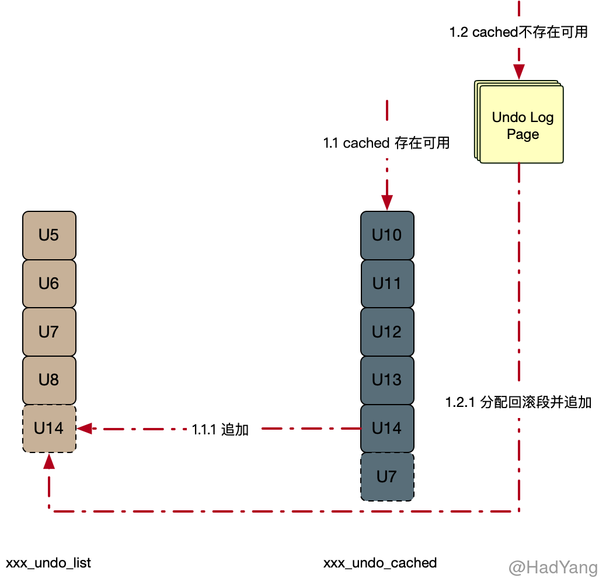
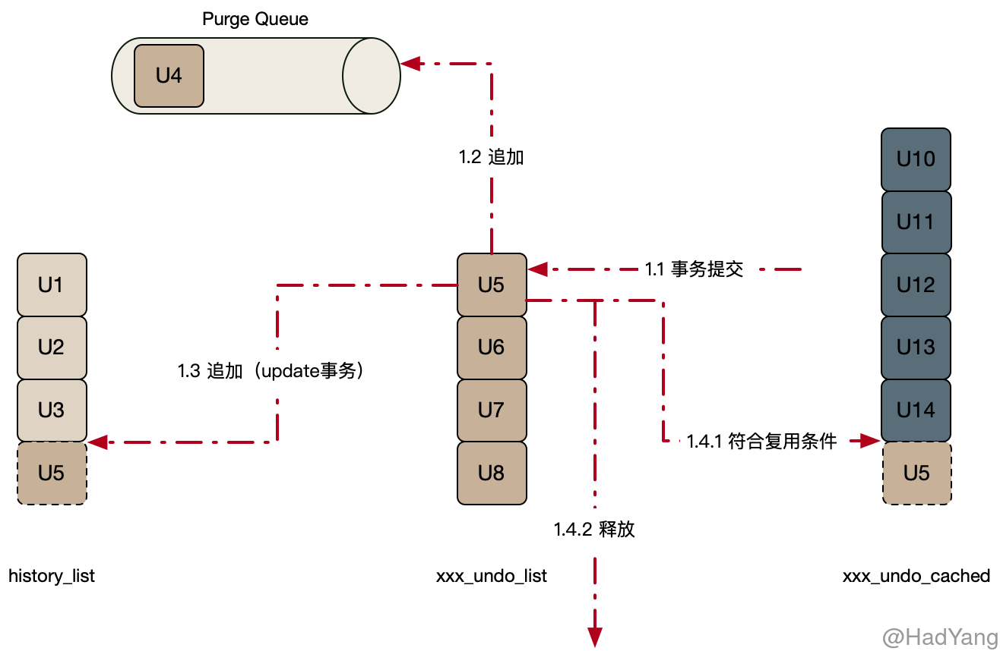

## Undo Log

Undo Log 是 Innodb 中重要的日志系统，包含系统对数据操作的逆操作，用于事务回滚和非锁定一致性读（MVCC）。 Undo Log 中存储的是逻辑日志，因此需要进行持久性保护，在写入 Undo Log 的同时也会写入 Redo Log。

Undo Log 包含 Insert Undo 和 Update Undo ，其中 Undate Undo 包含更新和删除两种操作。对于 Insert Log 在事务提交后就可以清理，而 Update Log 由于 MVCC 的要求在满足一定条件下，由 Purge Thread 清理。对记录的删除操作也是在（TODO）

### 数据结构

Innodb 采用 **回滚段（Rollback Segment）** 的方式管理 Undo Log 的并发写入和持久化，每个回滚段包含多个 **撤销日志槽（Undo Log Slot）**。总共 128 个回滚段分布在多个文件中，临时表空间中占用 32 个，根据配置的不同系统表空间中至少 1 个，Undo 表空间最多 95 个。

回滚段用 **Undo Log 对象（trx_undo_t）** 来管理撤销日志槽，每个 Undo Log 对象都对应一个撤销日志槽。事务开启时，会给该事务指定一个回滚段，事务所有 Undo Log 的分配都在该回滚段进行。一个事务最多可以关联四个撤销日志（Undo Log 对象），以下每种操作类型都可以分配一个：

- 用户定义表上的插入操作
- 用户定义表上的更新和删除操作
- 用户定义临时表上的插入操作
- 用户定义临时表上的更新和删除操作

当事务提交后，需要 Purge 的回滚段会被放入 Purge Queue，待 Purge Thread 处理。

回滚段使用了三种类型 `xxx_cache_list`、`xxx_undo_list` 和 `history_list` 链表来管理 Undo Log 对象。 `xxx_cache_list` 管理可复用的 Undo Log 对象，当一个事务提交后，会根据其 Undo Log 满足某种条件时，为减少存储的占用，会将其加入 `xxx_cache_list` 以供后续的事务使用；`xxx_undo_list` 管理正在被使用的 Undo Log 对象；`history_list` 管理已提交的 Update Undo Log 对象（按 trx_no 排序），为 Innodb 提供 MVCC 的能力。Insert Undo Log 是新插入的，所以不需要提供 MVCC 的能力，不会放入 `history_list`。

### 事务开启时

1. 分配回滚段：以 round-robin 方式从回滚段数组中获取可用的回滚段
   1. 若数据表为临时表，则从临时表空间获取回滚段
   2. 若数据表为普通表，则从系统表空间或 Undo 表空间获取回滚段
2. 分配回滚段成功：获取可用的 `trx_undo_t`
   1. 从 `xxx_cache_list` 中获取可用 `trx_undo_t`
   2. 若未能重用 `trx_undo_t` ，则从回滚段中分配一个新的 Undo Log Slot，分配 Undo Log Page，并初始化 `trx_undo_t`
3. 分配 `trx_undo_t` 成功后，会将 `trx_undo_t` 加入 `xxx_undo_list`
4. 写入 Undo Log
   1. 旧记录的回滚指针&事务ID
   2. 旧记录中被修改的相关属性值
5. 构建回滚指针，事务提交时写入聚集索引中

### 事务提交时

1. 若当前回滚段未在 Purge Queue 中，则将其加入
2. 若 `trx_undo_t` 为 update 类型，则将 `trx_undo_t` 中的 `TRX_UNDO_HISTORY_NODE`指针加入 `history_list`
3. 复用 `trx_undo_t` ：
      1. 若当前事务的 `trx_undo_t` 只占用一个 Page，并且剩余 1/4 的空间，则将其加入 `xxx_cache_list`
      2. 若不能复用则释放 `trx_undo_t`

### 事务回滚时

1. 根据 Undo Log 获取旧记录信息
2. 删除操作：清除删除标记
3. 更新操作
   1. in-palce：回滚数据到老版本
   2. 二级索引：
4. 插入操作：删除聚集索引&二级索引

### MVCC

Innodb 中的 MVCC 通过 Undo Log 构建，Undo Log 中包含旧行的数据信息。由于在聚集索引中包含了 **回滚指针**，每次行数据的修改都会更改这个指针，回滚指针中包含事务ID 和 Undo Log 记录。回滚指针就构成了一个行数据的快照链，可以通过这个快照链对旧数据进行构建。

对于二级索引来说，二级索引记录中并未包含回滚指针，只在其所在页上存储最大的事务ID（PAGE_MAX_TRX_ID）。如果该事务ID对当前事务是可见的，那么快照就是当前数据。否则，就回表查询聚集索引，通过事务ID来构建快照。

### Purge 流程

在上面有说到，事务提交时都会将回滚段放入 Purge Queue，Purge 逻辑会遍历 Purge Queue，从中取出回滚段。Piurge 逻辑会清理掉其中不再被访问的 Undo Log，并将页内标记删除的操作从物理上清理掉。

1. 可见性确认：Purge 线程 Clone 出一份最老版本活跃 View，在这个 View 之前的所有版本都可以清理
2. 获取需要 Purge 的多个 Undo Log，并分配到多个工作线程中
3. Purge 工作线程
   1. 标记删除：物理清除所有聚集索引和二级索引
   2. 清理索引：由于二级索引顺序的更新是 标记删除+插入 ，所以需要对二级索引进行清理
4. 清理 `history_list`
   1. 遍历 Purge Queue，获取回滚段
   2. 从回滚段中的 `history_list` 查找不再被访问事务撤销日志 trx_1 并清理
   3. 在 trx_1 Undo Log 所在的 Undo Log Segment 上，寻找其他可清理的事务（减少随机读取）
   4. 直到没有能清理的 Undo Log 为止
