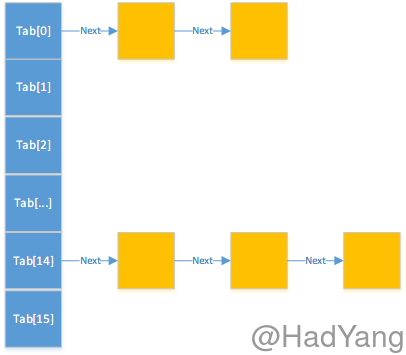

HashMap作为Java Map集合下常用类，我们在使用时对其中的原理知道的很少，最近看了HashMap的源码后觉得还是不难理解，在这里对HashMap做一个分析。

<!--more-->

### HashMap.Node

在HashMap中，有一个十分重要的类--HashMap.Node，根据源码中的注释我们可以知道Node类是HashMap的基本结点，适用于大多数的HashMap。通过Node类的源码我们可以很容易的看出：这是一个单链表，在每个Node对象中都存储了下一个链表结点的引用。

```Java
/**
* Basic hash bin node, used for most entries.  (See below for
* TreeNode subclass, and in LinkedHashMap for its Entry subclass.)
*/
static class Node<K,V> implements Map.Entry<K,V>{
  final int hash;
  final K key;
  V value;
  Node<K,V> next;
  ...
  public final boolean equals(Object o) {
      if (o == this)
          return true;
      if (o instanceof Map.Entry) {
          Map.Entry<?,?> e = (Map.Entry<?,?>)o;
          if (Objects.equals(key, e.getKey()) &&
              Objects.equals(value, e.getValue()))
                  return true;
            }
      return false;
    }
}
```

### LoadFactor & Capacity

```Java
/**
* The table, initialized on first use, and resized as
* necessary. When allocated, length is always a power of two.
* (We also tolerate length zero in some operations to allow
* bootstrapping mechanics that are currently not needed.)
*/
transient Node<K,V>[] table;
```



在HashMap内部使用数组来存储Node对象，那数组的大小是怎么确定的呢？HashMap中有一个`DEFAULT_INITIAL_CAPACITY`的常量，定义了默认的数组大小，当然你也可以通过构造函数传入你想要的初始容量大小。

```Java
/**
* The default initial capacity - MUST be a power of two.
*/
static final int DEFAULT_INITIAL_CAPACITY = 1 << 4; // aka 16
```

在上面的代码中明确写出了数组的容量必须为2的整数次方。这里为什么这样规定，我猜想是为了优化计算时间，因为对2的整数次方的乘除可以使用位运算，对HashMap的效率有一定的提高。

HashMap的构造函数中还有一个参数`loadFactor`，这个参数被称为加载因子。最初我在看到这个参数时是一头雾水，并没能发现这个参数的作用，后来在`HashMap.resize`方法中发现了它。学过散列表的人都知道哈希冲突，对于同一个哈希函数，散列表容量越小越容易发生哈希冲突，发生哈希冲突后就降低了散列表快速查找的优势。`loadFactor`就是解决散列表容量和HashMap中元素个数关系的一个指标，当超过这个指标后就扩大HashMap的容量。

### 存放元素

向HashMap存放元素是调用`HashMap.put`函数，最终会调用`HashMap.putVal`方法。HashMap顾名思义是根据key的hash值进行存储，那么hash值时如何计算的呢？

```Java
static final int hash(Object key) {
    int h;
    return (key == null) ? 0 : (h = key.hashCode()) ^ (h >>> 16);
}
```

在HashMap中的静态方法hash对key的hash值进行计算，在这里我们可以看到：null的hash值是0，否则取hashCode 异或 自己的高16位，这样做的目的是减少哈希冲突。这个函数的具体分析可以参考[HashMap源码之hash()函数分析（JDK 1.8）](http://blog.csdn.net/anxpp/article/details/51234835)。

```Java
final V putVal(int hash, K key, V value, boolean onlyIfAbsent,
               boolean evict) {
    Node<K,V>[] tab; Node<K,V> p; int n, i;

    //新建的HashMap 第一次都会走这个分支，table没有初始化。
    if ((tab = table) == null || (n = tab.length) == 0)
        n = (tab = resize()).length;

    //(n - 1) & hash 相当于哈希函数，用位运算代替取模运算
    //如果没有发生哈希冲突，直接新建一个Node对象并存储在tab[i]位置上
    if ((p = tab[i = (n - 1) & hash]) == null)
        //HashMap的子类可以通过重写newNode方法修改结点类型
        tab[i] = newNode(hash, key, value, null);

    //在tab[i]上发生哈希冲突
    else {
        Node<K,V> e; K k;
        //tab[i]上存在一个Node对象和需要存储的Node对象相同，更新它的值，并返回旧值
        if (p.hash == hash &&
            ((k = p.key) == key || (key != null && key.equals(k))))
            e = p;

        //如果tab[i]上的Node对象是TreeNode的实例，则该HashMap为LinkedHashMap的实例
        else if (p instanceof TreeNode)
            e = ((TreeNode<K,V>)p).putTreeVal(this, tab, hash, key, value);

        //从tab[i]开始遍历单链表，在单链表的最后插入新的元素
        else {
            for (int binCount = 0; ; ++binCount) {
                if ((e = p.next) == null) {
                    p.next = newNode(hash, key, value, null);
                    if (binCount >= TREEIFY_THRESHOLD - 1) // -1 for 1st
                        treeifyBin(tab, hash);
                    break;
                }
                if (e.hash == hash &&
                    ((k = e.key) == key || (key != null && key.equals(k))))
                    break;
                p = e;
            }
        }
        if (e != null) { // existing mapping for key
            V oldValue = e.value;
            if (!onlyIfAbsent || oldValue == null)
                e.value = value;
            ...
            return oldValue;
        }
    }
    ...
    //threshold = capacity * loadFactor，这个变量在resize中赋值
    //threshold的文档说明：The next size value at which to resize (capacity * load factor).
    if (++size > threshold)
        resize();
    ...
    return null;
}
```

在上面的代码中，我们看到了HashMap存储元素的基本流程，其中包含了哈希冲突的解决方法，即采用拉链法。下面我们来看看一个重要的函数--`resize`。

### Resize

```Java
final Node<K,V>[] resize() {
    Node<K,V>[] oldTab = table;
    int oldCap = (oldTab == null) ? 0 : oldTab.length;
    int oldThr = threshold;
    int newCap, newThr = 0;
    if (oldCap > 0) {
        if (oldCap >= MAXIMUM_CAPACITY) {
            threshold = Integer.MAX_VALUE;
            return oldTab;
        }

        //扩张HashMap的容量，这里可以看出HashMap中新容量是将旧容量直接乘2得到的
        //在扩容的同时将threshold（扩容门限值）增加
        else if ((newCap = oldCap << 1) < MAXIMUM_CAPACITY &&
                 oldCap >= DEFAULT_INITIAL_CAPACITY)
            newThr = oldThr << 1;
    }
    else if (oldThr > 0)
        newCap = oldThr;
    //第一次调用resize时走这条分支，将capacity 和 threshold都设为默认值
    //在这里可以看到threshold的计算方法：capacity * loadFactor
    else {
        newCap = DEFAULT_INITIAL_CAPACITY;
        newThr = (int)(DEFAULT_LOAD_FACTOR * DEFAULT_INITIAL_CAPACITY);
    }
    if (newThr == 0) {
        float ft = (float)newCap * loadFactor;
        newThr = (newCap < MAXIMUM_CAPACITY && ft < (float)MAXIMUM_CAPACITY ?
                  (int)ft : Integer.MAX_VALUE);
    }
    threshold = newThr;

    //创建新容量大小的Node对象数组，并将旧数组中的数据复制到新的数组中
    @SuppressWarnings({"rawtypes","unchecked"})
        Node<K,V>[] newTab = (Node<K,V>[])new Node[newCap];
    table = newTab;
    if (oldTab != null) {
        for (int j = 0; j < oldCap; ++j) {
            ...
        }
    }
    return newTab;
}
```
