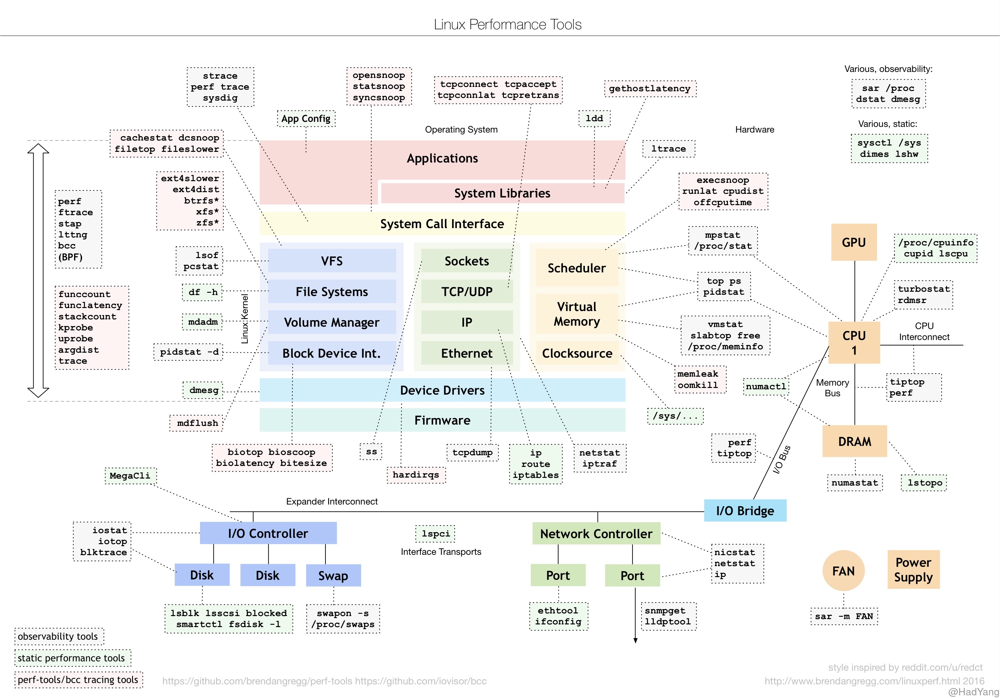

最近在逛博客时，发现有个海外程序员总结的 Linux 性能调试工具汇总，包含应用层、文件系统、内存、CPU等一系列的调试工具。这篇博客就介绍下这些工具，使用场景、概念以及说明。



## 系统函数库

### [ldd](https://man7.org/linux/man-pages/man1/ldd.1.html)


### [ltrace](https://man7.org/linux/man-pages/man1/ltrace.1.html)


## 系统调用


### [strace](https://man7.org/linux/man-pages/man1/strace.1.html)


### [perf trace](https://man7.org/linux/man-pages/man1/perf-trace.1.html)


## 文件系统

### [lsof](https://man7.org/linux/man-pages/man8/lsof.8.html)


### [df](https://man7.org/linux/man-pages/man1/df.1.html)

文件系统有自己的类型，包括 vfat、ext4等等

文件系统需要 mount 到目录结构上，才能被使用

https://superuser.com/questions/335252/dev-sda1-tmp-dev-shm


## 网络协议栈


## 进程资源


## 内存

rss
swap
buff/cache

```bash
# cat /proc/238/status
# 参考 https://man7.org/linux/man-pages/man5/proc.5.html

- VmPeak:         Peak virtual memory size.
- VmSize:         Virtual memory size.
- VmLck:          Locked memory size
- VmPin:          Pinned memory size (since Linux 3.2). These are pages that can\'t be moved because something needs to directly access physical memory.
- VmHWM:          Peak resident set size ("high water mark").  This value is inaccurate; see /proc/[pid]/statm above.
- VmRSS:          Resident set size.  Note that the value here is the sum of RssAnon, RssFile, and RssShmem. This value is inaccurate; see /proc/[pid]/statm above.
- RssAnon:        Size of resident anonymous memory.  (since Linux4.5).  This value is inaccurate; see /proc/[pid]/statm above.
- RssFile:        Size of resident file mappings.  (since Linux 4.5).This value is inaccurate; see /proc/[pid]/statm above.
- RssShmem:       Size of resident shared memory (includes System V shared memory, mappings from tmpfs(5), and shared anonymous mappings).  (since Linux 4.5).
- VmData:         Size of data, stack, and text segments.  This value is inaccurate; see /proc/[pid]/statm above.
- VmStk:          
- VmExe:          
- VmLib:          Shared library code size.
- VmPTE:          Page table entries size (since Linux 2.6.10).
- VmPMD:           Size of second-level page tables (added in Linux4.0; removed in Linux 4.15).
- VmSwap:         Swapped-out virtual memory size by anonymous private pages; shmem swap usage is not included(since Linux 2.6.34).  This value is inaccurate; see /proc/[pid]/statm above.
```


```bash
# cat /proc/meminfo
# https://access.redhat.com/documentation/en-us/red_hat_enterprise_linux/6/html/deployment_guide/s2-proc-meminfo

- MemTotal:           物理内存减去一部分预留占用和内核代码占用
- MemFree:            系统未使用的物理内存（会减去 Buffer/Cache）
- MemAvailable:           
- Buffers:            对原始磁盘块的临时存储，内核可以把分散的写集中起来，统一优化磁盘的写入，比如可以把多次小的写合并成单次大的写等等。
- Cached:            缓存从文件读取的数据。这样，下次访问这些文件数据时，就可以直接从内存中快速获取，而不需要再次访问缓慢的磁盘。
- SwapCached:          缓存置换到 Swap 的页面
- Active:           最近被使用的内存大小，Linux kernel设计了两种LRU list: active list 和 inactive list, 刚访问过的页面放进active list，长时间未访问过的页面放进inactive list，这样从inactive list回收页面就变得简单了。内核线程kswapd会周期性地把active list中符合条件的页面移到inactive list中，这项转移工作是由`refill_inactive_zone()`完成的。
- Inactive:           长时间未被使用的内存，可以被回收。如果inactive list很大，表明在必要时可以回收的页面很多；而如果inactive list很小，说明可以回收的页面不多。
- Active(anon):           至于在源代码中看到的ACTIVE_ANON和ACTIVE_FILE，分别表示anonymous pages和file-backed pages。用户进程的内存页分为两种：与文件关联的内存（比如程序文件、数据文件所对应的内存页）和与文件无关的内存（比如进程的堆栈，用malloc申请的内存），前者称为file-backed pages，后者称为anonymous pages。File-backed pages在发生换页(page-in或page-out)时，是从它对应的文件读入或写出；anonymous pages在发生换页时，是对交换区进行读/写操作。
- Inactive(anon):         
- Active(file):           
- Inactive(file):         
- Unevictable:            无法逐出的内存，一般是内存被锁定
- Mlocked:              
- SwapTotal:          
- SwapFree:           
- Dirty:          
- Writeback:          
- AnonPages:          
- Mapped:         
- Shmem:          
- Slab:           
- SReclaimable:           
- SUnreclaim:         
- KernelStack:            
- PageTables:         
- NFS_Unstable:           
- Bounce:         
- WritebackTmp:           
- CommitLimit:            
- Committed_AS:           
- VmallocTotal:           
- VmallocUsed:            
- VmallocChunk:           
- Percpu:               
- HardwareCorrupted:          
- AnonHugePages:          
- ShmemHugePages:         
- ShmemPmdMapped:         
- HugePages_Total         
- HugePages_Free          
- HugePages_Rsvd          
- HugePages_Surp          
- Hugepagesize:           
- DirectMap4k:            
- DirectMap2M:            
- DirectMap1G:            
```


正是如上的一系列动作，使得Page Cache与Buffer Cache(buffer_head)相互绑定。对上，在文件读写时，以page为单位进行处理。而对下，在数据向device进行刷新时，则可以以buffer_head(block)为单位进行处理。
https://lday.me/2019/09/09/0023_linux_page_cache_and_buffer_cache/

## IO设备


## 网络设备


## CPU