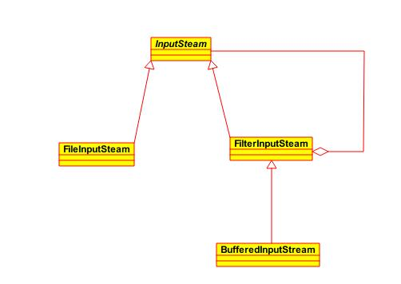

装饰模式，是面向对象编程领域中，一种动态地往一个类中添加新的行为的设计模式。就功能而言，修饰模式相比生成子类更为灵活，这样可以给某个对象而不是整个类添加一些功能。

<!--more-->

### 结构

装饰模式通过增加一个装饰类包裹原来的类，包裹的方式一般是通过在将原来的对象作为装饰类的构造函数的参数。装饰类实现新的功能，但是，在不需要用到新功能的地方，它可以直接调用原来的类中的方法。**装饰类必须和原来的类有相同的接口。**

> 装饰模式是类继承的另外一种选择。类继承在编译时候增加行为，而装饰模式是在运行时增加行为。

在实际应用中，Java I/O模型中使用了大量的装饰模式，下面我们就来看看Java I/O中装饰模式的结构：

其中`FilterInputStream`、`BufferedInputStream`都是装饰类，`FileInputStream`是组件类，也就是被装饰类。组件类和装饰类都继承自一个相同的祖先类，客户端调用装饰类的API，装饰类在完成自己的"装饰任务"后（或者之前），调用组件类的相关API。通过这样的 **组合和委托** 的方式来扩展组件的行为，这样我们就不需要修改现有的代码，很符合`开闭原则`。

### 优点

  - 装饰模式与继承关系的目的都是要扩展对象的功能，但是 **装饰者可以提供比继承更多的灵活性。**
  - 通过使用不同的具体装饰类以及这些装饰类的排列组合，设计师可以创造出很多不同行为的组合。

### 缺点

  - 这种比继承更加灵活机动的特性，也同时意味着更加多的复杂性。
  - 装饰模式会导致设计中出现许多小类，如果过度使用，会使程序变得很复杂。
  - 采用装饰模式在实例化组件时，将增加代码的复杂度，这时我们可以使用工厂模式或者生成器模式。

### 使用场景

  - 需要 **扩展一个类的功能，或给一个类添加附加职责。**
  - 需要动态的给一个对象添加功能，这些功能可以再动态的撤销。
  - 需要增加由一些基本功能的排列组合而产生的非常大量的功能，从而使继承关系变的不现实。
