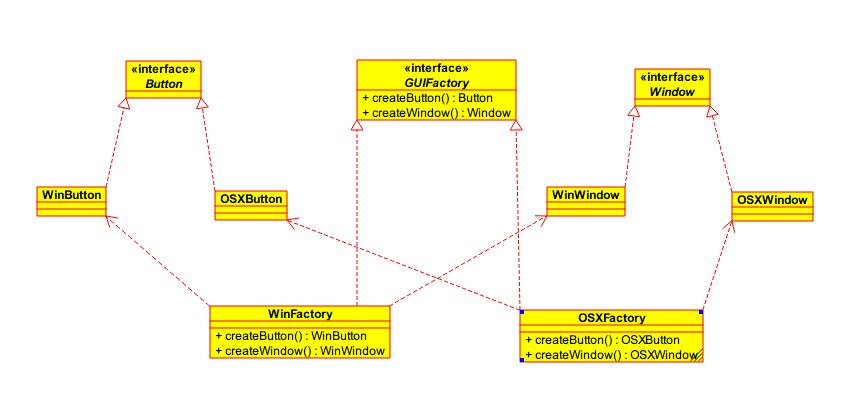

在面向对象程序设计中，`工厂`通常是一个用来创建其他对象的类或对象。**工厂是构造方法的抽象，用来实现不同的分配方案。**

工厂通常包含一个或多个方法，用来创建这个工厂所能创建的各种类型的对象。这些方法可能接收参数，用来指定对象创建的方式，最后返回创建的对象。

有时，特定类型对象的控制过程比简单地创建一个对象更复杂。在这种情况下，工厂就派上用场了。工厂可能会动态地创建产品类的对象，或者从对象池中返回一个对象，或者对所创建的对象进行复杂的配置，或者应用其他的操作。

<!--more-->

### 简单工厂模式

简单工厂模式其实并不是 [GOF](https://zh.wikipedia.org/wiki/%E8%AE%BE%E8%AE%A1%E6%A8%A1%E5%BC%8F%EF%BC%9A%E5%8F%AF%E5%A4%8D%E7%94%A8%E9%9D%A2%E5%90%91%E5%AF%B9%E8%B1%A1%E8%BD%AF%E4%BB%B6%E7%9A%84%E5%9F%BA%E7%A1%80) 23种设计模式之一 ，*而是一种良好的编码习惯*，它将客户程序从具体类解耦。通过传入不同的参数，返回不同类的对象。比如，一个程序要读取图像文件。程序支持多种图像格式，每种格式都有一个对应的`ImageReader`类用来读取图像。程序每次读取图像时，需要基于文件信息创建合适类型的`ImageReader`。这个选择逻辑可以包装在一个简单工厂中：

```Java
public class ImageReaderFactory {
    public static ImageReader imageReaderFactoryMethod(InputStream is) {
        ImageReader product = null;

        int imageType = determineImageType(is);
        switch (imageType) {
            case ImageReaderFactory.GIF:
                product = new GifReader(is);
            case ImageReaderFactory.JPEG:
                product = new JpegReader(is);
            //...
        }
        return product;
    }
}
```

### 工厂方法模式

工厂方法模式是一种实现了`工厂`概念的面向对象设计模式。就像其他创建型模式一样，它也是处理 **在不指定对象具体类型的情况下创建对象的问题。** 工厂方法模式的实质是 **定义一个创建对象的接口，但让实现这个接口的类来决定实例化哪个类。工厂方法让类的实例化推迟到子类中进行。**

#### 角色

`抽象工厂`：是工厂方法模式的核心，与应用程序无关。任何在模式中创建的对象的工厂类必须实现这个接口。
`具体工厂`：这是实现抽象工厂接口的具体工厂类，包含与应用程序密切相关的逻辑，并且受到应用程序调用以创建产品对象。
`抽象产品`：工厂方法模式所创建的对象的超类型，也就是产品对象的共同父类或共同拥有的接口。
`具体产品`：这个角色实现了抽象产品角色所定义的接口。某具体产品有专门的具体工厂创建，它们之间往往一一对应。

#### 结构

工厂方法模式在`Android`中的`ListView`适配器中有所展现。当我们自定义ListView适配器的时候，我们需要继承`BaseAdapter`并重写`getCount()`,`getView()`等几个方法。其中`getView()`方法就是工厂方法模式，`BaseAdapter`将创建视图的工作交给了子类，并由子类实现。


> `BaseAdapter`：抽象工厂；`MyAdapter`：具体工厂；`View`：抽象产品；`Button`：具体产品。

#### 使用场景

  - 只是需要一种产品，而不想知道也不需要知道究竟是哪个工厂为生产的，即最终选用哪个具体工厂的决定权在生产者一方，它们根据当前系统的情况来实例化一个具体的工厂返回给使用者，而这个决策过程这对于使用者来说是透明的。

### 抽象工厂模式

抽象工厂模式提供了一种方式，**可以将一组具有同一主题的单独的工厂封装起来**。在正常使用中，客户端程序需要创建抽象工厂的具体实现，然后使用抽象工厂作为接口来创建这一主题的具体对象。客户端程序不需要知道（或关心）它从这些内部的工厂方法中获得对象的具体类型，因为客户端程序仅使用这些对象的通用接口。**抽象工厂模式将一组对象的实现细节与他们的一般使用分离开来**。

> 抽象工厂模式内部其实是多个工厂方法模式的组合。

#### 结构



上图中`Button`和`Window`就是两种类型的产品，而`WinFactory`和`OSXFactory`就是两个抽象工厂的具体实现，将两种风格的GUI封装到一个类里面。

#### 使用场景

  用于创建产品家族或者想让制造的相关产品集合起来时，可以使用抽象工厂模式。

#### 优点

  - 它分离了具体的类
  - 它使得易于交换产品系列
  - 它有利于产品的一致性

#### 缺点

  - 难以支持新种类的产品。加入新的产品就需要修改接口，同时所有实现接口的类也需要修改，这是一个很繁重的工作。
