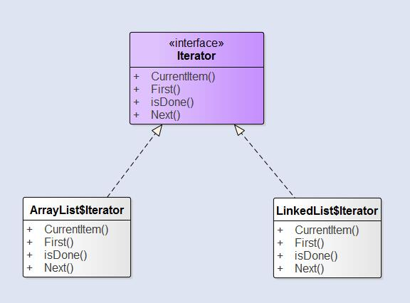

迭代器模式是一种最简单也最常见的设计模式。*它可以让用户通过特定的接口巡访容器中的每一个元素而不用了解底层的实现*。在Java集合框架中扮演着至关重要的作用。

<!--more-->

迭代器模式 **提供了一种方法顺序访问一个集合中的各个元素，而不暴露其内部的表示**。迭代器模式把在元素间游走的责任交给迭代器，而不是集合对象。各个集合只需要实现各自迭代器的逻辑，这样简化了集合的接口和实现，也让责任各得其所。

在[《设计模式》](https://zh.wikipedia.org/wiki/%E8%AE%BE%E8%AE%A1%E6%A8%A1%E5%BC%8F%EF%BC%9A%E5%8F%AF%E5%A4%8D%E7%94%A8%E9%9D%A2%E5%90%91%E5%AF%B9%E8%B1%A1%E8%BD%AF%E4%BB%B6%E7%9A%84%E5%9F%BA%E7%A1%80)中建议的迭代器接口为：

```Java
public interface Iterator
{
    public Object First();
    public Object Next();
    public boolean isDone();
    public Object CurrentItem();
}
```

### 结构

迭代器分为内部迭代器和外部迭代器，这里所说的是外部迭代器，客户通过调用`Next()`取得下一个元素。而内部迭代器则是由迭代器自己控制。在这种情况下，因为是由迭代器自行在元素之间游走，所以必须高效迭代器在游走过程中需要做什么，也就是说需要将操作传递给迭代器。由于客户不能控制迭代过程，所以内部迭代器比外部迭代器更没有弹性。



### 优点

  - 迭代器模式允许访问集合的元素，而不需要暴露它的内部结构。
