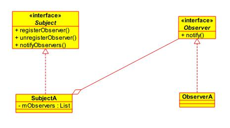

在观察者模式中，一个目标对象管理所有相依于它的观察者对象，并且在它本身的状态改变时主动发出通知。这通常透过呼叫各观察者所提供的方法来实现。此种模式通常被用来实时事件处理系统。

<!--more-->

### 结构

在观察者模式中分有两种角色：

  - `Subject`：发布者，通过保存在类中的观察者的引用发布消息。
  - `Observer`：观察者，对发布者的某种消息感兴趣，从而接受发布者发布的消息。

观察者模式以一种`松耦合`的方式在多个对象之间定义一对多的依赖关系，当一个对象的状态发生改变的时候，会通知依赖于它的对象，并根据新状态最初相应的反应。观察者模式在Android中使用的比较多，其中`onClickLisenter`就是一种观察者模式的实例，当用户点击`View`时，`View`会根据已经注册的监听器对点击事件进行分发。

> 松耦合：Subject不知道Observer的实现细节，只知道它实现了Observer接口。

### 优点

  - 观察者模式可以实现表示层和数据逻辑层的分离，并定义了稳定的消息更新传递机制，抽象了更新接口，使得可以有各种各样不同的表示层作为具体观察者角色。
  - 观察者模式在观察目标和观察者之间建立一个抽象的耦合。

### 缺点

  - 如果一个观察目标对象有很多直接和间接的观察者的话，将所有的观察者都通知到会花费很多时间。
  - 如果在观察者和观察目标之间有循环依赖的话，观察目标会触发它们之间进行循环调用，可能导致系统崩溃。

### 使用场景

  - 当抽象个体有两个互相依赖的层面时。封装这些层面在单独的对象内将可允许程序员单独地去变更与重复使用这些对象，而不会产生两者之间交互的问题。
  - 当其中一个对象的变更会影响其他对象，却又不知道多少对象必须被同时变更时。
  - 当对象应该有能力通知其他对象，又不应该知道其他对象的实做细节时。

观察者模式通常与`MVC`范式有关系。在`MVC`中，观察者模式被用来降低 `model` 与 `view` 的耦合程度。一般而言， `model` 的改变会触发通知其他身为观察者的 `model` 。而这些 `model` 实际上是 `view` 。

> 有多个观察者时，不能依赖特定的通知次序。
