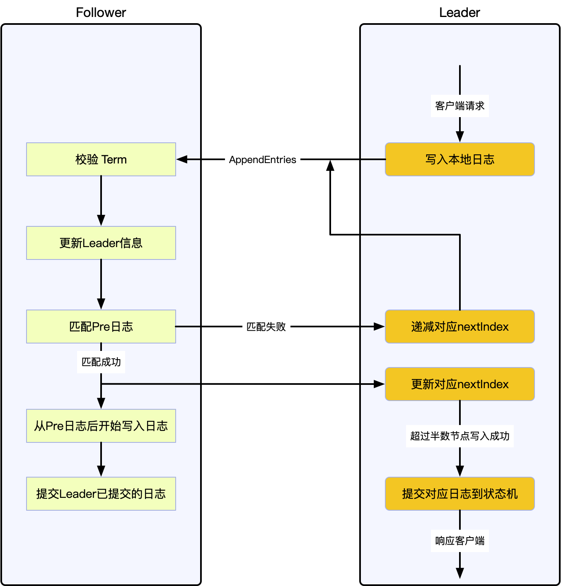

## 日志复制

当集群选举完成后，Leader 就会接收并处理客户端的请求。Leader 通过 `AppendEntries` 将客户端的请求打包为 `LogEntry` ，并行的发送给每个节点，请求在每个状态机顺序执行。当 `LogEntry` 被 “安全” 地复制，Leader 将 `LogEntry` 的请求在本地状态机执行，并返回结果给客户端。如果 Follower 由于故障或网络延迟等原因，未能返回成功，则 Leader 会持续重试 `AppendEntries` 直到 Follower 返回成功。

> 安全地复制：`LogEntry` 被复制到大多数节点

日志的组织形式如下图所示，每个 `LogEntry` 都包含一条命令和 Term 信息，Raft 通过Term 信息来区分 `LogEntry` 以及保证安全性。同时，每个 `LogEntry` 都还有一个正整数来标记其在日志中的位置。

当 `LogEntry` 被安全的复制后， Leader 会选择一个时间将 `LogEntry` 应用到本地状态机，这个 `LogEntry` 则被称为 **已提交**（在 ETCD 中的 Applied）。Raft 保证所有已提交的 `LogEntry` 都是持久的，并且最终会被所有状态机执行。当 Leader 将创建的 `LogEntry` 复制到超过半数的节点时，就可以提交这个 `LogEntry`，比如：上图中的第五个 `LogEntry` $e_5$。当 $e_i$ 被提交时，所有 $e_j$ $j<i$ 的 `LogEntry` 也都会被提交，即使是 **前一个任期** 的。

Leader 会追踪最新的已提交 `LogEntry`，并将其放在 `AppendEntries` 请求中，这样即使节点故障，当其恢复时也能感知到。一旦 Follower 发现某个 `LogEntry` 已提交，则 Follower 会将其应用到本地状态机。

## 日志一致性

Raft 的日志机制让整个集群的行为十分简单和可预测，同时也是保证安全性的重要环节。Raft 保证如果两个日志序列包含具有相同 Log Index 和 Term 的 `LogEntry`，则直到给定 Log Index 的所有 `LogEntry` 中的都是相同的，这个属性被称为 **日志一致性**。Raft 通过以下两个属性来保证日志一致性：

1. 如果不同的日志序列中的两个 `LogEntry` 具有相同的 Log Index 和 Term，那么这两个 `LogEntry` 包含相同的命令
2. 如果不同的日志序列中的两个 `LogEntry` 具有相同的 Log Index 和 Term，那么这两个 `LogEntry` 之前的所有 `LogEntry` 均一致

Leader 在同一 Term 内不会创建具有相同 Log Index 的 `LogEntry`，并且在日志复制过程中，也不会修改 `LogEntry` 的相关信息，因此第一条属性成立。

当 Leader 在发送 `AppendEntries` 请求时，会将本地最新日志的前一个日志的 Log Index 和 Term 添加到请求中，如果 Follower 在其本地日志中没有匹配上前一个日志，则拒绝本次请求，这就是 `AppendEntries` 的 **日志一致性校验**。这个日志一致性校验就保证了第二条属性，可通过以下步骤进行归纳：

- 初始化状态下，由于没有日志，所以 “日志一致性” 满足
- 当日志增长时，日志一致性校验可以保证 “日志一致性”

最后，只要 `AppendEntries` 返回成功，则 Leader 就知道 Follower 的日志与自己最新日志之前的日志保持同步。

### 不一致的处理

在正常状态下，Leader 和 Follower 的日志均保持一致， `AppendEntries` 的日志一致性校验也不会失败。但是当 Leader 故障时，就可能导致不一致的情况，比如：Leader 故障前，没能把日志复制到所有的节点。这种不一致可能同时在多个节点出现，下图展示了 Follower 与新的 Leader 不一致的情况。Follower 可能缺少了一些 Leader 上的日志，可能有多余的日志，也可能两种情况都存在。

上图中，当新 Leader 被选出后，Follower 上日志的状态可能为 a-c 这三种，其中每个方格里的数字表示日志的 Term。（a）表示 Follower 上的日志有缺少，（b）表示 Follower 上的有未提交的日志，（c）表示即有缺少也有多余未提交的日志。

Raft 算法在处理日志不一致的时候，采取 **强制同步** 的方式，将 Leader 的日志强制覆盖本地的日志。为了将 Follower 的日志状态与自己同步，Leader 需要找到自己的日志和 Follower 日志的公共祖先，就好比两个分叉的链表，需要找到分叉的那个 `LogEntry`，比如下图中 Log Index 为 3 的 `LogEntry`。

在找到这个 `LogEntry` Base 后，Leader 将之后的 `LogEntry` 按顺序发送给 Follower，Follower 则从 Base 开始覆盖本地日志。这里的所有操作，均通过 `AppendEntries` 请求完成。

Leader 为每个 Follower 都记录一个变量 $nextIndex$，表示下一个需要发送给 Follower 的日志索引。当节点转变为 Leader 时，每个 Follower 的 $nextIndex$ 均初始化为下一个 `LogEntry` 的索引，在上图中为 7。

如果 Follower 的日志与 Leader 不一致，则 `AppendEntries` 会返回失败，并且 Leader 会递减 $nextIndex$ 再次发起 `AppendEntries`。最终，$nextIndex$ 会到达一个点，在这个点上 Follower 和 Leader 的 `LogEntry` 一致。这时，`AppendEntries` 的日志一致性校验就会成功，Follower 删除不一致的日志，并把 Leader 的日志追加到本地。这样持续追加，Follower 的日志就和 Leader 的日志保持一致。

Raft 的日志复制主要是通过 `AppendEntries` 请求进行交互，其处理过程比较复杂。下图按节点的角色不同，展示了整个复制过程的处理。

### 可用的优化

上面有提到，当不一致发生时，Leader 需要通过请求 “探测” 出一个 Base 节点。理论上来说，这种 “探测” 是低效率的，可以通过修改通信协议，比如：当日志一致性校验失败时，Follower 返回请求 Term 里最小的 Log Index，这样就可以大量减少这种重试。但 Raft 设计者认为，不一致是不常发生的，并且不会有这么多不一致的日志。这种优化会增加算法的复杂度，所以 Raft 算法没有进行这个优化。

## 总结

在这种日志复制的机制下，为了将集群日志恢复为一致的，Leader 不需要进行任何特殊的操作，只需要和正常情况下发送 `AppendEntries` 请求，在日志一致性校验的作用下，不一致的日志就会自动的变为一致。这样 Leader 就只会追加日志，而不需要删除或覆盖自己的日志。

