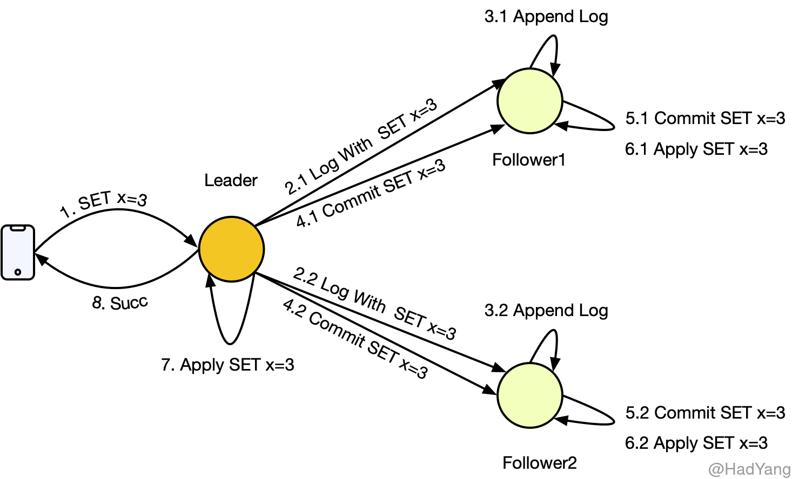
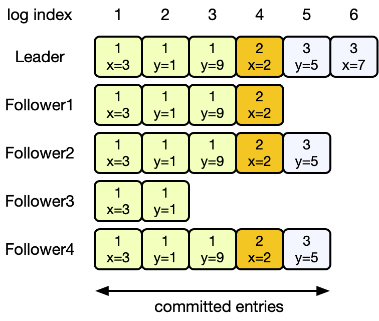
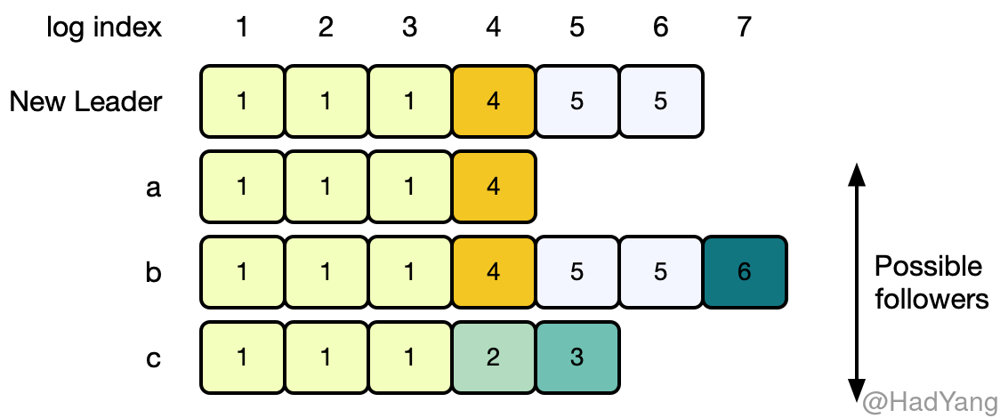
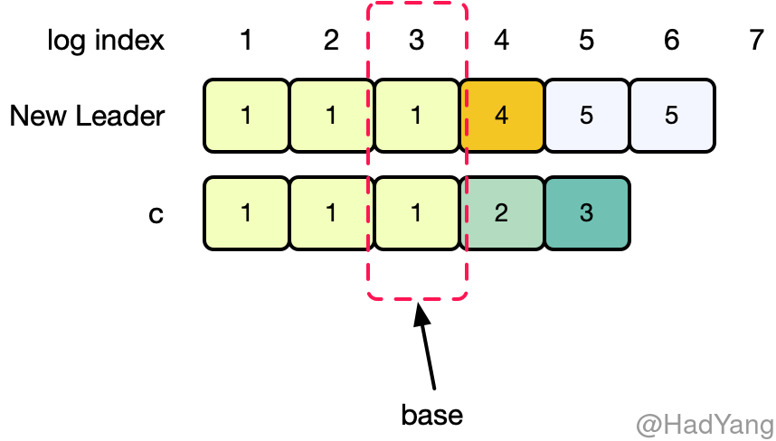

## 日志复制

Raft 中日志的组织形式如下图所示，每个 **日志条目**（LogEntry）都包含一条命令、 **任期**（Term）信息，以及一个正整数 **索引（Log Index）** 来标记其在日志中的位置。索引在不同的任期可以重复，但在同一任期内必须唯一。

日志条目在节点中的状态通过两个变量控制：`CommitIndex` 和 `LastApplied`，通过这两个变量就可以让日志条目在以下三个状态中进行转换：

- **已写入**：日志条目 Append 到节点上，未进行其他操作，日志条目可以只存在内存中
- **已提交**：Leader 把日志条目复制到集群中大多数节点，Leader 通过更新 `CommitIndex` 将日志条目置为提交状态。
- **已应用**：Leader 通过 `AppendEntries` 请求将自己的 `CommitIndex` 通知给其他节点，其他节点进行提交操作，当大多数节点提交完成后，Leader 更新自己的 `LastApplied` 并将日志条目中的命令应用到状态机中。

日志状态通过 `AppendEntries` 请求完成的，如果 Follower 由于故障或网络延迟等原因，未能返回成功，则 Leader 会持续重试 `AppendEntries` 直到 Follower 返回成功。当 Leader 应用某条日志条目后，就可以返回给客户端了。

当集群中大多数节点，把日志条目提交后，这个日志条目就是 **持久** 的,并且最终会被所有状态机执行。当 Leader 将创建的日志条目复制到超过半数的节点时，就可以提交这个日志条目，比如：下图中的第五个日志条目$e_5$。当 $e_i$ 被提交时，对于任意 $j<i$ 日志条目 $e_j$ 也都会被提交，即使是 **前一个任期** 的。

Leader 会将自己的 `CommitIndex`，放在 `AppendEntries` 请求中，这样即使其他节点故障，当其恢复时也能感知到。一旦 Follower 发现某个日志条目已提交，则 Follower 会将其应用到本地状态机。

## 日志一致性

Raft 的日志机制让整个集群的行为十分简单和可预测，同时也是保证安全性的重要环节。Raft 保证如果两个日志序列包含具有相同 **索引** 和 **任期** 的日志条目，则直到这个日志条目的所有日志条目都是相同的，这个属性被称为 **日志一致性**。Raft 通过以下两个属性来保证日志一致性：

1. 如果不同的日志序列中的两个日志条目具有相同的 索引 和 任期，那么这两个日志条目包含相同的命令
2. 如果不同的日志序列中的两个日志条目具有相同的 索引 和 任期，那么这两个日志条目 **之前** 的所有日志条目均一致

Leader 在同一任期内不会创建具有相同索引的日志条目，并且在日志复制过程中，也不会修改日志条目的相关信息，因此第一条属性成立。

当 Leader 在发送 `AppendEntries` 请求时，会将本地最新日志的前一个日志的索引和任期信息添加到请求中，如果 Follower 在其本地日志中没有匹配上前一个日志，则拒绝本次请求，这就是 `AppendEntries` 的 **日志一致性校验**。这个日志一致性校验就保证了第二条属性，可通过以下步骤进行归纳：

- 初始化状态下，由于没有日志，所以 “日志一致性” 满足
- 当日志增长时，日志一致性校验可以保证 “日志一致性”

最后，只要 `AppendEntries` 返回成功，则 Leader 就知道 Follower 的日志与自己最新日志之前的日志保持同步。

### 日志截断

在正常状态下，Leader 和 Follower 的日志均保持一致， `AppendEntries` 的日志一致性校验也不会失败。但是当 Leader 故障时，就可能导致不一致的情况，比如：Leader 故障前，没能把日志复制到所有的节点。这种不一致可能同时在多个节点出现，下图展示了 Follower 与新的 Leader 不一致的情况。Follower 可能缺少了一些 Leader 上的日志，可能有多余的日志，也可能两种情况都存在。

上图中，当新 Leader 被选出后，Follower 上日志的状态可能为 a-c 这三种，其中每个方格里的数字表示日志的 Term。（a）表示 Follower 上的日志有缺少，（b）表示 Follower 上的有未提交的日志，（c）表示即有缺少也有多余未提交的日志。

Raft 算法在处理日志不一致的时候，采取 **日志截断** 的方式，将 Leader 的日志强制覆盖本地的日志。为了将 Follower 的日志状态与自己同步，Leader 需要找到自己的日志和 Follower 日志的公共祖先，就好比两个分叉的链表，需要找到分叉的那个 `LogEntry`，比如下图中 Log Index 为 3 的 `LogEntry`。

在找到这个日志条目Base 后，Leader 将之后的日志条目按顺序发送给 Follower，Follower 则从 Base 开始覆盖本地日志。这里的所有操作，均通过 `AppendEntries` 请求完成。

Leader 为每个 Follower 都记录一个变量 `nextIndex`，表示下一个需要发送给 Follower 的日志索引。当节点转变为 Leader 时，每个 Follower 的 `nextIndex` 均初始化为下一个日志条目的索引，在上图中为 7。

如果 Follower 的日志与 Leader 不一致，则 `AppendEntries` 会返回失败，并且 Leader 会递减 `nextIndex` 再次发起 `AppendEntries`。最终，`nextIndex` 会到达一个点，在这个点上 Follower 和 Leader 的日志条目一致。这时，`AppendEntries` 的日志一致性校验就会成功，Follower 删除不一致的日志，并把 Leader 的日志追加到本地。这样持续追加，Follower 的日志就和 Leader 的日志保持一致。

在这种日志复制的机制下，为了将集群日志恢复为一致的，Leader 不需要进行任何特殊的操作，只需要和正常情况下发送 `AppendEntries` 请求，在日志一致性校验的作用下，不一致的日志就会自动的变为一致。这样 Leader 就只会追加日志，而不需要删除或覆盖自己的日志。

## 可用的优化

上面有提到，当不一致发生时，Leader 需要通过请求 “探测” 出一个 Base 节点。理论上来说，这种 “探测” 是低效率的，可以通过修改通信协议，比如：当日志一致性校验失败时，Follower 返回请求 Term 里最小的 Log Index，这样就可以大量减少这种重试。但 Raft 设计者认为，不一致是不常发生的，并且不会有这么多不一致的日志。这种优化会增加算法的复杂度，所以 Raft 算法没有进行这个优化。

## 前任的日志

当 Leader 将日志复制到超过半数节点后，就会提交这个日志。如果在提交前，Leader 故障了，那么新任 Leader 会尝试完成这个日志的复制过程。然而，新 Leader 不能很快的计算出之前的日志是否已经复制到超过半数的节点。

在上图中展示了一种情况，如果 Raft 新节点 “手动” 提交日志条目所可能发生的情况。

- （a）S1 作为任期 2 的 Leader，在索引 2 的位置写入新条目，并且复制到部分节点，未提交。
- （b）S1 故障，S5 被选举为任期 3 的 Leader，在索引 2 的位置写入新条目
- （c）S5 故障，S1 重新被选举为任期 4 的 Leader，在索引 3 的位置写入条目，并且继续复制之前任期的日志
- （d）这里就有可能出现两种情况
  - （d1）如果在上一步，S1 复制完成后提交了索引 2 的日志，并且返回给客户端，那么当 S1 故障，S5 重新被选举为任期 5 的 Leader，就会覆盖已提交的日志
  - （d2）S1 继续复制索引 3 的日志，并且在复制到大多数节点后进行提交，这时索引 2 的日志条目也被提交，并且 S5 不会再被选举为 Leader

在上面的示例中，由于 S1 “手动” 提交了日志，导致新 Leader 可以覆盖已提交的日志。为了防止这种情况， Raft 采取上图中 d2 的方式。新 Leader 不会提交前任的日志，而是提交当前任期的日志，根据 “日志一致性” 原则，前任的日志也会被提交和应用。当然，如果新 Leader 能将日志复制到所有节点上，那么它也可以直接提交前任的日志，但 Raft 为了简单没有选择这样做。

