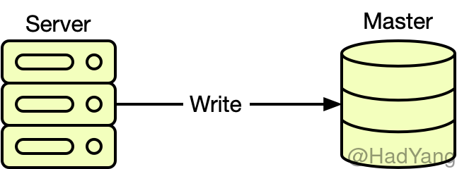

复制分为 **计算复制** 和 **数据复制**，不论是计算复制还是数据复制，都是为系统提供更好的可用性、可靠性以及吞吐量。计算复制就是我们常用的集群部署方式，将服务部署在集群中，并通过 Nginx 等中间件提供 *负载均衡* ，将计算能力复制到多个节点。


上图中 a 就是一个单点计算系统，所有用户请求均在单个服务器上执行。图 b 将计算能里复制到多个节点，形成服务集群，并通过负载均衡服务器（LB）对请求进行反向代理。在实际的系统中，在 LB 可能不止一层。


数据复制就是将数据复制到多个节点，形成冗余数据。典型的单节点数据系统如下图，服务器所有数据均在一个节点。在这种结构中，数据是不安全的，同时服务的可用性也有风险。



数据复制的类型可以从不同方面划分几种，首先从 **可写** 节点的个数，分为 **主从复制** 、**多主复制** 以及 很少见的 **无主复制**。通过节点复制时的通信方式分为 **同步复制**、**异步复制**和 **半同步复制**。


## 主从复制

在主从复制结构中，集群只有一个可写节点（Master），其他节点（Slave）从 Master 进行数据复制，下图展示了一种主从复制的结构。Master 可以接受读写请求，Slave 根据需要可以接受读请求，或者不接受请求，完全作为数据备份使用。


图中，Master 与 Slave1 是 **同步复制**，同步复制即用户在写 Master 时，Master 同步将请求转发到 Slave1，当 Slave1 完成写请求返回，才返回用户本次写请求成功。可以看到，同步复制实际会增加用户写操作的耗时，降低系统吞吐量。但是同步复制的好处就是能保证数据的一致性和安全性，在 Master 节点失效后，Slave1 能被当作新的 Master‘，并且无数据丢失。

Master 与 Slave2 是 **异步复制** ，异步复制不需要与用户请求同步进行，其优点就是不会增加用户写操作耗时，但缺点就是主从节点会有数据延迟，延迟的时间与系统负载、网络情况都有关。并且，当主节点失效时，若从节点未能即使将主节点数据复制，则会丢失部分数据。

根据不同复制方式的组合，有 **全同步复制**、 **半同步复制** 和 **异步复制**，采用何种复制方式，主要是在可用性和可靠性之间的平衡。上图就是一种半同步复制，在保证数据的安全性的同时，尽量减少对系统吞吐量的影响。

## 多主复制

多主复制即系统中有多个节点可接受写请求，并且主节点之间也要进行数据复制。在多主复制的系统中，最重要的是解决 **数据冲突** 和 **循环复制** 的问题。


当同一项数据在两个主节点均进行写入时，需要对数据冲突进行处理。处理的方式有 **最后写入者胜利（LWW）**、**节点优先级覆盖**、**值拼接** 以及 **用户处理**。当然我们可以通过把对单一数据修改集中到一个节点，来避免冲突。但是当该节点失效后，请求被路由到其他主节点，那么同样需要处理数据冲突。

当主节点之间进行数据复制时，需要考虑循环复制的问题，即 Master2 复制了 Master1 的数据 A，Master1 又将数据 A 从 Master2 复制回来。可以通过在复制信息中添加标记来处理，防止循环复制。

## 复制协议

根据复制协议的不同，可以把数据复制分为 **基于操作的复制** 和 **基于日志的复制**。

一般我们操作数据都是通过命令或者语句，基于操作的复制就是复制这些命令或语句，并在当前节点再次执行。基于操作的复制在很多场景下会导致数据不一致，比如命令中涉及获取当前时间、有自增序列或者带触发器等等。

基于日志的复制又可以 **基于预写日志（WAL）** 或者 **基于行逻辑日志**。WAL 是数据库操作数据的操作日志，每个写操作前都会先写入 WAL，WAL 的数据非常底层：包括哪个磁盘块的哪些字节发生变化。这使得 WAL 与存储引擎紧密耦合，不利于数据库版本兼容或异构的存储引擎。

行逻辑日志将存储细节与数据隔离，逻辑日志通常包含一系列记录来描述表中行的写请求。如果一个事务涉及多行修改，则会有多条日志记录，并最后标记事务完成。MySQL 的 binlog 就是行逻辑日志。

## 数据复制与分布式一致性

复制是指通过网络在多台计算机上保存相同的数据副本。在互联网架构中，大量使用复制是因为大部分的使用场景下，都会对系统的可用性有要求，比如至少有一个服务可用。并且对系统的可靠性（数据的正确性）也有要求，当数据拥有多个副本时，系统就能容忍数据损坏。

复制也能有效提高系统的吞吐量，同时，我们利用复制，可以使数据副本在物理上离用户更近，进而降低响应时间。复制能使系统有更好的可扩展性，来应对更高的系统负载。

复制能给系统带来这么多好处，其包含的问题也是明显的，最重要的就是数据一致性问题。在复制系统中，一致性和可用性是一个平衡的过程。想要拥有强一致性，那么就得牺牲系统性能甚至是可用性。

## 状态机复制

在计算机领域，状态机复制（状态机方法）是一种通用的通过复制构建 **可容错** 服务的方式。

### 分布式环境

单点系统是构建服务的最简单方式，但这样的服务的容错性太查，全部依赖服务当前运行的机器。通常来说，这样的容错性是无法接受的，这样就需要多个在物理上互相独立的机器，将单点服务复制到多个机器上，并通过算法来协调客户端和这些副本的交互。这样构建的分布式服务有更好的容错性。


### 状态机

状态机由 **一组状态**、 **一组输入**、 **一组输出**、 **一个状态转换函数**、 **一个输出函数** 以及 **初始状态** 组成。状态机从 “初始” 状态开始，每一个输入都被传入转换函数和输出函数，以生成一个新的状态和输出。在新的输入被接收到前，状态保持不变，而输出同时被传输给恰当的接受者。可以用代码来描述这个过程：

```py
state = init
log = []
while true:
  on receiving cmd from a client:
    log.append(cmd)
    state, output = apply(cmd, state)
    send output to the client
```

分布式环境下的的状态机需要是 **确定的**：多个状态机的副本从初始状态开始，按同样的顺序接受同样的输入，并且产生通向输出，到达同样的状态。


### 容错

**确定性是提供容错能力的理想特征** 。在一个多副本的系统中，如果一个副本出错，那么它的状态和输出必然与其他副本不一致。按这个逻辑推断，要提供容错的最小副本个数为三个，当一个副本出错，可以比较另外两个的状态和输出。如果系统只有两个副本，则我们无法判断哪个副本是正确的。可见三个副本的系统中，最多支持一个副本的失效，如果超过一个副本失效，那么三个副本的状态和输出就会不一致，并且无法选择出一个正确的状态和输出。

通常来说，在一个支持 $F$ 个副本失效的系统中，系统需要 $2\times F+1$ 个副本这个数量被称之为 **Quorum**。多余的副本是用来证明哪些副本是正确的，哪些是错误的。

上述这些推论都假设副本只遇到随机的独立故障，例如内存错误或硬盘崩溃。试图说谎，欺骗或串通的副本导致的故障也可以通过状态机复制进行处理。失效的副本并不要求停止服务，它们也可以继续进行操作，包括产生错误的输出。


#### 失败停止

理论上来说，如果失效的副本保证失效后停止服务，不产生输出，只需要 $F+1$ 个副本就可以保证容错。但是没有系统能达到这种效果，因为这需要在实现 “故障-停止” 的语义。


#### 拜占庭错误

副本向不同副本发送不同值，即存在说谎的情况，这种错误被称为拜占庭式错误。拜占庭式错误可能是随机的，虚假的错误，也可能是恶意的智能攻击。非加密的 $2\times F + 1$ 副本足以抵抗所有非恶意的拜占庭式故障。恶意攻击需要通过消息签名来实现 $2\times F + 1$ 的容错，或者可以应用非加密技术，但是副本数必须增加到 $3\times F + 1$。

**PoW**（Power of Work） 工作量算法就是拜占庭容错的算法，一般是要求用户进行一些耗时适当的复杂运算，并且答案能被服务方快速验算，以此耗用的时间、设备与能源做为担保成本。比特币就是采用的 Pow 算法，攻击者想要攻击比特币就必须拥有全网一半以上的算力，这使得攻击非常昂贵，几乎不可能。


### 状态机复制

前面的直观讨论暗含一种用于根据状态机实现容错服务的简单技术：

1. 将状态机的多个副本防止在多个相互独立的机器上
2. 接受用户请求，并作为状态机的输入
3. 为输入选择一个顺序
4. 按选择的顺序，在每个副本上执行输出函数
5. 状态机将输出响应给客户端
6. 观察每个副本在状态和输出上的差异


#### 输入排序

在分布式环境下构建状态机最关键的就是对输入进行排序。如果给定相同的输入，所有无故障副本都会到达一直的状态和相同的输出，那么输入在每个副本提交的顺序就至关重要。

对分布式系统来说，信息交换有两个通道：**可见通道**（Visibel Channel）、**隐藏通道**（Hidden Channel）

- **可见通道**： 通道两侧至少有一端在系统中，比如 Client <-> Serve 或者 Server <-> Server
- **隐藏通道**： 通道两侧均不再系统中，比如 Client <-> Client

隐藏通道对系统来说是不可知的。当所有信息交换的通道都是 “可见通道” 时，可以从信息交换的模式中推断出 **因果关系（偏序关系）**。如果状态机的输入按因果关系执行，那么也是可以保证无故障副本的一致状态和输出。

但在现实环境中，“隐藏通道” 是必然存在的。因此需要使用一种较弱的排序方式，这种顺序可以通过对 “可见通道” 的事件进行投票得到。

这种在多个相互独立的实体中决定一个值的问题，被称为 **共识问题**。可以通过对一系列的值进行共识，来决定这些值的顺序。当分布式系统发生 “网络分区” 时，这种共识问题就会变得更加困难。可以通过原子时钟、更少的消息数量、更少的消息交换回合以及更小的消息体，来优化共识算法。


#### 响应客户端

客户端的请求被解释为输入传递给状态机，以适当的顺序进行执行并输出。每个副本都是独立的执行并输出结果的，所有的无故障节点均会产生相同的输出。集群中大多数副本产生的一致输出会被返回给客户端，这样有故障副本的无效输出就会被过滤。


#### 故障检测

由于网络延迟、机器响应等原因，副本的故障检测比较困难。无故障的副本将始终保持相同的状态，产生相同的输出。通常情况下，状态或输出与大多数副本不一致的副本则被标记为有故障的。

一种通用的做法是，将当前副本状态和最近的输出的校验码广播给其他副本。当每个副本上的故障检测进程发现本地副本已经故障后，就重启本地副本。


#### FLP 结论

FLP 结论是基于异步系统模型做的证明，其表明如果节点存在失效的风险，则不存在总能达成共识的稳定算法。FLP 结论的模型中，算法都不能使用时钟或者超时机制，在实际的应用中，通常都会使用 **超时** 和同步来实现稳定的算法。

## 状态机复制与传统复制

从状态机的概念出发，可以发现传统的复制（主从、多主）也是一种状态机，每个节点从相同的状态开始，执行一系列相同的操作以达到相同状态。这两个概念有如下区别：

- 状态机复制提供 **容错机制**：集群可以实现一定程度的节点失效，不会丢失已产生共识的操作
- 状态机复制提供 **自动故障恢复**：当主节点失效后，能自动进行选举

状态机复制就是可用性、一致性以及可靠性的平衡。在状态机复制集群中不会出现状态回滚，状态只会向前进行。

## 参考文档

- [Consensus for State Machine Replication](https://decentralizedthoughts.github.io/2019-10-15-consensus-for-state-machine-replication/)
- [The State Machine Approach:A Tutorial](https://www.cs.cornell.edu/fbs/publications/ibmFault.sm.pdf)
- [The Byzantine Generals Problem](http://research.microsoft.com/users/lamport/pubs/pubs.html#byz)
- [State machine replication](https://en.wikipedia.org/wiki/State_machine_replication)