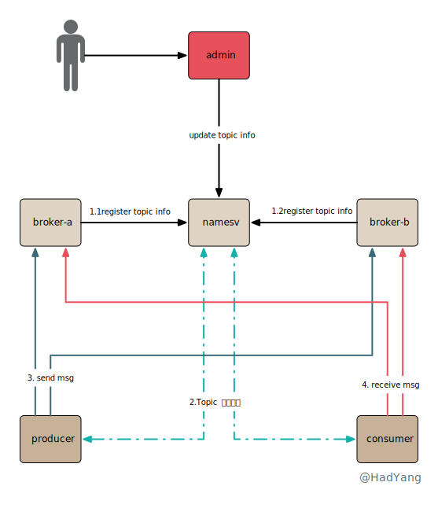

## 关键特性

- **事务/半事务消息**：本地事务和发送消息操作可以被定义到全局事务中，解决本地事务和消息发送的原子问题，提供分布式事务的 **最终一致性能力**
- **顺序消息**：RocketMQ 支持单个 topic 下的 **全局 FIFO 顺序**，以及单个 topic 下按某个 key 进行分区的 **分区 FIFO 顺序**
- **定时/延迟消息**：定时/延迟消息发送到 RocketMQ 后，会暂存到 `SCHEDULE_TOPIC_XXXX` topic 中，等待特定时间投递给真正的 topic
- **单向消息**：本地投递消息后，不需要 RocketMQ 进行确认，性能最高但可能丢消息
- **消息标签**：RocketMQ 支持对消息增加 Tag，并且消费时可以在 RocketMQ 服务端对 Tag 进行过滤
- **At Least Once**：每个消息至少投递一次，消费者获取到消息，处理成功后才会对消息进行 ACK，如果未 ACK， RocketMQ 会进行重试
- **消息回溯**：将已成功消费的消息再次消费，RocketMQ 支持毫秒级别的回溯
- **消息重试**：当消息消费失败时，对于顺序消息 RocketMQ 会自动不间断重试，无序消息会根据重试次数增加重试间隔
- **死信队列**：当消息重试到达最大次数后，消息会被放入一个特殊的死信队列，不再进行重试
- **消息重投**：当消息发送失败时，Producer 会重试发送
- **流量控制**：当消息发送过快时，Broker 根据策略拒绝 Send 流量；当消费者消费过慢时，会降低拉取消息的频率


## 性能对比

性能测试对比下 Kafka 和 RocketMQ 在 topic 增加时的表现。测试配置：每个 topic 有 8 个分区，每个 topic 都有一个订阅者，并且 topic 数量逐步增加。


通过上面性能测试数据，我们能看到 RocketMQ 和 Kafka 在不同的 topic 量级下，都能平衡 Send 和 Receive 速率，没有大量的消息积压。但也存在以下区别：
- 在 topic 较少时，Kafka 的吞吐量、延迟更低
- 在 topic 从 68 到 256 的增长过程中， Kafka 性能劣化 98%
- 在 topic 从 68 到 256 的增长过程中， RocketMQ 性能仅劣化 16%

Kafka 劣化的如此明显和其实现方式有关，Kafka 对每个 topic 每个分区都存储一个文件。当 topic 个数增加时，这种将消息分散到多个文件的存储方式会加剧 IO 竞争，导致性能下降。

相反，RocketMQ 在物理上只存在一个文件，topic 和 分区都是逻辑概念，所以 topic 增加不会导致 RocketMQ 性能的急剧下降。因此，**Kafka 适合少量 topic 的场景**， **RocketMQ 适合多 topic 场景**。

## 系统架构

Topic 是一组相似消息的集合，每个消息都属于某个 Topic，RocketMQ 中的 Topic 属于逻辑结构。在一次消息的发送中，RocketMQ 多种不同组件分工合作，包含管理 Topic 路由的 NameServer、存储消息的 Broker、以及发送消息的 Producer和处理消息的 Consumer。

- **NameServer** 保存集群的元信息，最主要的就是 Topic 路由，路由数据通过 Broker 上报，存储在本地内存中。一个集群中可以配置多个 NameServer 以提供容错保障，NameServer 之间独立无感知。
- **Broker** 存储消息数据的模块，一个集群中可以部署多个 Broker 主节点，一个 Broker 主节点可以部署多个从节点，提供高可用方案。 Broker 在启动时会初始化系统默认的 Topic，以完成某些功能。一个 Topic 可以存储在多个 Broker 主节点中，当 Broker 启动时，会对集群中所有 NameServer 进行注册，将自己的 Topic 信息上报。
- **Producer** 消息发送方，通过 NameServer 获取消息路由，将消息投递到 Broker 上。对于事务消息还需要实现事务查询接口。
- **Consumer** 消息消费方，有集群和广播两种消费方式。通过 NameServer 获取消息路由，并定时从 Broker 拉取消息。在客户端的实现上，有 Push 和 Pull 两种方式，本质上都是拉取的方式， Push 只是 SDK 自动完成拉取工作。
- [**Admin**](https://rocketmq-1.gitbook.io/rocketmq-connector/kai-fa-zhe-zhong-xin/mqadmin-cao-zuo-zhi-nan) 集群管理平台，可以对集群进行监控，修改路由信息等。



## 路由机制

消息系统中最重要的就是路由，消息从何处来、存放到何处、被谁消费，这都是通过路由机制来决定的，RocketMQ 中的 NameServer 承担起了管理路由的职责。在 Producer/Consumer 启动时，从 NameServer 获取 Topic 的路由，其中包括 Borker/Queue 的相关信息。

```java
public class TopicRouteData extends RemotingSerializable {
    private String orderTopicConf;
    private List<QueueData> queueDatas;
    private List<BrokerData> brokerDatas;
    private HashMap<String/* brokerAddr */, List<String>/* Filter Server */> filterServerTable;
}

public class QueueData implements Comparable<QueueData> {
    private String brokerName;
    private int readQueueNums; //当前Broker上读队列个数
    private int writeQueueNums; //当前Broker上写队列个数
    private int perm; //Topic的读写权限 6=可读可写
    private int topicSynFlag;
}

public class BrokerData implements Comparable<BrokerData> {
    private String cluster;
    private String brokerName;
    private HashMap<Long/* brokerId */, String/* broker address */> brokerAddrs;
}
```

可以看到，`QueueData` 中 `readQueueNums` `writeQueueNums` 控制 Borker 上队列的个数。在 Producer/Consumer 获取到路由信息后，会根据这两个参数的配置来构建 `MessageQueue`。在客户端的视角来看， MessageQueue 和 Broker 上的 ConsumerQueue 是对应的。

```java
public static TopicPublishInfo topicRouteData2TopicPublishInfo(final String topic, final TopicRouteData route) {
    ...
    for (int i = 0; i < qd.getWriteQueueNums(); i++) {
        MessageQueue mq = new MessageQueue(topic, qd.getBrokerName(), i);
        info.getMessageQueueList().add(mq);
    }
    ...
}

public static Set<MessageQueue> topicRouteData2TopicSubscribeInfo(final String topic, final TopicRouteData route) {
    ...
    for (int i = 0; i < qd.getReadQueueNums(); i++) {
        MessageQueue mq = new MessageQueue(topic, qd.getBrokerName(), i);
        mqList.add(mq);
    }
    ...
}
```

Producer/Consumer 会根据 MessageQueue 进行发送/拉取消息。注意，**当写队列个数大于读队列个数时，多出来的队列无法被消费**。

## 消息存储

一次典型的 RocketMQ 消息由 **生产者**（Producer）同步/异步发送到 **Brocker**，每个消息都必须确定一个 **Topic**。Brocker 将消息持久化存储在本地，消息可以由 **消费者** 从 Broker 拉取，或 Broker 推送到消费者。每个消费者都归属于一个 **消费组**，同一个消息（广播消息除外）在一个消费组里只能被消费一次。消费者在获取到消息后执行本地业务代码，成功后发送 Brocker 确认消息。

RocketMQ 的很多关键特性都是其持久化存储机制提供的，下面我们来看下消息是如何存储和索引的。Broker 中 `DefaultMessageStore` 处理存储的核心逻辑，所有消息都存储到 CommitLog，然后通过 **异步** 任务将消息构建为用于查询的 IndexFile 和用于消费的 ConsumeQueue。

### CommitLog


CommitLog 是由一条条消息记录组成的数组结构，发送到 Broker 的消息被顺序的写入 CommitLog 中。每条记录都包含消息的所有信息，`bodyCRC` 是消息体的校验码； `offset` 作为消息在 Broker 上的唯一标识，在 IndexFile/ConsumeQueue 等文件中标识消息； `preparedTransactionOffset` 在事务消息中存储半事务消息的 offset； `QueueId` 标识消息所在的 ConsumerQueue；

### ConsumerQueue

在 RocketMQ 中每条消息都会被存储到 ConsumerQueue 中供消费者消费，一个 Topic 可以拥有多个 ConsumerQueue ，每个 ConsumeQueue 都分配一个 QueueId。


ConsumerQueue 本身的结构也很简单，每条记录包含 offset/size/tagHashCode。前面两个就不多介绍， tagHashCode 存储消息在发送时指定 Tag 的哈希值，当消费者指定过滤条件时，就可根据这个哈希值进行 **过滤**。

### IndexFile


IndexFile 的内容主要包含 Header、HashSlot 以及 IndexData，本质上是一个 **哈希表** 的结构，当哈希碰撞后通过 `PreIndex` 构建单向链表。Header 包含时间戳、Offset以及哈希表相关信息，大小固定为 40 byte。

IndexData 部分是由 20byte 记录行组成的数组，每行记录都对应一个 Index（**类似于数组的下标**）。每行记录包含 KeyHash（消息 Key 的哈希值）、Offset（消息在 CommitLog 中的偏移量）、TimeDiff（当前消息相对于Header中时间的偏移量）以及 PreIndex（同一个 Slot 中下一条消息的下标）。

HashSlot 默认有 5,000,000 个，将消息的 `key` 进行哈希取模选择一个 Slot 存储消息的下标。


## Topic创建

RocketMQ 可以手动创建 Topic，也可以在 Producer 发送消息时自动创建。自动创建逻辑在实现时比较有意思，当 Producer/Consumer 启动时会开启一系列定时任务，包括定时从 NameServer 获取路由信息。当 Producer 发送消息时，若未发现 Topic 路由信息，则获取 Topic `TBW102` 的路由信息，并以此发送消息。 `TBW102` 属于一种系统 Topic，在 Broker 启动时就会创建。

## 负载均衡

Producer 的负载均衡相对来说比较简单，默认策略下是随机选取一个 MessageQueue（客户端概念，对应Broker的ConsumeQueue）。当开启 `LatencyFaultTolerance` 策略后，在默认策略的基础上，对之前失败的 MessageQueue 按一定的时间做退避。例如，如果上次请求的 `latency` 超过 550ms，就退避 3000ms；超过 1000ms，就退避 60000ms；


RocketMQ 中的 Consumer 支持集群消费和广播消费，集群消费的负载均衡会复杂一些，需要处理 ConsumerGroup 重复消费的问题。在实现上 RocketMQ 并没有通过集中化的方式来处理重复消费，而是通过算法策略（默认为平均分配），可以看下面的示例图。


这里的平均分配算法，类似于分页的算法，将所有 MessageQueue 排好序类似于记录，将所有消费端 Consumer 排好序类似页数，并求出每一页需要包含的平均 `size` 和每个页面记录的范围 `range` ，最后遍历整个 `range` 而计算出当前 Consumer 端应该分配到的记录，具体算法实现逻辑可以参考源码 `AllocateMessageQueueAveragely`。

正是由于这种非集中化的处理方式， RocketMQ 在负载均衡过程中会出现重复消费，不能保证 Exactly Once。

## 高可用


RocketMQ 支持 Broker 的复制能力，提供高可用方案，保证消息不会丢失，但 **不支持** 自动的主备切换。如果开启同步复制，当消息发送到 Master 后，则将消息转发给 Slave，当 Slave 定时将消息 Flush 后，上报 Offset 这时 Master 就可以返回给 Producer 成功。

## 事务消息

RocketMQ 采用了 2PC 的思想来实现了提交事务消息，同时增加一个补偿逻辑来处理二阶段超时或者失败的消息，如下图所示。


当发送事务消息时，首先会修改消息的 Topic、QueueId 并存储。当用户本地事务执行完成后，会提交或回滚事务消息，这时 RocketMQ 会新增一条关联到 Half 消息的 Op 消息，用于标记该 Half 消息已提交或回滚，不需要进行补偿。


同时，RocketMQ 有一个定时任务 `TransactionalMessageCheckService` 扫描 Half 消息，对于没有提交或回滚的事务消息进行补偿。

## 顺序消息

从上面负载均衡的小节中能发现，一个 ConsumerQueue 最多只能被一个 Consumer 消费。因此，顺序消息在实现上就更简单了，通过将消息分配到一个 ConsumerQueue 中实现消息的顺序消费。一个典型的顺序消息实现如下：

```java
SendResult sendResult = producer.send(msg, new MessageQueueSelector() {
    @Override
    public MessageQueue select(List<MessageQueue> mqs, Message msg, Object arg) {
        Integer id = (Integer) arg;
        int index = id % mqs.size();
        return mqs.get(index);
    }
}, orderId);
```

而全局顺序就是更简单了，将所有的 Msg 都在一个 ConsumerQueue 里，就能实现全局顺序消费😂

## 参考文档

- [RocketMQ 特性](https://github.com/apache/rocketmq/blob/master/docs/cn/features.md)
- [阿里云 消息队列 RocketMQ 版](https://www.aliyun.com/product/rocketmq)
