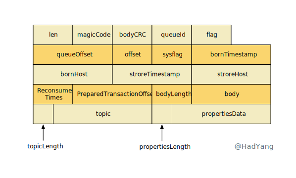

## 关键特性

- **事务/半事务消息**：本地事务和发送消息操作可以被定义到全局事务中，解决本地事务和消息发送的原子问题，提供分布式事务的 **最终一致性能力**
- **顺序消息**：RocketMQ 支持单个 topic 下的 **全局 FIFO 顺序**，以及单个 topic 下按某个 key 进行分区的 **分区 FIFO 顺序**
- **定时/延迟消息**：定时/延迟消息发送到 RocketMQ 后，会暂存到 `SCHEDULE_TOPIC_XXXX` topic 中，等待特定时间投递给真正的 topic
- **单向消息**：本地投递消息后，不需要 RocketMQ 进行确认，性能最高但可能丢消息
- **消息标签**：RocketMQ 支持对消息增加 Tag，并且消费时可以在 RocketMQ 服务端对 Tag 进行过滤
- **At Least Once**：每个消息至少投递一次，消费者获取到消息，处理成功后才会对消息进行 ACK，如果未 ACK RocketMQ 会进行重试
- **消息回溯**：将已成功消费的消息再次消费，RocketMQ 支持毫秒级别的回溯
- **消息重试**：当消息消费失败时，对于顺序消息 RocketMQ 会自动不间断重试，无序消息会根据重试次数增加重试间隔
- **死信队列**：当消息重试到达最大次数后，消息会被放入一个特殊的死信队列，不再进行重试
- **消息重投**：当消息发送失败时，
- **流量控制**：当消息发送过快时，Broker 根据策略拒绝 Send 流量；当消费者消费过慢时，会降低拉取消息的频率

## 性能对比

性能测试对比下 Kafka 和 RocketMQ 在 topic 增加时的表现。测试配置：每个 topic 有 8 个分区，每个 topic 都有一个订阅者，并且 topic 数量逐步增加。

通过上面性能测试数据，我们能看到 RocketMQ 和 Kafka 在不同的 topic 量级下，都能平衡 Send 和 Receive 速率，没有大量的消息积压。但也存在以下区别：
- 在 topic 较少时，Kafka 的吞吐量、延迟更低
- 在 topic 从 68 到 256 的增长过程中， Kafka 性能劣化 98%
- 在 topic 从 68 到 256 的增长过程中， RocketMQ 性能仅劣化 16%

Kafka 劣化的如此明显和其实现方式有关，Kafka 对每个 topic 每个分区都存储一个文件。当 topic 个数增加时，这种将消息分散到多个文件的存储方式会加剧 IO 竞争，导致性能下降。

相反，RocketMQ 在物理上只存在一个文件，topic 和 分区都是逻辑概念，所以 topic 增加不会导致 RocketMQ 性能的急剧下降。因此，**Kafka 适合少量 topic 的场景**， **RocketMQ 适合多 topic 场景**。

## 消息存储

一次典型的 RocketMQ 消息由 **生产者**（Producer）同步/异步发送到 **Brocker**，每个消息都必须确定一个 **Topic**。Brocker 将消息持久化存储在本地，消息可以由 **消费者** 从 Broker 拉取，或 Broker 推送到消费者。每个消费者都归属于一个 **消费组**，同一个消息（广播消息除外）在一个消费组里只能被消费一次。消费者在获取到消息后执行本地业务代码，成功后发送 Brocker 确认消息。

RocketMQ 的很多关键特性都是其持久化存储机制提供的，下面我们来看下消息是如何存储和索引的。Broker 中 `DefaultMessageStore` 处理存储的核心逻辑，所有消息都存储到 CommitLog，然后通过 **异步** 任务将消息构建为用于查询的 IndexFile 和用于消费的 ConsumeQueue。

### CommitLog

CommitLog 的内容主要包含消息的所有信息，其中 `bodyCRC` 是消息体的校验码； `offset` 作为消息在 Broker 上的唯一标识，在 IndexFile/ConsumeQueue 等文件中标识消息； `preparedTransactionOffset`

### IndexFile

IndexFile 的内容主要包含 Header、HashSlot 以及 IndexData，本质上是一个 **哈希表** 的结构，当哈希碰撞后通过 `PreIndex` 构建单向链表。Header 包含时间戳、Offset以及哈希表相关信息，大小固定为40 byte。

IndexData 部分是由 20byte 记录行组成的数组，每行记录都对应一个 Index（**类似于数组的下标**）。每行记录包含 KeyHash（消息 Key 的哈希值）、Offset（消息在 CommitLog 中的偏移量）、TimeDiff（当前消息相对于Header中时间的偏移量）以及 PreIndex（同一个 Slot 中下一条消息的下标）。

HashSlot 默认有 5,000,000 个，将消息的 `key` 进行哈希取模选择一个 Slot 存储消息的下标。

## 消费侧

### 客户端

消费者的 Push 和 Pull 模式，本质上都是 Pull 只不过，Push 自动完成消息拉取操作。

DefaultMQPushConsumer 作为提供给用户的操作接口，提供顺序和并发两种消费模式，内部通过代理 DefaultMQPushConsumerImpl 来实现消息拉取和处理。

DefaultMQPushConsumerImpl 在 Start 后，会加载包括 OffsetStore 在内的各种数据，并初始化消费者服务（ConsumeMessageOrderlyService/MQClientManager），同时通过 NameServer 获取所有 Topic 所在 Brokder 的地址。 Offset 会存储到 Broker 上

DefaultMQPushConsumerImpl 在消息消费完成后执行 ConsumeMessageOrderlyService.processConsumeResult 处理 Commit 等逻辑

MQClientManager 会创建 MQClientInstance ，

MQClientInstance 由 ip+instanceName 唯一确定，在初始化完成后会启动 RebalanceService。 DefaultMQPushConsumerImpl 会将自己按 consumerGroup 注册到 MQClientInstance 中

RebalanceService 会定时（默认20s）进行一次 Rebalance，调用 DefaultMQPushConsumerImpl.doRebalance ，doRebalance 会对所有 topic 进行 rebalance

ConsumeMessageOrderlyService 启动后，如果当前是集群模式，则会开启线程定时

ProcessQueue 作为消息的中转站， DefaultMQPushConsumerImpl 在拉取到消息后放入，并通过 ConsumeMessageOrderlyService 开启线程消费 ProcessQueue 中的消息

MessageQueue 由 Topic、BrokerName、QueueId 唯一确定，由 NameServer 接口 GET_ROUTEINFO_BY_TOPIC 返回的 Router 信息构建， QueueId 由路由在数组中的 Index 决定

### 服务端

DefaultMessageStore 负责消息在服务端的存储，其中维护了一个 consumeQueueTable 的 Map 结构，Key 为 Topic，Value 是 QueueId 到 ConsumeQueue 的 Map。在启动时会扫描 ConsumeQueue 文件，获取当前 CommitLog 已分发的最大index 。参考 ConsumeQueue.recover

一个 Topic 对应多个 ConsumeQueue， ConsumeQueue 由 Topic 和 QueueId 唯一标识。一个 ConsumeQueue 对应一个 MappedFileQueue， 

一个 MappedFileQueue 对应多个 MappedFile，MappedFile 每个单元固定长度为 20byte，其中包含 8byte offset，4byte size 以及 8byte tagscode

在从 MappedFile 获取某些参数后，直接从 CommitLog 里获取实际的数据 //TODO

Broker 启动时会调用 registerBrokerAll ，并且通过 REGISTER_BROKER 在 NameServer 进行注册

## 发送侧

### 服务端

### 数据存储

### 消息发送

### 消息处理

### 可靠性

## 参考文档

https://github.com/apache/rocketmq/blob/master/docs/cn/features.md
https://www.aliyun.com/product/rocketmq
https://github.com/apache/rocketmq-client-go/blob/master/docs/Introduction.md
https://help.aliyun.com/document_detail/102777.html?spm=a2c4g.11186623.6.601.73a86242U8VTgj
https://alibaba-cloud.medium.com/kafka-vs-rocketmq-multiple-topic-stress-test-results-d27b8cbb360f
