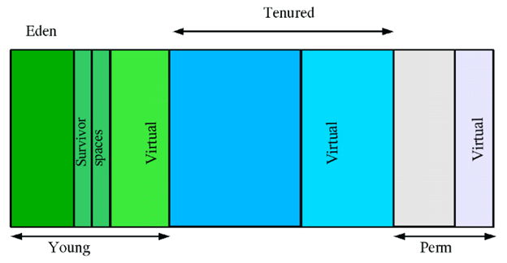

作为自动管理内存的编程语言，Java为我们做了许多的工作。程序员不需要关心内存分配和回收，这大大提高了程序员的工作效率，同时也减少了内存泄漏的风险。正是由于Java语言的这种特性，导致很多程序员对内存分配没有太深刻的概念，产生OOM后不知从何处修改。我们需要对Java内存管理进行了解，更加合理的利用Java自动管理内存的特性。

<!--more-->

Java堆中存放着大量的Java对象实例，在垃圾收集器回收内存前，第一件事情就是确定哪些对象是“活着的”，哪些是可以回收的。

#### 引用计数算法

引用计数算法是判断对象是否存活的基本算法：给每个对象添加一个引用计数器，没当一个地方引用它的时候，计数器值加1；当引用失效后，计数器值减1。但是这种方法有一个致命的缺陷，**当两个对象相互引用时会导致这两个都无法被回收**。

#### 根搜索算法

在主流的商用语言中（Java、C#...）都是使用根搜索算法来判断对象是否存活。对于程序来说，根对象总是可以访问的。*从这些根对象开始，任何可以被触及的对象都被认为是"活着的"的对象。无法触及的对象被认为是垃圾，需要被回收*。

Java虚拟机的根对象集合根据实现不同而不同，但是总会包含以下几个方面：
  - 虚拟机栈（栈帧中的本地变量表）中引用的对象。
  - 方法区中的类静态属性引用的变量。
  - 方法区中的常量引用的变量。
  - 本地方法JNI的引用对象。

**区分活动对象和垃圾的两个基本方法是引用计数和根搜索。** 引用计数是通过为堆中每个对象保存一个计数来区分活动对象和垃圾。根搜索算法实际上是追踪从根结点开始的引用图。

#### 引用对象

引用对象封装了指向其他对象的连接：被指向的对象称为引用目标。`Reference`有三个直接子类`SoftReference`、`WeakReference`、`PhantomReference`分别代表：软引用、弱引用、虚引用。强引用在Java中是普遍存在的，类似`Object o = new Object();`这类引用就是强引用，强引用和以上引用的区别在于：**强引用禁止引用目标被垃圾收集器收集，而其他引用不禁止。**

>当使用软引用、弱引用、虚引用时，并且对可触及性状态的改变有兴趣，可以把引用对象和引用队列关联起来。

对象有六种可触及状态变化：

  - `强可触及`：对象可以从根节点不通过任何引用对象搜索到。垃圾收集器不会回收这个对象的内存空间。

  - `软可触及`：对象可以从根节点通过一个或多个(未被清除的)软引用对象触及，垃圾收集器在要发生内存溢出前将这些对象列入回收范围中进行回收，如果该软引用对象和引用队列相关联，它会把该软引用对象加入队列。

  >SoftReference可以用来创建内存中缓存，JVM的实现需要在抛出OutOfMemoryError之前清除软引用，但在其他的情况下可以选择清理的时间或者是否清除它们。

  - `弱可触及`：对象可以从根节点开始通过一个或多个(未被清除的)弱引用对象触及，垃圾收集器在一次GC的时候会回收所有的弱引用对象，如果该弱引用对象和引用队列相关联，它会把该弱引用对象加入队列。

  - `可复活的`：对象既不是强可触及、软可触及、也不是弱可触及，但仍然可能通过执行某些终结方法复活到这几个状态之一。

  > Java类可以通过重写finalize方法复活准备回收的对象，但finalize方法只是在对象第一次回收时会调用。

  - `虚可触及`：**垃圾收集器不会清除一个虚引用，所有的虚引用都必须由程序明确的清除。** 同时也不能通过虚引用来取得一个对象的实例。

  - `不可触及`：不可触及对象已经准备好回收了。

  >若一个对象的引用类型有多个，那到底如何判断它的可达性呢？其实规则如下：
  >1. 单条引用链的可达性以最弱的一个引用类型来决定；
  >2. 多条引用链的可达性以最强的一个引用类型来决定；

#### 垃圾回收算法

##### 标记--清除算法

首先标记出所有需要回收的对象，在标记完成后统一回收所有被标记的对象，标记的方法使用根搜索算法。主要有两个缺点：

  - 效率问题，标记和清除的效率都不高。

  - 空间问题，标记清除后会产生大量不连续的内存碎片。

##### 复制回收算法

将可用内存分为大小相等的两份，在同一时刻只使用其中的一份。当这一份内存使用完了，就将还存活的对象复制到另一份上，然后将这一份上的内存清空。复制算法能有效避免内存碎片，但是算法需要将内存一分为二，导致内存使用率大大降低。

##### 标记--整理算法

复制算法在对象存活率较高的情况下会复制很多的对象，效率会很低。标记--整理算法就解决了这样的问题，标记过程和标记--清除算法一样，但后续是将所有存活的对象都移动到内存的一端，然后清理掉端外界的对象。

##### 分代回收算法

在JVM中不同的对象拥有不同的生命周期，因此对于不同生命周期的对象也可以采用不同的垃圾回收方法，以提高效率，这就是分代回收算法的核心思想。

在不进行对象存活时间区分的情况下，每次垃圾回收都是对整个堆空间进行回收，花费的时间相对会长。同时，因为每次回收都需要遍历所有存活对象，但实际上，对于生命周期长的对象而言，这种遍历是没有效果的，因为可能进行了很多次遍历，但是他们依旧存在。因此，分代垃圾回收采用分治的思想，进行代的划分，把不同生命周期的对象放在不同代上，不同代上采用最适合它的垃圾回收方式进行回收。

JVM中的共划分为三个代：`新生代（Young Generation）`、`老年代（Old Generation）`和`持久代（Permanent Generation）`。其中持久代主要存放的是Java类的类信息，与垃圾收集要收集的Java对象关系不大。

  

  - `新生代`：所有新生成的对象首先都是放在新生代的，新生代采用复制回收算法。新生代的目标就是尽可能快速的收集掉那些生命周期短的对象。新生代分三个区。一个Eden区，两个Survivor区(一般而言)。**大部分对象在Eden区中生成。当Eden区满时，还存活的对象将被复制到Survivor区（两个中的一个），当这个Survivor区满时，此区的存活对象将被复制到另外一个Survivor区，当这个Survivor去也满了的时候，从第一个Survivor区复制过来的并且此时还存活的对象，将被复制“年老区(Tenured)”**。需要注意，Survivor的两个区是对称的，没先后关系，所以同一个区中可能同时存在从Eden复制过来 对象，和从前一个Survivor复制过来的对象，而复制到年老区的只有从第一个Survivor去过来的对象。而且，Survivor区总有一个是空的。

  > 在HotSpot虚拟机内部默认Eden和Survivor的大小比例是8:1， 也就是每次新生代中可用内存为整个新生代的90%，这大大提高了复制回收算法的效率。

  - `老年代`：在新生代中经历了N次垃圾回收后仍然存活的对象，就会被放到老年代中，老年代采用标记整理回收算法。因此，可以认为老年代中存放的都是一些生命周期较长的对象。

  - `持久代`：用于存放静态文件，如final常量，static常量，常量池等。持久代对垃圾回收没有显著影响，但是有些应用可能动态生成或者调用一些class，例如Hibernate等，在这种时候需要设置一个比较大的持久代空间来存放这些运行过程中新增的类。

#### 垃圾回收触发条件

由于对象进行了分代处理，因此垃圾回收区域、时间也不一样。GC有两种类型：Scavenge GC和Full GC。对于一个拥有终结方法的对象，在垃圾收集器释放对象前必须执行终结方法。但是当垃圾收集器第二次收集这个对象时便不会再次调用终结方法。

##### Scavenge GC

  一般情况下，当新对象生成，并且在Eden申请空间失败时，就会触发Scavenge GC，对Eden区域进行GC，清除非存活对象，并且把尚且存活的对象移动到Survivor区，然后整理Survivor的两个区。这种方式的GC是对新生代的Eden区进行，不会影响到老年代。因为大部分对象都是从Eden区开始的，同时Eden区不会分配的很大，所以Eden区的GC会频繁进行。

##### Full GC

对整个堆进行整理，包括Young、Tenured和Perm。Full GC因为需要对整个对进行回收，所以比Scavenge GC要慢，因此应该尽可能减少Full GC的次数。在对JVM调优的过程中，很大一部分工作就是对于FullGC的调节。有如下原因可能导致Full GC：

  - 老年代（Tenured）被写满

  - 持久代（Perm）被写满

  - System.gc()被显示调用

#### 垃圾收集器

垃圾收集器是内存回收的具体实现，下图展示了7种用于不同分代的收集器，两个收集器之间有连线表示可以搭配使用。下面的这些收集器没有“最好的”这一说，每种收集器都有最适合的使用场景。

##### Serial收集器

**Serial收集器是最基本的收集器，这是一个单线程收集器，它“单线程”的意义不仅仅是说明它只用一个线程去完成垃圾收集工作，更重要的是在它进行垃圾收集工作时，必须暂停其他工作线程，直到它收集完成**。Sun将这件事称之为”Stop the world“。

> 没有一个收集器能完全不停顿，只是停顿的时间长短。

虽然Serial收集器的缺点很明显，但是它仍然是JVM在Client模式下的默认新生代收集器。它有着优于其他收集器的地方：简单而高效（与其他收集器的单线程比较），Serial收集器由于没有线程交互的开销，专心只做垃圾收集自然也获得最高的效率。在用户桌面场景下，分配给JVM的内存不会太多，停顿时间完全可以在几十到一百多毫秒之间，只要收集不频繁，这是完全可以接受的。

##### ParNew收集器

ParNew是Serial的多线程版本，在回收算法、对象分配原则上都是一致的。ParNew收集器是许多运行在Server模式下的默认新生代垃圾收集器，其主要在于除了Serial收集器，目前只有ParNew收集器能够与CMS收集器配合工作。

##### Parallel Scavenge收集器

Parallel Scavenge收集器是一个新生代垃圾收集器，其使用的算法是复制算法，也是并行的多线程收集器。

Parallel Scavenge收集器更关注可控制的吞吐量，吞吐量等于运行用户代码的时间/(运行用户代码的时间+垃圾收集时间)。直观上，只要最大的垃圾收集停顿时间越小，吞吐量是越高的，但是GC停顿时间的缩短是以牺牲吞吐量和新生代空间作为代价的。比如原来10秒收集一次，每次停顿100毫秒，现在变成5秒收集一次，每次停顿70毫秒。停顿时间下降的同时，吞吐量也下降了。

停顿时间越短就越适合需要与用户交互的程序；而高吞吐量则可以最高效的利用CPU的时间，尽快的完成计算任务，主要适用于后台运算。

##### Serial Old收集器

Serial Old收集器是Serial收集器的老年代版本，也是一个单线程收集器，采用“标记-整理算法”进行回收。其运行过程与Serial收集器一样。

##### Parallel Old收集器

Parallel Old收集器是Parallel Scavenge收集器的老年代版本，使用多线程和“标记-整理”算法进行垃圾回收。其通常与Parallel Scavenge收集器配合使用，“吞吐量优先”收集器是这个组合的特点，在注重吞吐量和CPU资源敏感的场合，都可以使用这个组合。

##### CMS 收集器

CMS（Concurrent Mark Sweep）收集器是一种以获取最短停顿时间为目标的收集器，CMS收集器采用标记--清除算法，运行在老年代。主要包含以下几个步骤：

  - 初始标记
  - 并发标记
  - 重新标记
  - 并发清除

其中初始标记和重新标记仍然需要“Stop the world”。初始标记仅仅标记GC Root能直接关联的对象，并发标记就是进行GC Root Tracing过程，而重新标记则是为了修正并发标记期间，因用户程序继续运行而导致标记变动的那部分对象的标记记录。

由于整个过程中最耗时的并发标记和并发清除，收集线程和用户线程一起工作，所以总体上来说，CMS收集器回收过程是与用户线程并发执行的。虽然CMS优点是并发收集、低停顿，很大程度上已经是一个不错的垃圾收集器，但是还是有三个显著的缺点：
  - CMS收集器对CPU资源很敏感。在并发阶段，虽然它不会导致用户线程停顿，但是会因为占用一部分线程（CPU资源）而导致应用程序变慢。

  - CMS收集器不能处理浮动垃圾。所谓的“浮动垃圾”，就是在并发标记阶段，由于用户程序在运行，那么自然就会有新的垃圾产生，这部分垃圾被标记过后，CMS无法在当次集中处理它们，只好在下一次GC的时候处理，这部分未处理的垃圾就称为“浮动垃圾”。也是由于在垃圾收集阶段程序还需要运行，即还需要预留足够的内存空间供用户使用，因此CMS收集器不能像其他收集器那样等到老年代几乎填满才进行收集，需要预留一部分空间提供并发收集时程序运作使用。要是CMS预留的内存空间不能满足程序的要求，这是JVM就会启动预备方案：临时启动Serial Old收集器来收集老年代，这样停顿的时间就会很长。

  - 由于CMS使用标记--清除算法，所以在收集之后会产生大量内存碎片。当内存碎片过多时，将会给分配大对象带来困难，这是就会进行Full GC。

##### G1收集器

G1收集器与CMS相比有很大的改进：

  - G1收集器采用标记--整理算法实现。
  - 可以非常精确地控制停顿。

G1收集器可以实现在基本不牺牲吞吐量的情况下完成低停顿的内存回收，这是由于它极力的避免全区域的回收，G1收集器将Java堆（包括新生代和老年代）划分为多个区域（Region），并在后台维护一个优先列表，每次根据允许的时间，优先回收垃圾最多的区域。
