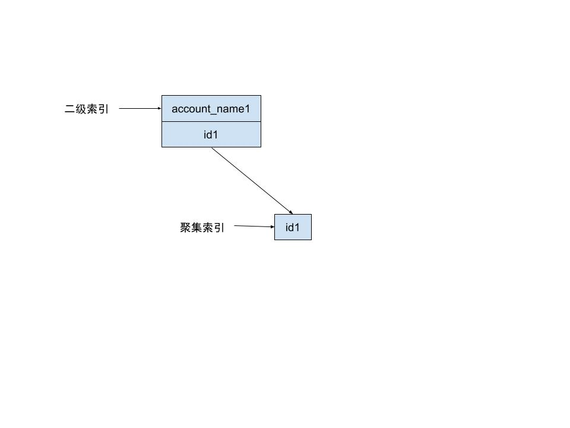

MySQL 死锁常常被人提起，在大学期间的数据库课程也会有所提及，但真正接触的 case 是没有过的。前段时间在线上发现了死锁，导致 MySQL 负载升高，连接不能及时释放，造成业务小范围瘫痪。这里死锁的场景是并发的 `delete` 和 `insert...on duplicate update`。

<!--more-->


发生死锁的表结构如下：

```
CREATE TABLE `passengers_account_mapping` (
	`id` bigint(20) UNSIGNED NOT NULL AUTO_INCREMENT COMMENT '自增主键',
	`cert_no` varchar(25) NOT NULL DEFAULT '' COMMENT '证件号码',
	`account_name` varchar(40) NOT NULL DEFAULT '' COMMENT '用户账号名',
	`cert_type` tinyint(1) NOT NULL DEFAULT '0' COMMENT '证件类型',
	`passenger_name` varchar(45) NOT NULL DEFAULT '' COMMENT '乘客姓名',
	PRIMARY KEY (`id`),
	UNIQUE `uniq_account_passengers_name` (`cert_no`, `account_name`, `passenger_name`),
	KEY `idx_account_name` (`account_name`)
) ENGINE = InnoDB AUTO_INCREMENT = 2 CHARSET = utf8mb4;
```

**事务隔离级别为：RR**

## 死锁日志分析

首先通过 `show engine innodb status;` 查处死锁相关日志信息。

```
2019-12-20 14:54:35 7fc9f8fe9700
*** (1) TRANSACTION: //事务1
TRANSACTION 83389013326, ACTIVE 0 sec updating or deleting
mysql tables in use 1, locked 1 //使用一个表
LOCK WAIT 4 lock struct(s), heap size 1184, 3 row lock(s), undo log entries 1 //有 4 个锁结构，3个行锁
MySQL thread id 22442, OS thread handle 0x7fcdd8cd5700, query id 1334027037 10.88.104.204 t_account_rw updating
`delete from passengers_account_mapping where account_name='c196cf184'` //死锁发生时执行的 SQL 语句
*** (1) WAITING FOR THIS LOCK TO BE GRANTED: //等待锁的信息
RECORD LOCKS space id 2238 page no 28003 n bits 304 index `uniq_account_passengers_name` of table `account`.`passengers_account_mapping` trx id 83389013326 lock_mode X locks rec but not gap waiting //唯一索引上的排他锁（Record-Lock）
*** (2) TRANSACTION: //事务2
TRANSACTION 83389013325, ACTIVE 0 sec starting index read, thread declared inside InnoDB 4999
mysql tables in use 1, locked 1
3 lock struct(s), heap size 1184, 2 row lock(s)
MySQL thread id 46111, OS thread handle 0x7fc9f8fe9700, query id 1334027030 10.88.104.202 t_account_rw update

`INSERT INTO passengers_account_mapping (id, account_name, cert_no, cert_type, passenger_name) VALUES (0, 'c196cf184', '6344_2iMxhPferW498', 0, '杨琳') ON DUPLICATE KEY UPDATE updated_ts = '2019-12-20 14:54:35.029';`

*** (2) HOLDS THE LOCK(S): // 持有锁的信息
RECORD LOCKS space id 2238 page no 28003 n bits 304 index `uniq_account_passengers_name` of table `account`.`passengers_account_mapping` trx id 83389013325 lock_mode X //唯一索引上的排他锁（Next-Key）
*** (2) WAITING FOR THIS LOCK TO BE GRANTED: //等待锁的信息
RECORD LOCKS space id 2238 page no 160778 n bits 216 index `PRIMARY` of table `account`.`passengers_account_mapping` trx id 83389013325 lock_mode X locks rec but not gap waiting //主键上的排他锁（Record-Lock）
*** WE ROLL BACK TRANSACTION (2)//回滚事务2
```

死锁日志的具体分析在上面的注释已说明，这里补充一些基础知识：

1. 事务隔离级别
   1. RC：针对当前读，RC隔离级别保证对读取到的记录加锁 (记录锁)，存在幻读现象
   2. RR：针对当前读，**RR隔离级别保证对读取到的记录加锁 (记录锁)，同时保证对读取的范围加锁，新的满足查询条件的记录不能够插入 (间隙锁)**，不存在幻读现象。
2. 锁的类型
   1. 按性质分
      1. 排他锁
      2. 共享锁
   2. 按作用级别分
      1. 表
      2. 页
      2. 行
   3. 行锁的具体分类：
      1. Record Lock：加到 **索引记录** 上的锁
      2. Gap Lock：对索引记录中的一段连续区域的锁
      3. Next-Key Lock：是记录锁和记录前的间隙锁的结合，解决了幻读问题

从日志中可以看到，事务1当前想要获取唯一索引上的锁；事务2持有唯一索引上的锁，想要主键索引上的锁。这里造成死锁，可以猜测是事务1已获取主键索引上的锁。根据 MySQL 的加锁规则：[Locks Set by Different SQL Statements in InnoDB](https://dev.mysql.com/doc/refman/5.6/en/innodb-locks-set.html)。官方文档的规则较多，这里我先解释两种语句的加锁规则：
  1. `DELETE` 会对所有符合条件的唯一索引或主键索引加 `Record Lock`、 非唯一索引加 `Next-Key Lock`。
      > `DELETE FROM ... WHERE ...` sets an exclusive next-key lock on every record the search encounters. However, only an index record lock is required for statements that lock rows using a unique index to search for a unique row.

  2. `INSERT ... ON DUPLICATE KEY UPDATE` 当发生 `duplicate-key` 时，会对主键索引加 `Record Lock`，对唯一索引加 `Next-Key Lock`。
      > `INSERT ... ON DUPLICATE KEY UPDATE` differs from a simple `INSERT` in that an exclusive lock rather than a shared lock is placed on the row to be updated when a `duplicate-key` error occurs. An exclusive `index-record lock` is taken for a duplicate primary key value. An exclusive `next-key lock` is taken for a duplicate unique key value.


我们可以得到以下加锁流程：

| 执行序列  | 事务1     | 事务2     |
|:---   | :------------- | :------------- |
|0   | Hold NK Lock In `idx_account_name`       |        |
|1   | Hold Record Lock In `PRIMARY`       |        |
|2   |      |   Hold NK Lock In `uniq_account_passengers_name`    |
|3   |   Want Record Lock In `uniq_account_passengers_name`     |       |
|4   |        |   Want Record Lock In `PRIMARY`    |

在第3、4步发生死锁，发生死锁主要的原因是加锁顺序不一致，那如何进行顺序一致的加锁处理？这里就需要对 MySQL 索引的存储结构有些理解。

## 索引结构

`idx_account_name` 索引属于非聚集索引（二级索引），非聚集索引的存储结构如下：



二级索引的B树结构中，指向的是聚集索引（主键索引）。所以针对 `delete from passengers_account_mapping where account_name='c196cf184'`，首先通过 `where` 子句条件找到 `account_name='c196cf184'` 的`idx_account_name` 索引并加锁，再找到对应的聚集索引，最后再将其他索引加锁。

## 解决方案

上面说过死锁的问题在于加锁顺序不一致，所以解决方案就是再删除的业务逻辑中，使用 `PRIMARY` 或者 `uniq_account_passengers_name` 索引进行删除。

## 参考

- [MySQL 加锁处理分析](https://www.cnblogs.com/tutar/p/5878651.html)
