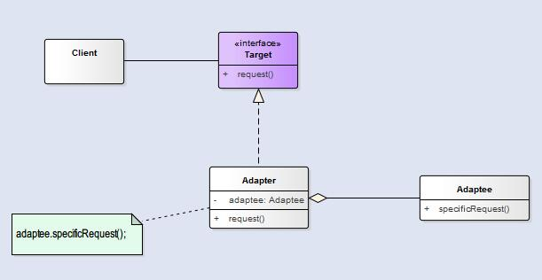

适配器模式，**将一个类的接口转接成用户所期待的**。一个适配使得因接口不兼容而不能在一起工作的类工作在一起，做法是将类自己的接口包裹在一个已存在的类中。

<!--more-->

适配器模式有两种形式：对象适配器模式和类适配器模式。对象适配器模式利用组合来完成的，而类适配器利用多重继承来实现，这在Java中是不能实现的，*所以下面说的适配器模式都是指对象适配器模式*。

### 结构

  - `Target`：目标抽象类
  - `Adapter`：适配器类
  - `Adaptee`：被适配类
  - `Client`：客户类

适配器模式将`Adaptee`对象的接口转换成`Target`接口，让不兼容的这两个接口变成兼容。这可以让客户从实现的接口解耦。如果一段时间后，我们想改变接口，适配器可以将改变的部分封装起来，客户就不需要为了应对不同的接口而每次跟着修改。同时，被适配类的所有子类都可以和适配器一起使用。

>适配器模式将客户和接口绑定，而不是和实现绑定。

### 适配器和装饰者

适配器模式可以运行客户使用新的库和子集合，只需要改变适配器的代码，而客户不需要修改，由适配器做转换即可。

装饰者模式是扩展所包装的对象的行为或责任。

### 优点
  - 将目标类和适配者类解耦，**通过引入一个适配器类来重用现有的被适配类**，而无须修改原有代码。
  - 增加了类的透明性和复用性，将具体的实现封装在适配者类中，对于客户端类来说是透明的，而且提高了适配者的复用性。
  - 同一个适配器可以把被适配类和它的子类都适配到目标接口。

### 使用场景

  - 系统需要使用现有的类，而这些类的接口不符合系统的需要。
  - 想要建立一个可以重复使用的类，用于与一些彼此之间没有太大关联的一些类，包括一些可能在将来引进的类一起工作。
