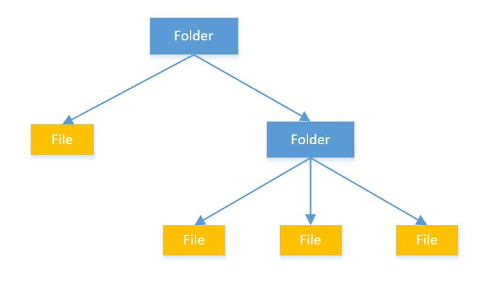

组合模式允许你 **将对象组合成树形结构来表现“整体/部分”层次结构**。组合能让客户以一致的方式处理个别对象以及对象组合。它使我们树型结构的问题中，模糊了简单元素和复杂元素的概念，客户程序可以向处理简单元素一样来处理复杂元素，从而使得客户程序与复杂元素的内部结构解耦。

<!--more-->

这里的简单元素和复杂元素又是指什么呢？我们这里用文件和文件夹来作为示例说明，*简单元素就相当于文件，这一个元素只包含这一个文件项。复杂元素就相当于文件夹，这一个元素可能包含多个文件项，形成一种复杂的树形结构*。我们就可以使用组合模式来统一处理简单元素和复杂元素，把相同的操作应用在简单和复杂元素上。换句话说，在大多数情况下，我们可以忽略他们之间的差别。

### 结构

要实现对简单元素和复杂元素统一的处理，组合模式提供给我们的方法就是采用统一的接口，消除简单元素和复杂元素的差异。

`Componet`为简单元素和复杂元素的共同接口，它为`add()`,`remove()`,`getChild()`提供默认的实现。`SimpleNode`通过实现`Componet`中支持的操作，定义了自己的行为。`ComplexNode`由于是复杂元素所以实现了`add()`,`remove()`,`getChild()`操作。

组合模式通过统一的接口，让客户将不同的元素一视同仁。也就是说，一个元素究竟是简单元素还是复杂元素对客户是透明的。当然这样的设计违反了[单一职责](https://zh.wikipedia.org/zh/%E5%8D%95%E4%B8%80%E5%8A%9F%E8%83%BD%E5%8E%9F%E5%88%99)，但是这样设计的优势也很明显，所以这是一种设计上的折中。

> Java中的File类也使用了组合模式，将文件和文件夹统一到File类中

### 使用场景

  - 想表示对象的“整体/部分”层次结构
  - 希望用户忽略组合对象与单个对象的不同，用户将统一地使用组合结构中的所有对象。
