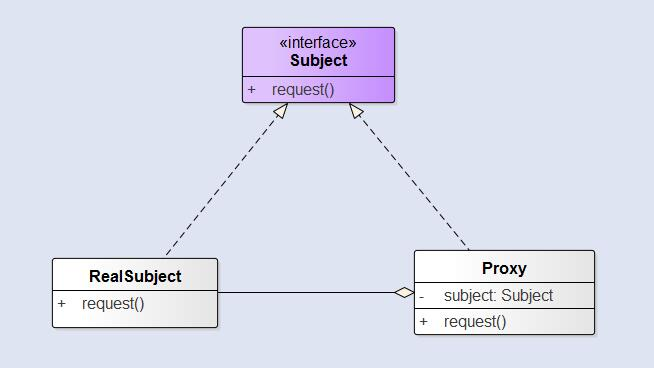
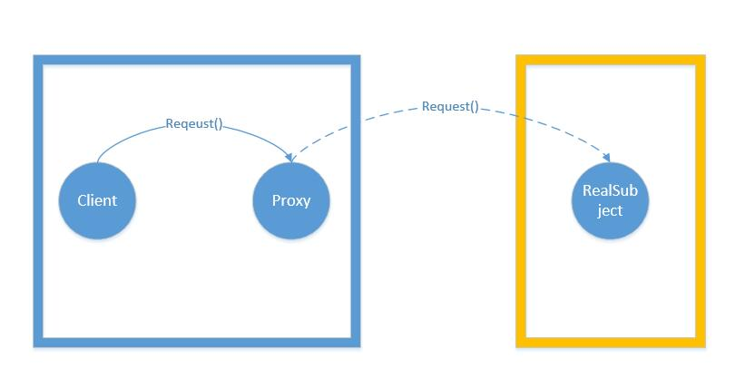

在某些情况下，一个客户不想或者不能直接引用一个对象，此时可以通过一个称之为`代理`的第三者来实现间接引用。**代理对象可以在客户端和目标对象之间起到中介的作用，并且可以通过代理对象去掉客户不能看到的内容和服务或者添加客户需要的额外服务**。代理模式是为另一个对象提供一个替身或者占位符以控制对这个对象的访问。使用代理模式创建代理对象，让代理对象控制某对象的访问，被代理对象可以是远程的对象、创建开销大的对象或者是需要安全控制的对象。

<!--more-->

根据`控制访问`的实现的不同，代理模式的变体有很多，我们这里介绍三种：

  - `远程代理`控制访问远程对象。
  - `虚拟代理`控制访问创建开销大的对象。
  - `保护代理`基于权限控制对资源的访问。

### 结构

这里我们首先看看一般的代理模式的类图：

  - `RealSubject`：通常是真正做事的对象，`Proxy`会控制对`RealSubject`的访问。
  - `Proxy`：负责创建`RealSubject`，同时持有`RealSubject`的引用，可以在必要的时候讲请求转发给`RealSubject`。

`RealSubject`和`Proxy`都实现了`Subject`接口，这样就允许任何客户都可以像处理`RealSubject`一样地处理`Proxy`对象。客户必须通过`Proxy`与`RealSubject`进行交互。`Proxy`控制了对`RealSubject`的访问，在某些情况下，我们可能需要这样的控制。这些情况包括`RealSubject`是远程对象、`RealSubject`创建开销大、或者`RealSubject`需要被保护。

### 远程代理

远程代理为一个位于不同的地址空间的对象提供一个本地的代理对象，这个不同的地址空间可以是在同一台主机中，也可是在另一台主机中。*远程代理可以将网络的细节隐藏起来*，使得客户端不必考虑网络的存在。**客户完全可以认为被代理的远程业务对象是局域的而不是远程的，而远程代理对象承担了大部分的网络通信工作**。

### 虚拟代理

**虚拟代理作为创建开销大的对象的代理。虚拟代理通常直到我们真正需要一个对象的时候才创建它**。当对象在创建前和创建中时，由虚拟代理来扮演对象的替身。对象创建后，代理就会将请求直接委托给对象。

`Copy-on-write`：写时复制，是一种计算机程序设计领域的优化策略。其核心思想是，**如果有多个调用者同时要求相同资源（如内存或磁盘上的数据存储），他们会共同获取相同的指针指向相同的资源，直到某个调用者试图修改资源的内容时，系统才会真正复制一份专用副本给该调用者，而其他调用者所见到的最初的资源仍然保持不变**。这过程对其他的调用者都是透明的。此作法主要的优点是如果调用者没有修改该资源，就不会有副本被创建，因此多个调用者只是读取操作时可以共享同一份资源。

`Copy-on-Write代理`：它是虚拟代理的一种，把复制（克隆）操作延迟到只有在客户端真正需要时才执行。一般来说，对象的深克隆是一个开销较大的操作，`Copy-on-Write代理`可以让这个操作延迟，只有对象被用到的时候才被克隆。

### 保护代理

保护代理是控制对一个对象的访问，**可以给不同的用户提供不同级别的使用权限**。

### 区别

#### 代理模式和装饰者模式

装饰者模式和代理模式都是用一个对象将另一个对象包裹，然后把调用委托给内部的对象。虽然这两者看起来很像，但是它们的目的却不同。**装饰者模式为对象增加行为，而代理模式是控制对象的访问**。

#### 代理模式和适配器模式

代理模式和适配器模式都是挡在其他对象的前面，并负责将请求转发。但是 **适配器模式会改变对象适配的接口，而代理模式则实现相同的接口**。

### 优点

  - 代理模式能够协调调用者和被调用者，在一定程度上降低了系统的耦合度。
  - 远程代理使得客户端可以访问在远程机器上的对象，远程机器可能具有更好的计算性能与处理速度，可以快速响应并处理客户端请求。
  - 虚拟代理通过使用一个小对象来代表一个大对象，可以减少系统资源的消耗，对系统进行优化并提高运行速度。
  - 保护代理可以控制对真实对象的使用权限。

### 缺点

  - 由于在客户端和真实主题之间增加了代理对象，因此有些类型的代理模式可能会造成请求的处理速度变慢。
  - 实现代理模式需要额外的工作，有些代理模式的实现非常复杂。

### 其他代理模式

代理模式的变体很多，下面我们就来说说其他的代理模式：

  - `防火墙代理`：控制网络资源的访问，保护`Subject`免于侵害。
  - `智能引用代理`：当`Subject`被引用时，进行额外的动作，比如计算一个对象的引用次数。
  - `缓存代理`：为开销大的运算结果提供暂时的存储，它允许多个客户共享结果，以减少计算或网络延迟。
  - `同步代理`：在多线程情况下为`Subject`提供安全的访问。
