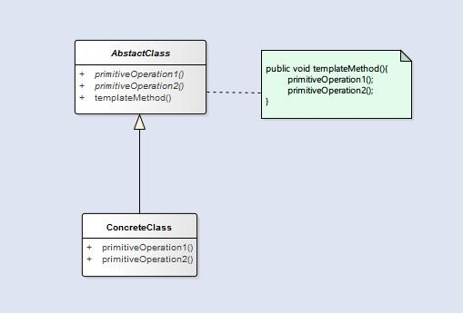

模板方法模式 **定义了一个算法的骨架，并允许子类别为一个或多个步骤提供其实践方式**。让子类别在不改变算法架构的情况下，重新定义算法中的某些步骤。

<!--more-->

模板就是一个方法，这个方法将算法定义成一组步骤，其中的任何步骤都可以是抽象的，由子类负责实现。这可以确保算法的结构保持不变，同时子类提供部分实现。下面是模板类的一个示例。

```Java
abstract class Game {

    private int playersCount;

    abstract void initializeGame();

    abstract void makePlay(int player);

    abstract boolean endOfGame();

    abstract void printWinner();

    /* 钩子方法 */
    boolean justOnce() {
        return false;
    }

    /* 模板方法 */
    final void playGame(int playersCount) {
        for (int i = 0; i < 3; i++) {
            this.playersCount = playersCount;
            initializeGame();
            int j = 0;
            while (!endOfGame()) {
                makePlay(j);
                j = (j + 1) % playersCount;
            }
            printWinner();

            if (justOnce())
                break;
        }
    }
}
```

在使用模板方法的时候，我们还可以采用钩子(`hook`)方法来对算法的某些步骤进行控制。在上面代码中的第14行就是一个hook方法，它提供了一个默认的实现，**子类可以覆盖这个方法来控制模板方法的流程**。

### 结构



在图中的抽象类包含了模板方法，通过抽象的方式将模板方法和具体操作之间解耦。通常我们会将模板方法设置为`final`这样可以防止子类修改。

> 在Java API中也有许多模板方法的使用，比如：`Comparable`接口，这个接口可以实现自定义的排序。

### 模板方法和策略模式

  - 策略模式使用的是对象组合，所以更具有弹性，客户端可以根据需求更换。
  - 在策略模式中，所组合的类实现了整个算法，而模板方法模式只是让子类实现部分的算法。
  - 模板方法模式对算法有更多的控制权，而且重用的代码更多。
  - 策略模式和模板方法模式都是封装算法，一个用组合，一个用继承。

> Tip:工厂方法模式是模板方法的一种特殊版本。
